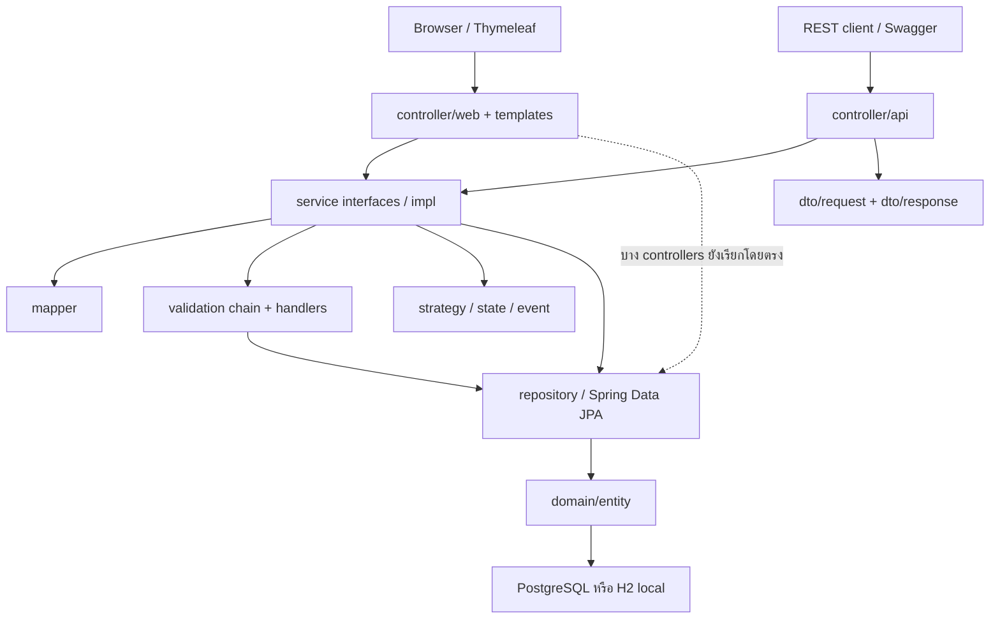
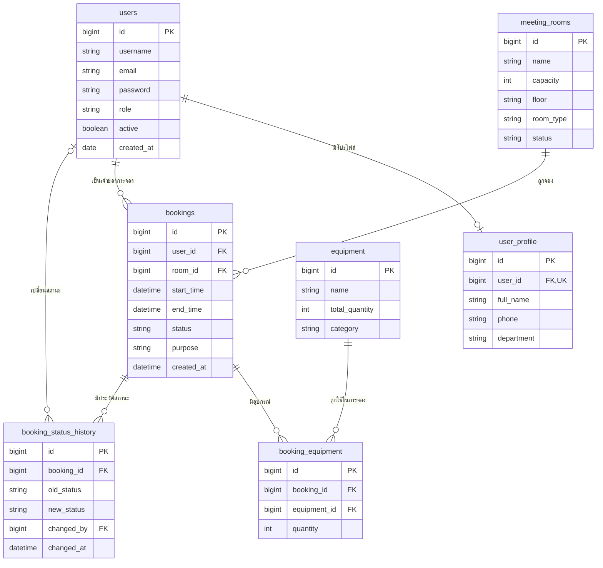

# Co-Working-Space-Equipment-Rental

ระบบจองพื้นที่ทำงานร่วมกัน ห้องประชุม และอุปกรณ์สำหรับการใช้งานในองค์กร  
สมาชิกเลือกห้อง วันเวลา และอุปกรณ์ ตรวจสอบความว่าง และติดตามสถานะการจองของตนเองได้  
เจ้าหน้าที่และผู้ดูแลจัดการห้อง อุปกรณ์ การจอง และการจองแทนผู้ใช้ ส่วนผู้ดูแลจัดการบัญชีผู้ใช้ได้  
พัฒนาด้วย Spring Boot, REST API และ Thymeleaf โดยแยกโหมดเว็บทดลองบนเครื่องออกจากโหมด API ที่ใช้ PostgreSQL

Repository: [BRHansol/Co-Working-Space-Equipment-Rental](https://github.com/BRHansol/Co-Working-Space-Equipment-Rental)

## สมาชิกกลุ่ม

| ลำดับ | ชื่อ-นามสกุล | รหัสนักศึกษา | Section | Branch | หน้าที่รับผิดชอบ |
| --- | --- | --- | --- | --- | --- |
| 1 | นายยุทธนา เหล่าวิสัย | 673380422-8 | 03 | `yuttana_673380422-8_03` | User & Authentication: `User`, `UserProfile` แบบ One-to-One, User Controller/Service/Repository, login และสิทธิ์ผู้ใช้, README ส่วน Tech Stack และ Installation |
| 2 | นายกฤติธี ศรีใสย์ | 673380572-9 | 04 | `krittitee_673380572-9_04` | Room & Equipment + Strategy: MeetingRoom/Equipment Controller/Service/Repository, `BookingRuleStrategy`, VIP/Standard strategies และเอกสาร SOLID ของส่วนห้อง/อุปกรณ์ |
| 3 | นายบุญปวีณ เรืองไพศาล | 673380588-4 | 03 | `boonyapaween_673380588-4_03` | Booking Core + State: `Booking`, `BookingStatus`, Booking CRUD Controller/Service/Repository, State classes/`BookingContext`, pagination และ sorting |
| 4 | นายณัฏฐชัย ผลดี | 673380581-8 | 04 | `nuttachai_673380581-8_04` | Booking Validation + Equipment Linking: `BookingEquipment`, validation handlers/chain/context แบบ Chain of Responsibility, Booking request/response DTO และ Mapper |
| 5 | นายจีรภัทร แก้วดี | 673380577-9 | 03 | `jiraphat_673380577-9_03` | Notification Observer + Infrastructure: `BookingStatusHistory`, event/listener, Global Exception Handler/`ErrorResponse`, Swagger, Docker/Compose, Cloud Deployment และ CI |

ชื่อและหน้าที่เป็นข้อมูลที่ทีมระบุ ส่วนรหัสนักศึกษาและ Section อ้างอิงจากชื่อ branches ที่พบใน Git ต้องตรวจยืนยันข้อมูลสมาชิกก่อนส่งงาน

## Tech Stack

| ส่วน | เทคโนโลยีที่ใช้ในโค้ดปัจจุบัน |
| --- | --- |
| ภาษา | Java 17 ตาม `code/pom.xml` |
| Backend | Spring Boot 4.1.1, Spring MVC |
| Build | Maven Wrapper 3.9.16 |
| Persistence | Spring Data JPA / Hibernate |
| ฐานข้อมูล | PostgreSQL สำหรับโหมด API; H2 แบบไฟล์สำหรับ `local` |
| Frontend | Thymeleaf, HTML, CSS และ JavaScript |
| Validation | Jakarta Bean Validation |
| Security | Spring Security, BCrypt และ session/CSRF guard สำหรับเว็บ `local` |
| API documentation | springdoc-openapi-starter-webmvc-ui 3.1.0 |
| Testing | JUnit Jupiter 6.0.3, Mockito 5.23.0, Spring Boot Test, H2 และ Awaitility; เวอร์ชันทดสอบจัดการโดย Spring Boot BOM |
| เครื่องมืออื่น | Lombok, Git/GitHub; มี Dockerfile และ Compose แต่ configuration ยังต้องปรับก่อนใช้งาน |

## System Architecture

โค้ดแบ่ง package ตาม Presentation, Service, Repository, Domain, DTO/Mapper และส่วนสนับสนุน เว็บ Thymeleaf ใช้ Spring MVC เพื่อเรียกบริการและส่งข้อมูลเข้า views ส่วน REST controllers รับ request DTO และคืน response DTO



สถานะปัจจุบันยังไม่ผ่านข้อกำหนดห้ามข้าม layer ทั้งหมด: `AuthViewController`, `AdminViewController`, `CatalogViewController` และ `WebSessionSupport` ยังใช้ Repository โดยตรง การปรับโค้ดรอบนี้จำกัดส่วนของสมาชิกคนที่ 4 จึงไม่ได้ย้ายความรับผิดชอบของ controllers ดังกล่าว

Patterns ที่มี implementation ในระบบ:

| Pattern | ตำแหน่งและการใช้งาน |
| --- | --- |
| MVC | `controller/web` สร้าง model ให้ Thymeleaf templates |
| Repository / Service Layer / DTO + Mapper | `repository`, `service` และ `dto`/`mapper` แยก data access, business logic และ API contract |
| Dependency Injection | Service interfaces และ constructor injection |
| Strategy | `service/strategy`: เลือกกฎจองห้อง STANDARD/VIP |
| State | `domain/state`: ควบคุมการเปลี่ยนสถานะการจอง |
| Observer | `BookingStatusChangedEvent` และ `NotificationListener` |
| Chain of Responsibility | `service/validation`: ตรวจสิทธิ์ เวลา ความว่างห้อง และจำนวนอุปกรณ์ตามลำดับ |

ห้อง STANDARD อนุมัติทันทีตาม strategy ส่วนห้อง VIP รออนุมัติ การจองใช้สถานะ `PENDING`, `APPROVED`, `REJECTED`, `CANCELLED` และ `COMPLETED`

## Database Design (ER Diagram)

ระบบมี 7 entities แผนภาพนี้อ้างอิง JPA mappings ใน `domain/entity`; ชื่อคอลัมน์ของ properties ที่ไม่ได้ระบุ `@Column` ใช้ naming strategy ของ Hibernate ยังไม่ได้ตรวจ schema PostgreSQL จริงในขั้นตอนจัดทำ README



- `User`–`UserProfile` เป็น One-to-One โดย `user_profile.user_id` เป็น unique FK
- ผู้ใช้/ห้องมีหลายการจอง และการจองมีหลายรายการอุปกรณ์/ประวัติสถานะ
- `BookingEquipment` เป็น associative entity เชื่อม Booking กับ Equipment และเก็บจำนวนที่ขอใช้
- Booking ใช้ cascade/orphan removal สำหรับรายการอุปกรณ์ และมี index สำหรับห้อง/ช่วงเวลา/ผู้ใช้

### SQL scripts ของสมาชิกคนที่ 4

ไฟล์ [schema.sql](code/src/main/resources/db/person4/schema.sql) และ [data.sql](code/src/main/resources/db/person4/data.sql) เป็น **manual scripts เฉพาะ `booking_equipment`** ไม่ใช่ migration ครบทั้งระบบ และ Spring Boot ไม่รันไฟล์ในโฟลเดอร์นี้โดยอัตโนมัติ

1. เตรียมฐานข้อมูลทดสอบและ parent tables `bookings(id)` กับ `equipment(id)` ก่อน โดยใช้ workflow ของเจ้าของตารางเหล่านั้น
2. อ่านเงื่อนไขและตรวจข้อมูลเดิมตาม comments ใน `schema.sql` แล้วรัน schema ก่อน data; สำรองข้อมูลและหยุด writers ก่อนปรับฐานข้อมูลเดิม
3. Schema กำหนด FKs เมื่อสร้างตารางใหม่, quantity ห้าม null/ต้องมากกว่า 0 และ indexes ของ `booking_id` กับ `equipment_id` โดยไม่ลบหรือซ่อมข้อมูลเดิมอัตโนมัติ
4. `data.sql` เพิ่ม fixture เท่านั้น: ต้องมี CANCELLED booking ที่ purpose เป็น `[person4-demo] equipment-link fixture` และ equipment ชื่อ `Person 4 demo equipment` ใน category `person4-demo` ตามเงื่อนไขในไฟล์ หากไม่มี parents ที่ตรงเงื่อนไข จะไม่เพิ่มแถว

ไม่ควรนำ scripts นี้ไปตีความว่าเตรียมครบทั้ง 7 ตารางแล้ว ปัจจุบัน configuration หลักยังใช้ `spring.jpa.hibernate.ddl-auto=update` และไม่มี full-system Flyway/Liquibase migration

## Installation & Setup

### สิ่งที่ต้องเตรียม

- JDK 17 และตั้ง `JAVA_HOME`/`PATH` ให้ Terminal เรียก `java` กับ `javac` ได้
- Git และอินเทอร์เน็ตสำหรับดาวน์โหลด Maven/dependencies ครั้งแรก ไม่ต้องติดตั้ง Maven แยก
- PostgreSQL เฉพาะกรณีจะรันโหมด API; เว็บทดลอง `local` ใช้ H2 ได้ทันที

Clone repository แล้วเข้าโฟลเดอร์ที่มี `pom.xml`:

```powershell
git clone https://github.com/BRHansol/Co-Working-Space-Equipment-Rental.git
Set-Location -LiteralPath '.\Co-Working-Space-Equipment-Rental\code'
java -version
javac -version
.\mvnw.cmd --version
```

หากใช้ CMD:

```bat
git clone https://github.com/BRHansol/Co-Working-Space-Equipment-Rental.git
cd Co-Working-Space-Equipment-Rental\code
java -version
javac -version
mvnw.cmd --version
```

คำสั่ง Maven หลังจากนี้รันจาก `code/` เสมอ หากมีโปรเจกต์อยู่แล้ว ให้เข้า `code/` ของ checkout ที่ทีมตกลงใช้งาน โดยไม่ clone ซ้ำ ตัวอย่าง clone รับ default branch; หากทีมส่งงานบน branch อื่น ต้องเลือก branch/version ที่มีโค้ดชุดเดียวกับ README นี้ก่อนรัน

## How to Run

### 1. เว็บ Thymeleaf บนเครื่อง: profile `local`

PowerShell:

```powershell
.\mvnw.cmd spring-boot:run "-Dspring-boot.run.profiles=local"
```

CMD:

```bat
mvnw.cmd spring-boot:run "-Dspring-boot.run.profiles=local"
```

macOS/Linux:

```sh
sh ./mvnw spring-boot:run -Dspring-boot.run.profiles=local
```

เปิด [http://127.0.0.1:8080/](http://127.0.0.1:8080/) หลังแอปเริ่มสำเร็จ กด Ctrl+C ใน Terminal เพื่อหยุด เว็บ bind ที่ `127.0.0.1` จึงเปิดจากเครื่องที่รันแอปเท่านั้น

| Username | Password ทดลอง | Role |
| --- | --- | --- |
| `narin` | `local123` | USER |
| `staff` | `local123` | STAFF |
| `admin` | `local123` | ADMIN |

Seeder สร้างบัญชี 3 roles, ห้อง 6 ห้อง และอุปกรณ์ 6 รายการ **เฉพาะเมื่อทั้งตาราง users, meeting_rooms และ equipment ว่างพร้อมกัน** ไม่คืนบัญชีหรือรหัสผ่านที่ถูกเปลี่ยนไปแล้ว H2 เก็บข้อมูลที่ `code/.local-data/room-booking.mv.db` เมื่อรันจาก `code/` และข้อมูลนี้ถูก Git ignore

หน้าหลัก: `/`, `/rooms`, `/equipment`, `/login`, `/register`, `/account`, `/bookings` และ `/admin` ตามสิทธิ์บัญชี ใน profile นี้ `/api/**` ถูกปิด และ Swagger/OpenAPI ถูกปิดใน `application-local.properties`

หากเปลี่ยน port ใน PowerShell:

```powershell
.\mvnw.cmd spring-boot:run "-Dspring-boot.run.profiles=local" "-Dspring-boot.run.arguments=--server.port=8081"
```

CMD ใช้ argument เดียวกัน แต่เริ่มด้วย `mvnw.cmd` เปิด Terminal ที่ไม่มี `SPRING_DATASOURCE_*` ตั้งค้างจากการทดลอง PostgreSQL เพราะ environment variables สามารถ override datasource ของ local ได้ คู่มือเปิดเว็บและแก้ปัญหาเพิ่มเติมอยู่ที่ [HOWTORUN.md](HOWTORUN.md)

### 2. Backend REST API กับ PostgreSQL: profile `api`

`api` ใช้เป็นชื่อ profile ที่ไม่ใช่ `local` จึงเลือก configuration PostgreSQL ใน `application.properties` และ SecurityConfig ฝั่ง API ปัจจุบันไม่มี `application-api.properties` และไม่มี Thymeleaf web controllers ในโหมดนี้

สร้างฐานข้อมูล `room_booking` ใน PostgreSQL ก่อน และเตรียม host/port, username, password และสิทธิ์ของบัญชีที่ใช้เชื่อมต่อ เปลี่ยน placeholders ในตัวอย่างให้เป็นข้อมูลของเครื่องตนเอง:

PowerShell:

```powershell
$env:DB_URL = 'jdbc:postgresql://localhost:5432/room_booking'
$env:DB_USERNAME = 'postgres'
$env:DB_PASSWORD = '<your-postgresql-password>'
.\mvnw.cmd spring-boot:run "-Dspring-boot.run.profiles=api"
```

CMD:

```bat
set "DB_URL=jdbc:postgresql://localhost:5432/room_booking"
set "DB_USERNAME=postgres"
set "DB_PASSWORD=<your-postgresql-password>"
mvnw.cmd spring-boot:run "-Dspring-boot.run.profiles=api"
```

ใช้ค่าความลับบนเครื่อง/ระบบ environment และไม่ commit credentials จริง บัญชี demo ของ local จะไม่ถูก seed ใน profile นี้ แอปยัง bind `127.0.0.1`; ขั้นตอนนี้เป็นการรัน API บนเครื่อง ไม่ใช่ public deployment การจัดทำ README ไม่ได้เชื่อมต่อหรือยืนยัน PostgreSQL runtime

## API Documentation

เมื่อรัน profile ที่ไม่ใช่ `local` และแอปเริ่มสำเร็จ สามารถตรวจ:

- Swagger UI: [http://127.0.0.1:8080/swagger-ui.html](http://127.0.0.1:8080/swagger-ui.html)
- OpenAPI JSON: [http://127.0.0.1:8080/v3/api-docs](http://127.0.0.1:8080/v3/api-docs)

URLs นี้เป็นตำแหน่งที่ configuration รองรับ ยังไม่ได้ยืนยันการเข้าถึงผ่าน PostgreSQL runtime ในรอบนี้ และใช้ไม่ได้ใน default `local`

| Method | Endpoint | หน้าที่ / success status |
| --- | --- | --- |
| POST | `/api/v1/users` | สร้างผู้ใช้และโปรไฟล์ — 201 |
| GET | `/api/v1/users` | รายการผู้ใช้แบบแบ่งหน้า — 200 |
| GET | `/api/v1/users/{id}` | รายละเอียดผู้ใช้ — 200 |
| PUT | `/api/v1/users/{id}` | แก้ผู้ใช้ — 200 |
| DELETE | `/api/v1/users/{id}` | ลบผู้ใช้ — 204 |
| POST | `/api/v1/rooms` | สร้างห้อง — 201 |
| GET | `/api/v1/rooms` | รายการห้องแบบแบ่งหน้า/เรียงลำดับ — 200 |
| GET | `/api/v1/rooms/{id}` | รายละเอียดห้อง — 200 |
| PUT | `/api/v1/rooms/{id}` | แก้ห้อง — 200 |
| DELETE | `/api/v1/rooms/{id}` | ลบห้อง — 204 |
| POST | `/api/v1/equipments` | สร้างอุปกรณ์ — 201 |
| GET | `/api/v1/equipments` | รายการอุปกรณ์แบบแบ่งหน้า/เรียงลำดับ — 200 |
| GET | `/api/v1/equipments/{id}` | รายละเอียดอุปกรณ์ — 200 |
| PUT | `/api/v1/equipments/{id}` | แก้อุปกรณ์ — 200 |
| DELETE | `/api/v1/equipments/{id}` | ลบอุปกรณ์ — 204 |
| POST | `/api/v1/bookings` | สร้างการจอง — 201 |
| GET | `/api/v1/bookings/{id}` | รายละเอียดการจอง — 200 |
| GET | `/api/v1/rooms/{roomId}/bookings` | การจองของห้องแบบแบ่งหน้า/เรียงลำดับ — 200 |
| GET | `/api/v1/users/{userId}/bookings` | การจองของผู้ใช้แบบแบ่งหน้า/เรียงลำดับ — 200 |
| PUT | `/api/v1/bookings/{id}` | แก้การจอง — 200 |
| PATCH | `/api/v1/bookings/{id}/status` | เปลี่ยนสถานะ เช่น `{"status":"APPROVED"}` — 200 |

ตัวอย่าง pagination/sorting: `GET /api/v1/rooms?page=0&size=10&sort=name,asc` และ `GET /api/v1/rooms/1/bookings?page=0&size=10&sort=startTime,desc` ส่วน users รองรับ page/size แต่ implementation ปัจจุบันเรียง `id,desc` เสมอ

POST/PUT/PATCH ของ bookings ใช้ header `X-User-Id` เป็น ID ผู้ดำเนินการ ตัวอย่าง request body โดยต้องแทน IDs ด้วยข้อมูลที่มีจริงในฐานข้อมูล:

```json
{
  "roomId": 1,
  "startTime": "2026-11-01T09:00:00",
  "endTime": "2026-11-01T10:00:00",
  "purpose": "ประชุมทีม",
  "equipmentItems": [
    { "equipmentId": 1, "quantity": 2 }
  ]
}
```

`equipmentItems` เว้นได้หากไม่ใช้อุปกรณ์ แต่รายการที่ส่งต้องมี equipment ID และ quantity เป็นจำนวนบวก วัตถุประสงค์ยาวได้ไม่เกิน 255 ตัวอักษร `bookingForUserId` ใช้สำหรับการจองแทนตามสิทธิ์ ส่วน `bookingId` เป็นข้อมูลที่ service ควบคุมเมื่อแก้การจอง

Global Exception Handler คืน `ErrorResponse` ที่มี `timestamp`, `status`, `error`, `message`, `path`, `details` สำหรับ validation/not found/conflict/server errors ส่วน header interceptor ยังมี error JSON แบบ `error`/`message` แยกต่างหาก

Authentication ฝั่ง REST ยังไม่สมบูรณ์: `X-User-Id` เป็นค่าที่ client ส่งเอง และ Swagger ประกาศ bearer JWT โดยยังไม่มี JWT validation จริง จึงไม่ควรอ้างว่า API นี้พร้อมเปิดสาธารณะหรือใช้ปุ่ม Authorize เป็นการ login สำเร็จ

## How to Run Tests

รันจาก `code/` โดยใช้ profile `local` และใส่เครื่องหมายคำพูดรอบ `-D...` ใน PowerShell

### ชุดเดิมที่ Maven ตรวจพบ

PowerShell:

```powershell
.\mvnw.cmd test "-Dspring.profiles.active=local"
```

CMD:

```bat
mvnw.cmd test "-Dspring.profiles.active=local"
```

ใช้ test sources ใน `code/src/test/java` และรายงานอยู่ที่ `code/target/surefire-reports/` มี tests ของ controllers, authentication, profile security, local migration, application context และ HTTP integration ของเว็บ ซึ่ง integration tests กำหนด H2 in-memory

### ชุดเฉพาะสมาชิกคนที่ 4

PowerShell:

```powershell
.\mvnw.cmd -Pperson4-tests test "-Dspring.profiles.active=local"
```

CMD:

```bat
mvnw.cmd -Pperson4-tests test "-Dspring.profiles.active=local"
```

Profile `person4-tests` ใช้ sources จาก repository root `test/person4/java`, แยก test classes ไป `code/target/person4-test-classes/` และแยกรายงานไป `code/target/person4-surefire-reports/` ครอบคลุม validation/chain, Booking DTO/Mapper และข้อกำหนดตารางเชื่อมในขอบเขตคนที่ 4 ไม่แทนที่ชุดเดิม

ผลตรวจวันที่ 2026-10-07: ชุดสมาชิกคนที่ 4 ผ่าน 40 tests และชุดเดิมผ่าน 67 tests ทั้งสองชุดมี 0 failures, 0 errors และ 0 skipped ทดสอบด้วย H2/Mockito โดยไม่ได้เชื่อม PostgreSQL จริง

| Test class | ขอบเขต |
| --- | --- |
| `BookingValidationTest` | Chain/context และ validation handlers |
| `BookingCreateRequestTest` | Bean Validation ของ Booking request/รายการอุปกรณ์ |
| `BookingMapperTest` | การแปลง Booking request/entity/response |
| `BookingEquipmentRepositoryTest` | Entity/repository และข้อจำกัดตารางเชื่อมด้วย H2 |
| `BookingEquipmentSqlTest` | Manual schema/data scripts ด้วย H2 |

ไฟล์ใน `code/src/test/Tanny test/` มี 23 tests ของ Room/Equipment/Strategy แต่ไม่ได้อยู่ใน test source path ที่ Maven ตรวจพบตามปกติ และไม่ได้รวมใน profile คนที่ 4 จำนวน tests ที่ผ่านต้องอ้างอิงรายงานของแต่ละชุด ไม่ใช่นับรวมไฟล์ทดสอบที่ยังไม่ถูกเรียกใช้งาน การทดสอบ H2/Mockito ไม่ยืนยัน PostgreSQL หรือ Cloud Deployment

## Deployment URL

**ยังไม่มี URL สาธารณะที่ยืนยันว่าใช้งานได้** URL `http://127.0.0.1:8080/` เป็นเว็บบนเครื่องเท่านั้น ข้อกำหนด Cloud/Server Deployment ของใบงานจึงยังไม่เสร็จ

มี `code/Dockerfile` และ `code/docker-compose.yml` แต่ยังไม่เสนอเป็นคำสั่งรันที่พร้อมใช้งาน: Compose ตั้ง PostgreSQL ขณะที่ default profile ยังเป็น local/H2 และ server bind loopback รวมถึง writable directory ของ H2 ใน container ต้องจัดการให้สอดคล้องกัน ต้องปรับ profile, datasource, binding, secrets และ authentication พร้อมทดสอบ deployment ก่อนบันทึก public URL จริง

## Project Structure

```text
Co-Working-Space-Equipment-Rental/
├── README.md
├── HOWTORUN.md
├── code/
│   ├── pom.xml
│   ├── mvnw / mvnw.cmd / .mvn/wrapper/
│   ├── Dockerfile / docker-compose.yml
│   └── src/
│       ├── main/
│       │   ├── java/com/example/roombooking/
│       │   │   ├── controller/api/           # REST controllers
│       │   │   ├── controller/web/           # MVC, form/forms และ support
│       │   │   ├── service/impl/             # Business services
│       │   │   ├── service/strategy/         # STANDARD/VIP rules
│       │   │   ├── service/validation/       # Validation chain/handlers
│       │   │   ├── repository/               # Spring Data repositories
│       │   │   ├── domain/entity/            # 7 JPA entities
│       │   │   ├── domain/enums/             # Role, room/booking statuses
│       │   │   ├── domain/state/             # Booking state handling
│       │   │   ├── dto/request/ / dto/response/
│       │   │   ├── mapper/ / event/
│       │   │   └── config/ / exception/ / common/
│       │   └── resources/
│       │       ├── application.properties
│       │       ├── application-local.properties
│       │       ├── db/person4/               # Manual booking_equipment SQL
│       │       └── templates/
│       │           ├── account/ / admin/ / auth/ / bookings/
│       │           ├── rooms/ / equipment/ / pages/
│       │           ├── fragments/ / common/
│       │           └── assets/css/ / assets/js/ / assets/img/
│       └── test/
│           ├── java/                         # Default Maven test sources
│           └── Tanny test/                   # Existing unscanned tests
├── test/
│   └── person4/java/                          # Dedicated person4-tests sources
├── doc/                                      # เอกสารและ diagrams ของทีม
├── img/                                      # โฟลเดอร์มัลติมีเดียตามใบงาน
└── .github/                                  # โครงสร้างงาน GitHub; ไม่ยืนยัน CI/CD จากชื่อโฟลเดอร์
```

Assets ของเว็บปัจจุบันอยู่ใน `code/src/main/resources/templates/assets/` และถูก map เป็น `/assets/**` ด้วย `WebAssetsConfig` ไม่ได้โหลดจาก root `img/` ส่วน `doc/` และ `img/` มี placeholder เดิม จึงต้องดูไฟล์เอกสาร/diagrams ที่ส่งจริงประกอบ ไม่ถือว่าเอกสารทุกหัวข้อในใบงานเสร็จจากการมีโฟลเดอร์เพียงอย่างเดียว
