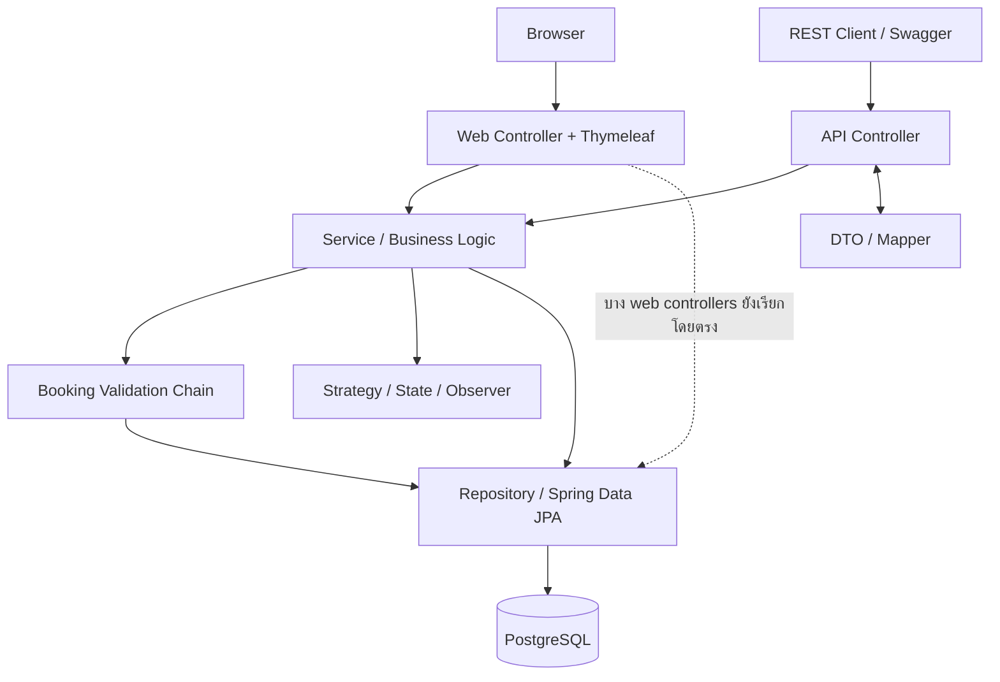
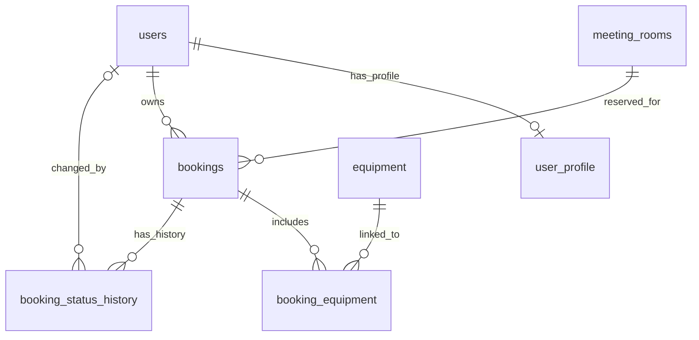

# Co-Working-Space-Equipment-Rental — ระบบจองห้องประชุมและอุปกรณ์

เว็บสำหรับจองพื้นที่ทำงานร่วมกัน ห้องประชุม และอุปกรณ์ภายในองค์กร
สมาชิกค้นหาห้อง เลือกช่วงเวลาและอุปกรณ์ แล้วติดตามสถานะการจองของตนเองได้
เจ้าหน้าที่ตรวจคำขอและอนุมัติการจอง ส่วนผู้ดูแลจัดการห้อง อุปกรณ์ และบัญชีผู้ใช้

โปรเจกต์นี้จัดทำสำหรับวิชา **CP353002 Principles of Software Design and Development** โดยใช้ Spring Boot และ Thymeleaf

Repository: [BRHansol/Co-Working-Space-Equipment-Rental](https://github.com/BRHansol/Co-Working-Space-Equipment-Rental)

## สมาชิกกลุ่ม

| ลำดับ | ชื่อ–นามสกุล | รหัสนักศึกษา | Section | Branch | หน้าที่หลัก |
| --- | --- | --- | --- | --- | --- |
| 1 | นายยุทธนา เหล่าวิสัย | 673380422-8 | 03 | `yuttana_673380422-8_03` | User & Authentication: User/UserProfile แบบ One-to-One, User Controller/Service/Repository, login และสิทธิ์ผู้ใช้ รวมถึง README ส่วน Tech Stack/Installation |
| 2 | นายกฤติธี ศรีใสย์ | 673380572-9 | 04 | `krittitee_673380572-9_04` | Room & Equipment: Entity และ Controller/Service/Repository ของห้องและอุปกรณ์, Strategy Pattern และเอกสาร SOLID ของส่วนงาน |
| 3 | นายบุญปวีณ เรืองไพศาล | 673380588-4 | 03 | `boonyapaween_673380588-4_03` | Booking Core: Booking/BookingStatus, Booking API Controller/Service/Repository, CRUD หลัก, State Pattern, pagination และ sorting |
| 4 | นายณัฏฐชัย ผลดี | 673380581-8 | 04 | `nuttachai_673380581-8_04` | Booking Validation & Equipment Linking: BookingEquipment, Chain of Responsibility และ Booking request/response DTO กับ Mapper |
| 5 | นายจีรภัทร แก้วดี | 673380577-9 | 03 | `jiraphat_673380577-9_03` | Notification & Infrastructure: BookingStatusHistory, Observer, GlobalExceptionHandler/ErrorResponse, Swagger, Docker, Cloud Deployment และ CI/CD |

ตารางนี้ระบุขอบเขตงานหลักของสมาชิก โดย Booking API Controller และ CRUD หลักอยู่ในงานคนที่ 3 ส่วนคนที่ 4 ดูแลข้อมูลรับส่งและการตรวจสอบที่กระบวนการจองนำไปใช้

## การใช้งานหลัก

สมาชิกเลือกห้องและช่วงเวลา พร้อมระบุจำนวนอุปกรณ์ที่ต้องการ ระบบตรวจสิทธิ์ สถานะห้อง เวลาที่ซ้อนกับการจองเดิม และจำนวนอุปกรณ์ที่เหลือก่อนบันทึก ห้องประเภท STANDARD อนุมัติทันทีตาม Strategy ส่วน VIP เริ่มที่ PENDING เพื่อรอเจ้าหน้าที่อนุมัติ

| Role | สิทธิ์หลักในหน้าเว็บ |
| --- | --- |
| USER | ค้นหาห้องและอุปกรณ์ สร้างการจอง ดูและจัดการการจองของตนเองตามสถานะ |
| STAFF | ตรวจและอนุมัติ/ปฏิเสธการจอง จัดการห้องและอุปกรณ์ และจองแทนผู้ใช้ |
| ADMIN | ทำงานเจ้าหน้าที่ได้ รวมถึงสร้าง/ดู/ลบบัญชีผู้ใช้ และกำหนด Role ตอนสร้าง |

สถานะการจองประกอบด้วย `PENDING`, `APPROVED`, `REJECTED`, `CANCELLED` และ `COMPLETED` โดย State Pattern ควบคุมการเปลี่ยนสถานะที่อนุญาต การแจ้งเตือนปัจจุบันบันทึกผ่าน log และประวัติสถานะ ยังไม่มีบริการส่งอีเมลหรือ SMS

## Tech Stack

### เทคโนโลยีและหน้าที่ในระบบ

| ส่วน | เทคโนโลยี | ใช้ทำอะไรในโครงการ |
| --- | --- | --- |
| ภาษา | **Java 17** | เขียนกฎธุรกิจและโค้ดฝั่งเซิร์ฟเวอร์ |
| Backend | **Spring Boot 4.1.1** | ตั้งค่าและรันแอป รวมถึงเชื่อมองค์ประกอบของระบบ |
| เว็บและ API | **Spring MVC** | รับ HTTP request และส่งหน้าเว็บหรือ JSON ผ่าน Controller |
| หน้าจอ | **Thymeleaf** | สร้าง HTML โดยนำข้อมูลจาก Controller มาแสดง |
| ส่วนโต้ตอบ | **HTML, CSS และ JavaScript** | จัดหน้าจอ ฟอร์ม เมนู และการโต้ตอบบนเว็บ |
| ความปลอดภัย | **Spring Security, BCrypt และ web guards** | ตั้งค่า security profiles, เข้ารหัสรหัสผ่าน และตรวจ session/role/CSRF ของหน้าเว็บ |
| ตรวจข้อมูล | **Jakarta Bean Validation** | ตรวจข้อมูลใน DTO เช่น ค่าที่จำเป็นและจำนวนอุปกรณ์ที่เป็นบวก |
| ฐานข้อมูล | **PostgreSQL** | เก็บผู้ใช้ ห้อง อุปกรณ์ การจอง และประวัติสถานะ |
| การเข้าถึงข้อมูล | **Spring Data JPA / Hibernate** | เชื่อม Entity กับตารางและอ่าน/บันทึกข้อมูลผ่าน Repository |
| เอกสาร API | **springdoc-openapi 3.1.0 / Swagger UI** | แสดงรายละเอียด endpoint และทดลองเรียก REST API |
| Build | **Maven Wrapper 3.9.16** | จัดการ dependency รันทดสอบ และสร้างไฟล์ JAR |
| การทดสอบ | **JUnit Jupiter, Mockito, Spring Boot Test และ Awaitility** | ตรวจส่วนงานแยกและการทำงานร่วมกัน โดยใช้เวอร์ชันที่ Spring Boot BOM จัดการ |
| ฐานข้อมูลทดสอบ | **H2 in-memory** | ทดสอบ Entity, Repository และ SQL แยกจากข้อมูลใช้งานจริง |
| ลดโค้ดซ้ำ | **Lombok** | สร้าง getter/setter, constructor และโค้ดประกอบ |
| สภาพแวดล้อม | **Docker / Docker Compose** | แพ็กและรันแอป โดย Compose ปัจจุบันเชื่อมกับ PostgreSQL ภายนอก |
| CI/CD | **GitHub Actions** | Build/Test และเรียก Render Deploy Hook หลัง tests ผ่าน |
| Hosting / Cloud DB | **Render / PostgreSQL ภายนอก เช่น Aiven** | มี workflow สำหรับ Render และคู่มือ Railway + Aiven แยกไว้ใน HOWTORUN |

## System Architecture

ระบบแบ่งงานเป็น Presentation, Service และ Persistence โดยใช้ Domain Entity แทนข้อมูลที่จัดเก็บ และ DTO/Mapper กำหนดข้อมูลที่รับส่งผ่าน API



Controller รับคำขอและส่งผลกลับ Service จัดการเงื่อนไขธุรกิจและ transaction ส่วน Repository ติดต่อฐานข้อมูล ปัจจุบัน `AuthViewController`, `AdminViewController`, `CatalogViewController` และ `WebSessionSupport` ยังเรียก Repository โดยตรง จึงยังมีส่วนที่ต้องปรับให้ผ่าน Service layer ตามข้อกำหนด

| Pattern | การนำไปใช้ |
| --- | --- |
| Strategy | เลือกกฎจองห้อง STANDARD/VIP ผ่าน `BookingRuleStrategy` |
| State | ตรวจและดำเนินการเปลี่ยนสถานะผ่าน `BookingState` และ `BookingContext` |
| Observer | ส่ง `BookingStatusChangedEvent` ไปยัง `NotificationListener` เพื่อบันทึกประวัติและแจ้งเตือน |
| Chain of Responsibility | ตรวจสิทธิ์ → ความพร้อมห้อง → เวลาซ้อน → จำนวนอุปกรณ์ ตามลำดับ handlers |
| Repository / Service Layer / DTO + Mapper | แยกการเข้าถึงข้อมูล กฎธุรกิจ และรูปแบบข้อมูลที่ API รับส่ง |
| MVC / Dependency Injection | แยก Controller/View และส่ง dependency ผ่าน constructor |

Observer รับ event จากการเปลี่ยนสถานะผ่าน `updateStatus` ส่วนการอนุมัติ STANDARD ทันทีตอนสร้างยังไม่ได้ส่ง event นี้ จึงยังไม่มีประวัติแถวนั้น

### เอกสารการออกแบบของสมาชิก

| ส่วนงาน | เอกสาร |
| --- | --- |
| คนที่ 2 — Room/Equipment | [สารบัญ](doc/krittitee_673380572-9_04/README.md), [Design Patterns](doc/krittitee_673380572-9_04/design-patterns.md), [SOLID Analysis](doc/krittitee_673380572-9_04/solid-analysis.md) |
| คนที่ 4 — Validation/Equipment Linking | [Design Patterns](doc/nuttachai_673380581-8_04/design-patterns.md), [SOLID Analysis](doc/nuttachai_673380581-8_04/solid-analysis.md), [Booking Validation / DTO / Mapper](doc/nuttachai_673380581-8_04/api-booking-validation.md) |
| คนที่ 5 — Observer/Infrastructure | [สารบัญ](doc/jiraphat_673380577-9_03/README.md), [Design Patterns](doc/jiraphat_673380577-9_03/design-patterns.md), [SOLID Analysis](doc/jiraphat_673380577-9_03/solid-analysis.md), [Component/Deployment Diagram](doc/jiraphat_673380577-9_03/diagrams/component-deployment-diagram.md) |

## Database Design

ระบบมี 7 ตาราง ความสัมพันธ์หลักอ้างอิง Entity และ [PostgreSQL schema](code/src/main/resources/db/postgresql/schema.sql):



| ตาราง | ข้อมูลที่จัดเก็บ |
| --- | --- |
| `users` | บัญชีผู้ใช้ รหัสผ่านที่เข้ารหัส Role และสถานะ active |
| `user_profile` | ชื่อเต็ม โทรศัพท์ และหน่วยงาน เชื่อม User แบบ One-to-One |
| `meeting_rooms` | ชื่อห้อง ความจุ ชั้น ประเภท และสถานะ |
| `equipment` | ชื่ออุปกรณ์ หมวดหมู่ และจำนวนทั้งหมด |
| `bookings` | ผู้จอง ห้อง ช่วงเวลา วัตถุประสงค์ และสถานะ |
| `booking_equipment` | ตารางเชื่อม Booking–Equipment พร้อมจำนวนที่เลือก |
| `booking_status_history` | สถานะก่อน/หลัง ผู้ดำเนินการ และเวลาที่เปลี่ยนสถานะ |

Booking–Equipment เป็น Many-to-Many ผ่าน `BookingEquipment` เพื่อเก็บ quantity เพิ่มเติม โดย Booking จัดการรายการเชื่อมผ่าน cascade และ orphan removal รายละเอียดส่วนนี้อยู่ใน [ER Diagram และ Data Dictionary ของคนที่ 4](doc/nuttachai_673380581-8_04/diagrams/05-er-diagram.md)

Full schema สร้างทั้ง 7 ตาราง พร้อม foreign keys, CHECK constraints และ indexes โดยไม่มีข้อมูลทดลอง Runtime ใช้ `ddl-auto=validate` และ `spring.sql.init.mode=never` จึงต้องเตรียม schema ก่อนเริ่มแอป การใช้ `IF NOT EXISTS` ไม่ได้อัปเกรดโครงสร้างตารางเก่าให้ตรงกับ Entity

## Installation & Setup

เตรียม **JDK 17**, **Git**, PostgreSQL หรือ Aiven for PostgreSQL และ PostgreSQL client (`psql`) สำหรับสร้าง schema ใช้ Docker Desktop เมื่อต้องการรันแอปด้วย Docker

```powershell
git clone https://github.com/BRHansol/Co-Working-Space-Equipment-Rental.git
cd Co-Working-Space-Equipment-Rental
git checkout develop
```

### ตั้งค่าฐานข้อมูล

สร้างไฟล์ `code/.env` โดยดู [ตัวอย่าง configuration](code/.env.example) หรือกำหนดค่าผ่าน environment ของเครื่อง/บริการโฮสต์:

```properties
DB_URL=jdbc:postgresql://YOUR_DB_HOST:YOUR_DB_PORT/YOUR_DB_NAME?sslmode=require
DB_USERNAME=YOUR_DB_USER
DB_PASSWORD=YOUR_DB_PASSWORD
```

ใช้ host, port, database และ credentials ของฐานข้อมูลจริง `DB_URL` ต้องเป็น JDBC URL และแยก username/password ออกมาตามตัวอย่าง เก็บไฟล์ `.env` ไว้เฉพาะเครื่อง; ในบริการคลาวด์ให้ใส่ค่าใน Environment/Variables

| ตัวแปรเพิ่มเติม | การใช้งาน |
| --- | --- |
| `SPRING_PROFILES_ACTIVE` | `prod` สำหรับหน้าเว็บ หรือ `api` สำหรับ REST API |
| `PORT` | พอร์ตที่แอปรับฟัง ค่าเริ่มต้น 8080 |
| `SESSION_COOKIE_SECURE` | ค่าเริ่มต้น `true` สำหรับ HTTPS; ตั้ง `false` เฉพาะเมื่อรันหน้าเว็บผ่าน HTTP บนเครื่อง |

หากใช้ PostgreSQL บนเครื่อง เปลี่ยน `DB_URL` เป็น `jdbc:postgresql://localhost:5432/room_booking` และใช้ credentials ของฐานข้อมูลนั้น

### เตรียม schema

สร้างฐานข้อมูลว่างก่อน แล้วรันคำสั่งนี้จากโฟลเดอร์หลัก โดยแทนค่าตัวอย่างด้วยข้อมูลฐานข้อมูลของตนเอง:

```powershell
psql "host=YOUR_DB_HOST port=YOUR_DB_PORT dbname=YOUR_DB_NAME user=YOUR_DB_USER sslmode=require" -W -v ON_ERROR_STOP=1 --single-transaction -f "./code/src/main/resources/db/postgresql/schema.sql"
```

`-W` ให้กรอกรหัสผ่านผ่าน prompt ก่อนรันกับฐานข้อมูลเดิมต้องตรวจโครงสร้างและข้อมูลให้พร้อม สคริปต์ [schema เฉพาะคนที่ 4](code/src/main/resources/db/nuttachai_673380581-8_04/schema.sql) ใช้กับ `booking_equipment` และไม่ใช้แทน full schema ส่วน `data.sql` ของสมาชิกและ SQL fixtures ใช้สำหรับการทดสอบ

## How to Run

คำสั่ง Maven และ Docker Compose ในส่วนต่อไปนี้ให้รันจากโฟลเดอร์ `code/` แอปอ่านไฟล์ `.env` จาก working directory นี้

### หน้าเว็บ

Windows:

```powershell
.\mvnw.cmd spring-boot:run
```

Linux/macOS:

```bash
sh ./mvnw spring-boot:run
```

ค่าเริ่มต้นคือ profile `prod` ซึ่งรวม `web` และ `postgres` เปิดเว็บที่ [http://localhost:8080](http://localhost:8080) หากใช้ HTTP บนเครื่องต้องตั้ง `SESSION_COOKIE_SECURE=false` เพื่อให้ login/session ทำงาน

### REST API และ Swagger

เปิดอีก terminal ใน `code/` แล้วใช้ profile `api` และพอร์ตต่างจากเว็บ:

```powershell
$env:PORT = "8081"
.\mvnw.cmd spring-boot:run "-Dspring-boot.run.profiles=api"
```

Linux/macOS:

```bash
PORT=8081 sh ./mvnw spring-boot:run -Dspring-boot.run.profiles=api
```

เปิด Swagger ที่ [http://localhost:8081/swagger-ui.html](http://localhost:8081/swagger-ui.html) ทั้งสอง profile ใช้ฐานข้อมูลเดียวกัน หน้าเว็บ `prod` ปิด `/api/**` ด้วย HTTP 403 และปิด Swagger จึงต้องเปิด API service แยก

### รันด้วย Docker Compose

```powershell
docker compose up --build
```

[Compose](code/docker-compose.yml) ปัจจุบันเปิดเฉพาะแอป profile `prod` และรับ `DB_URL`, `DB_USERNAME`, `DB_PASSWORD` เพื่อเชื่อม PostgreSQL ภายนอก หากฐานข้อมูลอยู่บนเครื่องและแอปอยู่ใน Docker Desktop ใช้ host `host.docker.internal` แทน `localhost` หน้าเว็บใช้ secure cookie ตามค่าเริ่มต้นของ profile จึงต้องเข้าใช้งานผ่าน HTTPS proxy ที่ตั้งค่าไว้

ระบบไม่มีบัญชีหรือห้องตัวอย่าง เริ่มจากสมัครที่ `/register` เพื่อได้ Role USER แล้วให้ผู้ดูแลฐานข้อมูลกำหนด ADMIN คนแรก จากนั้นเพิ่มห้องและอุปกรณ์ที่ `/admin` ขั้นตอนละเอียดอยู่ใน [HOWTORUN — Railway/Aiven](HOWTORUN.md) และ [คู่มือรัน/Deploy ของคนที่ 5](doc/jiraphat_673380577-9_03/HOWTORUN.md)

## API Documentation

เปิดได้ใน profile `api`:

- Swagger UI: [http://localhost:8081/swagger-ui.html](http://localhost:8081/swagger-ui.html)
- OpenAPI JSON: [http://localhost:8081/v3/api-docs](http://localhost:8081/v3/api-docs)

| กลุ่ม | Endpoint หลัก | การทำงาน |
| --- | --- | --- |
| ผู้ใช้ | `/api/v1/users`, `/api/v1/users/{id}` | POST/GET รายการ และ GET/PUT/DELETE รายบุคคล |
| ห้อง | `/api/v1/rooms`, `/api/v1/rooms/{id}` | POST/GET รายการ และ GET/PUT/DELETE รายห้อง |
| อุปกรณ์ | `/api/v1/equipments`, `/api/v1/equipments/{id}` | POST/GET รายการ และ GET/PUT/DELETE รายอุปกรณ์ |
| การจอง | `/api/v1/bookings`, `/api/v1/bookings/{id}` | POST สร้าง และ GET/PUT รายการตาม ID |
| รายการจองตามห้อง/ผู้ใช้ | `/api/v1/rooms/{roomId}/bookings`, `/api/v1/users/{userId}/bookings` | GET แบบแบ่งหน้าและเรียงลำดับ |
| สถานะและประวัติ | `/api/v1/bookings/{id}/status`, `/api/v1/bookings/{id}/status-history` | PATCH เปลี่ยนสถานะ และ GET ประวัติ |

ตัวอย่าง pagination/sorting: `GET /api/v1/rooms?page=0&size=10&sort=name,asc` ส่วน users รับ page/size แต่ implementation ปัจจุบันเรียง `id,desc` เสมอ การยกเลิก Booking ใช้ PATCH สถานะ `CANCELLED` แทน DELETE

ตัวอย่าง body ของ `POST /api/v1/bookings` โดยแทน IDs ด้วยข้อมูลที่มีอยู่จริง และส่ง header `X-User-Id` เป็น ID ผู้ดำเนินการ:

```json
{
  "roomId": 1,
  "startTime": "2026-11-01T09:00:00",
  "endTime": "2026-11-01T10:00:00",
  "purpose": "ประชุมทีม",
  "equipmentItems": [
    { "equipmentId": 1, "quantity": 2 }
  ]
}
```

เว้น `equipmentItems` ได้หากไม่ใช้อุปกรณ์ รายการที่ส่งต้องมี equipment ID และ quantity เป็นจำนวนบวก ส่วน `bookingForUserId` ใช้จองแทนผู้ใช้ตามสิทธิ์ รายละเอียด DTO และ validation อยู่ใน [เอกสารคนที่ 4](doc/nuttachai_673380581-8_04/api-booking-validation.md)

REST profile ปัจจุบันใช้ `permitAll` และ header `X-User-Id` ที่ client ระบุเอง ยังไม่มี JWT/Basic authentication จริง สิทธิ์ในตาราง Role ข้างต้นเป็นของหน้าเว็บที่ใช้ session/role/CSRF guards

Global Exception Handler คืน `timestamp`, `status`, `error`, `message`, `path` และ `details` ส่วน header interceptor คืน JSON `error`/`message` แยกต่างหาก ดู [Error Handling](doc/jiraphat_673380577-9_03/error-handling.md)

## How to Run Tests

รันจาก `code/` ชุดทดสอบใช้ H2 in-memory จึงไม่ต้องเชื่อม PostgreSQL หรือ Aiven:

```powershell
.\mvnw.cmd clean test
```

Linux/macOS ใช้ `sh ./mvnw clean test` หากต้องการตรวจและสร้าง JAR ใช้ `verify` ปัจจุบัน POM รวม tests จาก `code/src/test/java` และโฟลเดอร์ของคนที่ 1, 2, 4 และ 5 ใน `test/{branch}/java`

รันเฉพาะคนที่ 4:

```powershell
.\mvnw.cmd clean test -Pnuttachai_673380581-8_04
```

ผลชุดรวมอยู่ใน `code/target/surefire-reports/` ส่วน profile คนที่ 4 เก็บใน `code/target/nuttachai_673380581-8_04-surefire-reports/`

สร้างรายงาน HTML ของชุดรวมหลังรันทดสอบ:

```powershell
.\mvnw.cmd surefire-report:report-only
```

เปิด `code/target/reports/surefire.html` หรือดาวน์โหลด artifact `test-report` จาก GitHub Actions ดูรายงานที่ทีมเก็บไว้ใน [Test Report](doc/test-report/README.md)

รายงานดังกล่าวระบุ **294 tests ผ่าน** วันที่ **2026-10-10** สำหรับ `develop (744ac8a)` ร่วมกับ PR #79 และ PR #78 เป็นผลของ snapshot ที่รายงานระบุ ไม่ใช่ผลยืนยันว่า checkout ปัจจุบันผ่านจำนวนเดียวกัน

## CI/CD

[GitHub Actions workflow](.github/workflows/ci-cd.yml) ทำงานเมื่อ push/เปิด PR เข้า `main` หรือ `develop` และรองรับการรันเองผ่าน `workflow_dispatch`

| Job | การทำงาน |
| --- | --- |
| Build | สร้าง JAR และเก็บ artifact `app-jar` โดยขั้นนี้ยังไม่รัน tests |
| Test | รัน tests ตาม test sources ใน POM และเก็บ artifact `test-report` |
| Deploy to Render | หลัง Test ผ่าน เรียก Deploy Hook ของ API และเว็บเฉพาะ push หรือ manual workflow; ไม่ deploy จาก PR |

ตั้ง GitHub Actions Secrets ชื่อ `RENDER_DEPLOY_HOOK_URL` สำหรับ API และ `RENDER_WEB_DEPLOY_HOOK_URL` สำหรับเว็บ หากไม่ได้ตั้งค่า workflow จะข้าม hook นั้น การตอบรับ hook เป็นการสั่งเริ่ม deploy ต้องตรวจสถานะบริการใน Render ต่อด้วย

## Deployment URL

ลิงก์ deployment ที่ทีมระบุไว้:

| บริการ | URL |
| --- | --- |
| หน้าเว็บ | [web-service-m1fz.onrender.com](https://web-service-m1fz.onrender.com) |
| REST API — รายการห้อง | [room-booking-api-k47v.onrender.com/api/v1/rooms](https://room-booking-api-k47v.onrender.com/api/v1/rooms) |
| Swagger UI | [room-booking-api-k47v.onrender.com/swagger-ui.html](https://room-booking-api-k47v.onrender.com/swagger-ui.html) |

แอปใช้ [Dockerfile](code/Dockerfile) สำหรับ build และรัน ตั้งค่าเชื่อมฐานข้อมูลผ่าน Environment ของบริการโฮสต์ โดยเว็บใช้ `prod` และ REST API ใช้ `api`

Workflow ใน repository ปัจจุบันเรียก Render สำหรับผู้ที่ต้องการใช้ **Railway + Aiven** ให้ทำตาม [HOWTORUN](HOWTORUN.md) ซึ่งเป็นคู่มือเตรียมและตั้งค่า ยังไม่ได้ระบุ URL ของ Railway ที่ยืนยันว่า deploy สำเร็จ

## Project Structure

```text
Co-Working-Space-Equipment-Rental/
├── README.md
├── HOWTORUN.md
├── code/
│   ├── pom.xml
│   ├── mvnw / mvnw.cmd / .mvn/wrapper/
│   ├── Dockerfile / docker-compose.yml
│   └── src/
│       ├── main/
│       │   ├── java/com/example/roombooking/
│       │   │   ├── config/
│       │   │   ├── controller/api/ และ controller/web/
│       │   │   ├── service/impl/ / service/strategy/ / service/validation/
│       │   │   ├── repository/
│       │   │   ├── domain/entity/ / domain/enums/ / domain/state/
│       │   │   ├── dto/request/ / dto/response/
│       │   │   ├── mapper/ / event/
│       │   │   └── exception/ / common/
│       │   └── resources/
│       │       ├── application*.properties
│       │       ├── db/postgresql/schema.sql
│       │       ├── db/nuttachai_673380581-8_04/
│       │       └── templates/
│       │           ├── account/ / admin/ / auth/ / bookings/
│       │           ├── rooms/ / equipment/ / pages/ / fragments/ / common/
│       │           └── assets/css/ / assets/js/ / assets/img/
│       └── test/java/ และ test/resources/
├── test/
│   ├── yuttana_673380422-8_03/java/
│   ├── krittitee_673380572-9_04/java/
│   ├── nuttachai_673380581-8_04/java/
│   └── jiraphat_673380577-9_03/java/
├── doc/
│   ├── krittitee_673380572-9_04/diagrams/
│   ├── nuttachai_673380581-8_04/diagrams/
│   ├── jiraphat_673380577-9_03/diagrams/
│   └── test-report/
├── img/
└── .github/workflows/
```

Assets ของเว็บอยู่ใน `code/src/main/resources/templates/assets/` และ `WebAssetsConfig` map เป็น `/assets/**` ส่วน `img/` เป็นโฟลเดอร์มัลติมีเดียของโครงการ ไฟล์ `.env`, logs และ build output ใช้เฉพาะเครื่องและไม่ควรเก็บใน repository
