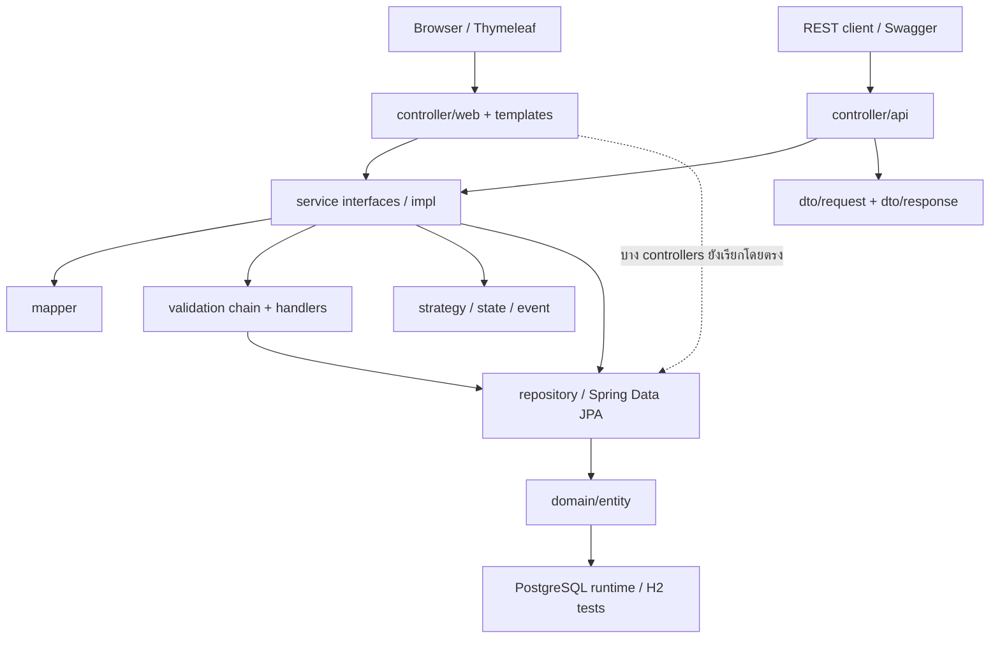
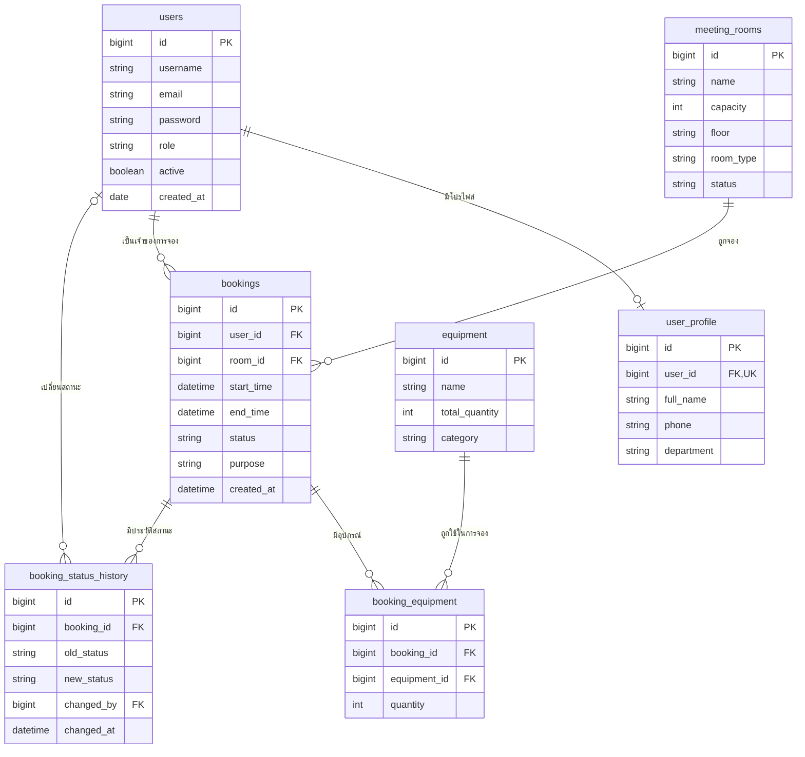

# Co-Working-Space-Equipment-Rental

ระบบจองพื้นที่ทำงานร่วมกัน ห้องประชุม และอุปกรณ์สำหรับการใช้งานในองค์กร  
สมาชิกเลือกห้อง วันเวลา และอุปกรณ์ ตรวจสอบความว่าง และติดตามสถานะการจองของตนเองได้  
เจ้าหน้าที่และผู้ดูแลจัดการห้อง อุปกรณ์ การจอง และการจองแทนผู้ใช้ ส่วนผู้ดูแลจัดการบัญชีผู้ใช้ได้  
พัฒนาด้วย Spring Boot, REST API และ Thymeleaf โดยเว็บใช้ profile `prod` กับ PostgreSQL เป็นค่าเริ่มต้น สำหรับ Railway/Aiven; H2 ใช้เฉพาะชุดทดสอบ

Repository: [BRHansol/Co-Working-Space-Equipment-Rental](https://github.com/BRHansol/Co-Working-Space-Equipment-Rental)

## สมาชิกกลุ่ม

| ลำดับ | ชื่อ-นามสกุล | รหัสนักศึกษา | Section | Branch | หน้าที่รับผิดชอบ |
| --- | --- | --- | --- | --- | --- |
| 1 | นายยุทธนา เหล่าวิสัย | 673380422-8 | 03 | `yuttana_673380422-8_03` | User & Authentication: `User`, `UserProfile` แบบ One-to-One, User Controller/Service/Repository, login และสิทธิ์ผู้ใช้, README ส่วน Tech Stack และ Installation |
| 2 | นายกฤติธี ศรีใสย์ | 673380572-9 | 04 | `krittitee_673380572-9_04` | Room & Equipment + Strategy: MeetingRoom/Equipment Controller/Service/Repository, `BookingRuleStrategy`, VIP/Standard strategies และเอกสาร SOLID ของส่วนห้อง/อุปกรณ์ |
| 3 | นายบุญปวีณ เรืองไพศาล | 673380588-4 | 03 | `boonyapaween_673380588-4_03` | Booking Core + State: `Booking`, `BookingStatus`, Booking CRUD Controller/Service/Repository, State classes/`BookingContext`, pagination และ sorting |
| 4 | นายณัฏฐชัย ผลดี | 673380581-8 | 04 | `nuttachai_673380581-8_04` | Booking Validation + Equipment Linking: `BookingEquipment`, validation handlers/chain/context แบบ Chain of Responsibility, Booking request/response DTO และ Mapper |
| 5 | นายจีรภัทร แก้วดี | 673380577-9 | 03 | `jiraphat_673380577-9_03` | Notification Observer + Infrastructure: `BookingStatusHistory`, event/listener, Global Exception Handler/`ErrorResponse`, Swagger, Docker/Compose, Cloud Deployment และ CI |

ชื่อและหน้าที่เป็นข้อมูลที่ทีมระบุ ส่วนรหัสนักศึกษาและ Section อ้างอิงจากชื่อ branches ที่พบใน Git ต้องตรวจยืนยันข้อมูลสมาชิกก่อนส่งงาน

## Tech Stack

| ส่วน | เทคโนโลยีที่ใช้ในโค้ดปัจจุบัน |
| --- | --- |
| ภาษา | Java 17 ตาม `code/pom.xml` |
| Backend | Spring Boot 4.1.1, Spring MVC |
| Build | Maven Wrapper 3.9.16 |
| Persistence | Spring Data JPA / Hibernate |
| ฐานข้อมูล | PostgreSQL สำหรับเว็บและ API; H2 in-memory เฉพาะ tests |
| Frontend | Thymeleaf, HTML, CSS และ JavaScript |
| Validation | Jakarta Bean Validation |
| Security | Spring Security, BCrypt และ session/CSRF guard สำหรับเว็บ `prod` |
| API documentation | springdoc-openapi-starter-webmvc-ui 3.1.0 |
| Testing | JUnit Jupiter 6.0.3, Mockito 5.23.0, Spring Boot Test, H2 และ Awaitility; เวอร์ชันทดสอบจัดการโดย Spring Boot BOM |
| เครื่องมืออื่น | Lombok, Git/GitHub, Dockerfile และ Compose สำหรับเชื่อม PostgreSQL ภายนอก |

## System Architecture

โค้ดแบ่ง package ตาม Presentation, Service, Repository, Domain, DTO/Mapper และส่วนสนับสนุน เว็บ Thymeleaf ใช้ Spring MVC เพื่อเรียกบริการและส่งข้อมูลเข้า views ส่วน REST controllers รับ request DTO และคืน response DTO



สถานะปัจจุบันยังไม่ผ่านข้อกำหนดห้ามข้าม layer ทั้งหมด: `AuthViewController`, `AdminViewController`, `CatalogViewController` และ `WebSessionSupport` ยังใช้ Repository โดยตรง

Patterns ที่มี implementation ในระบบ:

| Pattern | ตำแหน่งและการใช้งาน |
| --- | --- |
| MVC | `controller/web` สร้าง model ให้ Thymeleaf templates |
| Repository / Service Layer / DTO + Mapper | `repository`, `service` และ `dto`/`mapper` แยก data access, business logic และ API contract |
| Dependency Injection | Service interfaces และ constructor injection |
| Strategy | `service/strategy`: เลือกกฎจองห้อง STANDARD/VIP |
| State | `domain/state`: ควบคุมการเปลี่ยนสถานะการจอง |
| Observer | `BookingStatusChangedEvent` และ `NotificationListener` |
| Chain of Responsibility | `service/validation`: ตรวจสิทธิ์ เวลา ความว่างห้อง และจำนวนอุปกรณ์ตามลำดับ |

ห้อง STANDARD อนุมัติทันทีตาม strategy ส่วนห้อง VIP รออนุมัติ การจองใช้สถานะ `PENDING`, `APPROVED`, `REJECTED`, `CANCELLED` และ `COMPLETED`

## Database Design (ER Diagram)

ระบบมี 7 entities แผนภาพนี้อ้างอิง JPA mappings ใน `domain/entity`; ชื่อคอลัมน์ของ properties ที่ไม่ได้ระบุ `@Column` ใช้ naming strategy ของ Hibernate มี full-schema bootstrap สำหรับ PostgreSQL และ runtime ใช้ `ddl-auto=validate` เพื่อตรวจความตรงกันของ schema โดยไม่ปรับตารางอัตโนมัติ



- `User`–`UserProfile` เป็น One-to-One โดย `user_profile.user_id` เป็น unique FK
- ผู้ใช้/ห้องมีหลายการจอง และการจองมีหลายรายการอุปกรณ์/ประวัติสถานะ
- `BookingEquipment` เป็น associative entity เชื่อม Booking กับ Equipment และเก็บจำนวนที่ขอใช้
- Booking ใช้ cascade/orphan removal สำหรับรายการอุปกรณ์ และมี index สำหรับห้อง/ช่วงเวลา/ผู้ใช้

### SQL สำหรับ PostgreSQL และขอบเขตสมาชิกคนที่ 4

ใช้ [full schema](code/src/main/resources/db/postgresql/schema.sql) สำหรับ **ฐานข้อมูล PostgreSQL/Aiven ที่ว่าง** ไฟล์นี้สร้างทั้ง 7 ตาราง, foreign keys, enum/quantity checks และ indexes โดยไม่มีบัญชีหรือข้อมูลทดลอง ต้องรันด้วย `psql` แยกก่อนเปิดแอป แล้ว runtime ใช้ `spring.jpa.hibernate.ddl-auto=validate` และ `spring.sql.init.mode=never` ขั้นตอนและ SSL อยู่ใน [HOWTORUN.md](HOWTORUN.md)

`CREATE TABLE IF NOT EXISTS` ช่วยให้รันซ้ำโดยคงข้อมูลเดิม แต่ไม่ได้แก้ columns/constraints ของตารางที่มีอยู่แล้ว หากฐานข้อมูลเดิมไม่ตรง Entity ต้องตรวจและเตรียม migration แยก ห้ามถือว่า full schema ซ่อมข้อมูลเก่าให้เอง

[schema ของสมาชิกคนที่ 4](code/src/main/resources/db/nuttachai_673380581-8_04/schema.sql) เป็น manual upgrade เฉพาะ `booking_equipment` ต้องมี parent tables `bookings(id)` กับ `equipment(id)` ก่อน โดยคง positive quantity CHECK และ indexes ธรรมดา ไม่เพิ่ม UNIQUE คู่ booking/equipment เพราะกระทบการแทนที่รายการของ service

[data.sql ของสมาชิกคนที่ 4](code/src/main/resources/db/nuttachai_673380581-8_04/data.sql) และ [fixture สำหรับ SQL tests](code/src/test/resources/db/nuttachai_673380581-8_04/data.sql) เป็นข้อมูล fixture สำหรับฐานข้อมูลทดสอบแยกเท่านั้น ไม่ต้องรันเพื่อ deploy จริง และไม่สร้าง parent rows หรือสมมติ IDs หากไม่พบ parent fixtures ที่ตรงเงื่อนไขจะไม่เพิ่มแถว ไม่มี Flyway/Liquibase ที่รัน migration ให้อัตโนมัติ

## Installation & Setup

### สิ่งที่ต้องเตรียม

- JDK 17 และตั้ง `JAVA_HOME`/`PATH` ให้ Terminal เรียก `java` กับ `javac` ได้
- Git และอินเทอร์เน็ตสำหรับดาวน์โหลด Maven/dependencies ครั้งแรก ไม่ต้องติดตั้ง Maven แยก
- PostgreSQL หรือ Aiven for PostgreSQL พร้อมสิทธิ์เตรียม schema; เว็บและ API ต้องมี `DB_URL`, `DB_USERNAME`, `DB_PASSWORD`
- PostgreSQL client (`psql`) สำหรับรัน full-schema bootstrap และบัญชี Railway สำหรับขั้นตอน deployment

Clone repository แล้วเข้าโฟลเดอร์ที่มี `pom.xml`:

```powershell
git clone https://github.com/BRHansol/Co-Working-Space-Equipment-Rental.git
Set-Location -LiteralPath '.\Co-Working-Space-Equipment-Rental\code'
java -version
javac -version
.\mvnw.cmd --version
```

หากใช้ CMD:

```bat
git clone https://github.com/BRHansol/Co-Working-Space-Equipment-Rental.git
cd Co-Working-Space-Equipment-Rental\code
java -version
javac -version
mvnw.cmd --version
```

คำสั่ง Maven หลังจากนี้รันจาก `code/` เสมอ หากมีโปรเจกต์อยู่แล้ว ให้เข้า `code/` ของ checkout ที่ทีมตกลงใช้งาน โดยไม่ clone ซ้ำ ตัวอย่าง clone รับ default branch; หากทีมส่งงานบน branch อื่น ต้องเลือก branch/version ที่มีโค้ดชุดเดียวกับ README นี้ก่อนรัน

## How to Run

### เว็บ production: profile `prod`

ค่าเริ่มต้นคือ `prod` ซึ่งรวม `web,postgres` ใช้ Thymeleaf, session, role guards และ CSRF กับ PostgreSQL; profile `local`/`local-postgres` และ H2 แบบไฟล์ไม่ได้ใช้ใน runtime แล้ว

| Environment | ค่าที่ต้องเตรียม |
| --- | --- |
| `DB_URL` | JDBC URL ของ Aiven เช่น `jdbc:postgresql://YOUR_AIVEN_HOST:YOUR_AIVEN_PORT/YOUR_DATABASE?sslmode=require` |
| `DB_USERNAME` | ผู้ใช้ฐานข้อมูลจาก Aiven |
| `DB_PASSWORD` | รหัสผ่านฐานข้อมูล ตั้งผ่าน environment/Variables ของ service |
| `PORT` | Railway กำหนดให้; หากไม่กำหนดใช้ 8080 |
| `SPRING_PROFILES_ACTIVE` | ไม่จำเป็นเมื่อใช้ค่าเริ่มต้น; ตั้ง `prod` ได้เพื่อระบุชัดเจน |

ไม่มี fallback ไปฐานข้อมูล localhost เมื่อไม่ตั้งค่า DB แอปจะเริ่มไม่ได้ ให้เตรียม full schema ก่อนเริ่มเว็บ แอปรับที่ `0.0.0.0` และใช้ secure/HttpOnly/SameSite=Lax session cookie พร้อมรองรับ forwarded headers จาก proxy จึงต้องเข้าเว็บผ่าน HTTPS เพื่อใช้ login/session

เมื่อกำหนด environment และเตรียมฐานข้อมูลแล้ว รันจาก `code/`:

```powershell
.\mvnw.cmd spring-boot:run "-Dspring-boot.run.profiles=prod"
```

```sh
sh ./mvnw spring-boot:run -Dspring-boot.run.profiles=prod
```

เว็บ production ไม่มี demo accounts, rooms หรือ equipment สมัครผ่าน `/register` จะได้ role `USER` การเตรียม ADMIN คนแรกทำโดยผู้ดูแลผ่าน DB console หลังตรวจบัญชีเป้าหมายตาม [HOWTORUN.md](HOWTORUN.md) จากนั้นใช้ `/admin` จัดการห้อง อุปกรณ์และผู้ใช้

ดูขั้นตอน [เตรียม Aiven, SSL, Railway และ Docker Compose](HOWTORUN.md) โดย Compose ใช้ PostgreSQL ภายนอกผ่าน environment ไม่สร้าง PostgreSQL service หรือ H2 ให้เอง

### โหมด API แยก: profile `api`

`api` รวม `postgres` และใช้ DB environment/schema เดียวกัน ใช้สำหรับ API integration/testing ของ backend โดยไม่เปิด Thymeleaf web controllers:

```powershell
.\mvnw.cmd spring-boot:run "-Dspring-boot.run.profiles=api"
```

การยืนยันตัวตนของ API ยังเป็น contract เดิมตามหัวข้อถัดไป ไม่ควรเปิด API service นี้เป็น production สาธารณะโดยอ้างว่ามี authentication สมบูรณ์ ส่วนเว็บ `prod` ปิด `/api/**` ด้วย HTTP 403

## API Documentation

เมื่อเลือก profile `api` สามารถตรวจ `/swagger-ui.html` และ `/v3/api-docs` บน URL ของ service ที่ตนรันได้ เว็บ `prod` ปิด API และ Swagger/OpenAPI; รายการ endpoints ต่อไปนี้อธิบาย backend contract สำหรับ integration/testing ไม่ใช่ public API ที่ยืนยัน deployment แล้ว

| Method | Endpoint | หน้าที่ / success status |
| --- | --- | --- |
| POST | `/api/v1/users` | สร้างผู้ใช้และโปรไฟล์ — 201 |
| GET | `/api/v1/users` | รายการผู้ใช้แบบแบ่งหน้า — 200 |
| GET | `/api/v1/users/{id}` | รายละเอียดผู้ใช้ — 200 |
| PUT | `/api/v1/users/{id}` | แก้ผู้ใช้ — 200 |
| DELETE | `/api/v1/users/{id}` | ลบผู้ใช้ — 204 |
| POST | `/api/v1/rooms` | สร้างห้อง — 201 |
| GET | `/api/v1/rooms` | รายการห้องแบบแบ่งหน้า/เรียงลำดับ — 200 |
| GET | `/api/v1/rooms/{id}` | รายละเอียดห้อง — 200 |
| PUT | `/api/v1/rooms/{id}` | แก้ห้อง — 200 |
| DELETE | `/api/v1/rooms/{id}` | ลบห้อง — 204 |
| POST | `/api/v1/equipments` | สร้างอุปกรณ์ — 201 |
| GET | `/api/v1/equipments` | รายการอุปกรณ์แบบแบ่งหน้า/เรียงลำดับ — 200 |
| GET | `/api/v1/equipments/{id}` | รายละเอียดอุปกรณ์ — 200 |
| PUT | `/api/v1/equipments/{id}` | แก้อุปกรณ์ — 200 |
| DELETE | `/api/v1/equipments/{id}` | ลบอุปกรณ์ — 204 |
| POST | `/api/v1/bookings` | สร้างการจอง — 201 |
| GET | `/api/v1/bookings/{id}` | รายละเอียดการจอง — 200 |
| GET | `/api/v1/rooms/{roomId}/bookings` | การจองของห้องแบบแบ่งหน้า/เรียงลำดับ — 200 |
| GET | `/api/v1/users/{userId}/bookings` | การจองของผู้ใช้แบบแบ่งหน้า/เรียงลำดับ — 200 |
| PUT | `/api/v1/bookings/{id}` | แก้การจอง — 200 |
| PATCH | `/api/v1/bookings/{id}/status` | เปลี่ยนสถานะ เช่น `{"status":"APPROVED"}` — 200 |

ตัวอย่าง pagination/sorting: `GET /api/v1/rooms?page=0&size=10&sort=name,asc` และ `GET /api/v1/rooms/1/bookings?page=0&size=10&sort=startTime,desc` ส่วน users รองรับ page/size แต่ implementation ปัจจุบันเรียง `id,desc` เสมอ

POST/PUT/PATCH ของ bookings ใช้ header `X-User-Id` เป็น ID ผู้ดำเนินการ ตัวอย่าง request body โดยต้องแทน IDs ด้วยข้อมูลที่มีจริงในฐานข้อมูล:

```json
{
  "roomId": 1,
  "startTime": "2026-11-01T09:00:00",
  "endTime": "2026-11-01T10:00:00",
  "purpose": "ประชุมทีม",
  "equipmentItems": [
    { "equipmentId": 1, "quantity": 2 }
  ]
}
```

`equipmentItems` เว้นได้หากไม่ใช้อุปกรณ์ แต่รายการที่ส่งต้องมี equipment ID และ quantity เป็นจำนวนบวก วัตถุประสงค์ยาวได้ไม่เกิน 255 ตัวอักษร `bookingForUserId` ใช้สำหรับการจองแทนตามสิทธิ์ ส่วน `bookingId` เป็นข้อมูลที่ service ควบคุมเมื่อแก้การจอง

Global Exception Handler คืน `ErrorResponse` ที่มี `timestamp`, `status`, `error`, `message`, `path`, `details` สำหรับ validation/not found/conflict/server errors ส่วน header interceptor ยังมี error JSON แบบ `error`/`message` แยกต่างหาก

Authentication ฝั่ง REST ยังเป็น contract เดิม: `api` ใช้ `permitAll` และ booking รับ `X-User-Id` ที่ client ส่งเอง โดยไม่มี Basic/JWT validation จริง ใช้สำหรับ integration/testing ในขอบเขตที่ควบคุมการเข้าถึงเท่านั้น เว็บ `prod` ปิด `/api/**` จึงไม่ใช้ header นี้ข้าม session/role/CSRF guards

## How to Run Tests

รันจาก `code/` โดยใช้ test configuration ใน `src/test/resources` ซึ่งกำหนด H2 in-memory แยกจาก PostgreSQL/Aiven ไม่ต้องเตรียม cloud DB เพื่อรันชุดนี้ และไม่ต้องใส่ profile runtime `prod` หรือ `api` เพิ่มเอง

### ชุดรวมที่ Maven ตรวจพบ

```powershell
.\mvnw.cmd test
```

```sh
sh ./mvnw test
```

คำสั่งปกติรวม tests จาก `code/src/test/java` และ `test/{branch}/java` ของ `nuttachai_673380581-8_04`, `krittitee_673380572-9_04` และ `jiraphat_673380577-9_03` ผ่าน build-helper รายงานอยู่ที่ `code/target/surefire-reports/`

### ชุดเฉพาะสมาชิกคนที่ 4

```powershell
.\mvnw.cmd -Pnuttachai_673380581-8_04 test
```

Profile นี้ใช้ `test/nuttachai_673380581-8_04/java` แยก test classes ไป `code/target/nuttachai_673380581-8_04-test-classes/` และรายงานไป `code/target/nuttachai_673380581-8_04-surefire-reports/` โดยไม่เพิ่ม test sources ของสมาชิกอื่น

| Test class | ขอบเขต |
| --- | --- |
| `BookingValidationTest` | Chain/context และ validation handlers |
| `BookingCreateRequestTest` | Bean Validation ของ Booking request/รายการอุปกรณ์ |
| `BookingMapperTest` | การแปลง Booking request/entity/response |
| `BookingEquipmentRepositoryTest` | Entity/repository และข้อจำกัดตารางเชื่อมด้วย H2 |
| `BookingEquipmentSqlTest` | Manual schema/data scripts ด้วย H2 |
| `PostgresqlSchemaTest` | Full-schema bootstrap, FK/check/nullability, การรันซ้ำและ JPA schema validation |

จำนวน tests และผลผ่านให้อ้างอิง Surefire reports จากการรันล่าสุด การทดสอบด้วย H2/Mockito ไม่ยืนยันการเชื่อม Aiven หรือการเปิดเว็บบน Railway

## Deployment URL

ยังไม่มี public URL ที่ยืนยันจาก deployment ในเอกสารนี้ หลัง deploy และตรวจ login/roles/CSRF/การบันทึก booking บน Railway จริงแล้ว จึงบันทึก URL และผลตรวจ ขั้นตอนอยู่ใน [HOWTORUN.md](HOWTORUN.md)

Railway ใช้ Root Directory `code`, Dockerfile build และ Variables ของ Aiven; ให้ Generate Domain เพื่อเข้าผ่าน HTTPS แอปไม่สร้าง schema หรือ seed demo data ระหว่าง startup

GitHub Actions ปัจจุบันมี build/test และ Render Deploy Hooks ของทีม การเตรียม profile `prod` ไม่ได้เปลี่ยน workflow นี้เป็น Railway deploy อัตโนมัติ ต้องตั้ง Railway service แยกให้ใช้โค้ดเวอร์ชันที่ทีมเลือก ไม่มีคำสั่ง commit/push อัตโนมัติในคู่มือนี้

## Project Structure

```text
Co-Working-Space-Equipment-Rental/
├── README.md / HOWTORUN.md
├── code/
│   ├── pom.xml
│   ├── mvnw / mvnw.cmd / .mvn/wrapper/
│   ├── Dockerfile / docker-compose.yml
│   └── src/
│       ├── main/
│       │   ├── java/com/example/roombooking/
│       │   │   ├── controller/api/ / controller/web/
│       │   │   ├── service/impl/ / service/strategy/ / service/validation/
│       │   │   ├── repository/ / domain/entity/ / domain/enums/ / domain/state/
│       │   │   ├── dto/request/ / dto/response/ / mapper/ / event/
│       │   │   └── config/ / exception/ / common/
│       │   └── resources/
│       │       ├── application.properties
│       │       ├── application-web.properties / application-postgres.properties
│       │       ├── db/postgresql/schema.sql
│       │       ├── db/nuttachai_673380581-8_04/  # Scoped manual SQL / isolated fixture
│       │       └── templates/
│       │           ├── account/ / admin/ / auth/ / bookings/
│       │           ├── rooms/ / equipment/ / pages/ / fragments/ / common/
│       │           └── assets/css/ / assets/js/ / assets/img/
│       └── test/
│           ├── java/                          # Default Maven test sources / test fixtures
│           └── resources/                     # H2 test config / SQL fixtures
├── test/
│   ├── nuttachai_673380581-8_04/java/
│   ├── krittitee_673380572-9_04/java/
│   └── jiraphat_673380577-9_03/java/
├── doc/                                       # เอกสารและ diagrams ของทีม
├── img/                                       # โฟลเดอร์มัลติมีเดียตามใบงาน
└── .github/workflows/                         # CI/CD workflow ของทีม
```

Assets ของเว็บอยู่ใน `code/src/main/resources/templates/assets/` และถูก map เป็น `/assets/**` ด้วย `WebAssetsConfig` ไม่ได้โหลดจาก root `img/` ต้องตรวจเอกสาร/diagrams และสื่อที่ส่งจริงใน `doc/` และ `img/` ตามหัวข้อของใบงาน ไม่ถือว่าเอกสารครบจากการมีโฟลเดอร์เพียงอย่างเดียว
