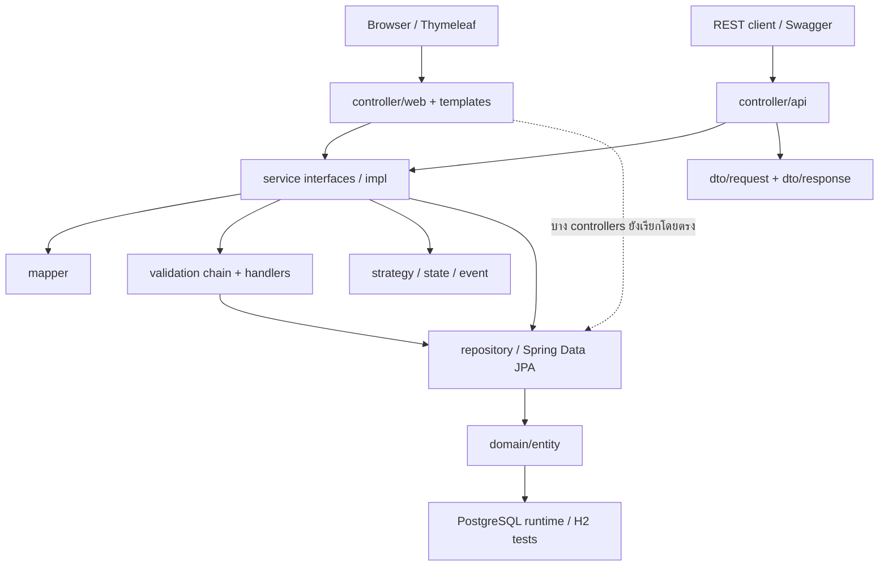
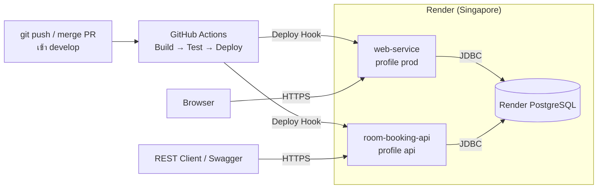
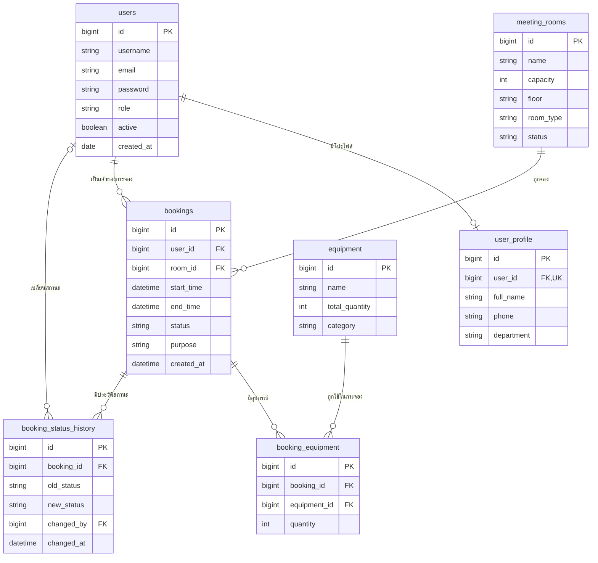

# Co-Working-Space-Equipment-Rental

ระบบจองพื้นที่ทำงานร่วมกัน ห้องประชุม และอุปกรณ์สำหรับการใช้งานในองค์กร
สมาชิกค้นหาห้องตามจำนวนคน วันเวลา และอุปกรณ์ ตรวจสอบความว่าง จอง และติดตามสถานะการจองของตนเองได้
เจ้าหน้าที่ (STAFF) และผู้ดูแล (ADMIN) อนุมัติ/ปฏิเสธการจอง จัดการห้อง อุปกรณ์ และจองแทนผู้ใช้ ส่วน ADMIN จัดการบัญชีผู้ใช้ได้

พัฒนาด้วย Spring Boot 4, Thymeleaf และ REST API บนฐานข้อมูล PostgreSQL ติดตั้งใช้งานจริงบน Render ผ่าน CI/CD ของ GitHub Actions

Repository: [BRHansol/Co-Working-Space-Equipment-Rental](https://github.com/BRHansol/Co-Working-Space-Equipment-Rental)

## ระบบที่ใช้งานจริง (Deployment URL)
1.
| | URL |
| --- | --- |
| หน้าเว็บ | https://web-service-m1fz.onrender.com |
| REST API | https://room-booking-api-k47v.onrender.com/api/v1/rooms |
| Swagger UI | https://room-booking-api-k47v.onrender.com/swagger-ui.html |
2.
| | URL |
| --- | --- |
| หน้าเว็บ |  |
| REST API |  |
| Swagger UI |  |

Render แบบฟรีจะหยุด service เมื่อไม่มีการใช้งานประมาณ 15 นาที การเปิดครั้งแรกหลังจากนั้นใช้เวลาประมาณ 30–60 วินาที

## สมาชิกกลุ่ม

| ลำดับ | ชื่อ-นามสกุล | รหัสนักศึกษา | Section | Branch | หน้าที่รับผิดชอบ |
| --- | --- | --- | --- | --- | --- |
| 1 | นายยุทธนา เหล่าวิสัย | 673380422-8 | 03 | `yuttana_673380422-8_03` | User & Authentication: `User`, `UserProfile` แบบ One-to-One, User Controller/Service/Repository, login และสิทธิ์ผู้ใช้, README ส่วน Tech Stack และ Installation |
| 2 | นายกฤติธี ศรีใสย์ | 673380572-9 | 04 | `krittitee_673380572-9_04` | Room & Equipment + Strategy: MeetingRoom/Equipment Controller/Service/Repository, `BookingRuleStrategy`, VIP/Standard strategies และเอกสาร SOLID ของส่วนห้อง/อุปกรณ์ |
| 3 | นายบุญปวีณ เรืองไพศาล | 673380588-4 | 03 | `boonyapaween_673380588-4_03` | Booking Core + State: `Booking`, `BookingStatus`, Booking CRUD Controller/Service/Repository, State classes/`BookingContext`, pagination และ sorting |
| 4 | นายณัฏฐชัย ผลดี | 673380581-8 | 04 | `nuttachai_673380581-8_04` | Booking Validation + Equipment Linking: `BookingEquipment`, validation handlers/chain/context แบบ Chain of Responsibility, Booking request/response DTO และ Mapper |
| 5 | นายจีรภัทร แก้วดี | 673380577-9 | 03 | `jiraphat_673380577-9_03` | Notification Observer + Infrastructure: `BookingStatusHistory`, event/listener, Global Exception Handler/`ErrorResponse`, Swagger, Docker/Compose, Cloud Deployment และ CI |

## Tech Stack

| ส่วน | เทคโนโลยีที่ใช้ในโค้ดปัจจุบัน |
| --- | --- |
| ภาษา | Java 17 ตาม `code/pom.xml` |
| Backend | Spring Boot 4.1.1, Spring MVC |
| Build | Maven Wrapper 3.9.16 |
| Persistence | Spring Data JPA / Hibernate |
| ฐานข้อมูล | PostgreSQL สำหรับเว็บและ API; H2 in-memory เฉพาะ tests |
| Frontend | Thymeleaf, HTML, CSS และ JavaScript |
| Validation | Jakarta Bean Validation |
| Security | Spring Security, BCrypt และ session/CSRF guard สำหรับเว็บ `prod` |
| API documentation | springdoc-openapi-starter-webmvc-ui 3.1.0 |
| Testing | JUnit Jupiter 6.0.3, Mockito 5.23.0, Spring Boot Test, H2 และ Awaitility; เวอร์ชันทดสอบจัดการโดย Spring Boot BOM |
| เครื่องมืออื่น | Lombok, Git/GitHub |
| CI/CD | GitHub Actions: Build → Test → Deploy (Render Deploy Hook) |
| Deployment | Docker (multi-stage build), Render Web Service × 2 และ Render PostgreSQL |

## System Architecture

โค้ดแบ่ง package ตาม Presentation, Service, Repository, Domain, DTO/Mapper และส่วนสนับสนุน เว็บ Thymeleaf ใช้ Spring MVC เพื่อเรียกบริการและส่งข้อมูลเข้า views ส่วน REST controllers รับ request DTO และคืน response DTO



สถานะปัจจุบันยังไม่ผ่านข้อกำหนดห้ามข้าม layer ทั้งหมด: `AuthViewController`, `AdminViewController`, `CatalogViewController` และ `WebSessionSupport` ยังใช้ Repository โดยตรง

Patterns ที่มี implementation ในระบบ:

| Pattern | ตำแหน่งและการใช้งาน |
| --- | --- |
| MVC | `controller/web` สร้าง model ให้ Thymeleaf templates |
| Repository / Service Layer / DTO + Mapper | `repository`, `service` และ `dto`/`mapper` แยก data access, business logic และ API contract |
| Dependency Injection | Service interfaces และ constructor injection |
| Strategy | `service/strategy`: เลือกกฎจองห้อง STANDARD/VIP |
| State | `domain/state`: ควบคุมการเปลี่ยนสถานะการจอง |
| Observer | `BookingStatusChangedEvent` และ `NotificationListener` |
| Chain of Responsibility | `service/validation`: ตรวจสิทธิ์ เวลา ความว่างห้อง และจำนวนอุปกรณ์ตามลำดับ |

ห้อง STANDARD อนุมัติทันทีตาม strategy ส่วนห้อง VIP รออนุมัติ การจองใช้สถานะ `PENDING`, `APPROVED`, `REJECTED`, `CANCELLED` และ `COMPLETED`

### Deployment Architecture

แอปตัวเดียวกันถูก deploy เป็น 2 service ที่ใช้ฐานข้อมูลเดียวกัน แยกกันด้วย Spring profile

| Service | Profile | เปิดอะไร |
| --- | --- | --- |
| `web-service` | `prod` (= `web` + `postgres`, ค่าเริ่มต้น) | หน้าเว็บ Thymeleaf, login/session, สิทธิ์ USER/STAFF/ADMIN, CSRF และปิด `/api/**` ด้วย 403 |
| `room-booking-api` | `api` (= `postgres`) | REST API `/api/v1/**` และ Swagger UI |

ที่ต้องแยกเพราะ REST API ระบุผู้ใช้ด้วย header `X-User-Id` ที่ client ส่งเอง ถ้าเปิดบน service เดียวกับหน้าเว็บ จะใช้ API ข้ามการตรวจสิทธิ์ของหน้าเว็บได้



รายละเอียด Component/Deployment Diagram, ตารางเครือข่าย และสเปกเครื่องอยู่ที่ [doc/jiraphat_673380577-9_03/diagrams/component-deployment-diagram.md](doc/jiraphat_673380577-9_03/diagrams/component-deployment-diagram.md)

## Database Design (ER Diagram)

ระบบมี 7 entities แผนภาพนี้อ้างอิง JPA mappings ใน `domain/entity`; ชื่อคอลัมน์ของ properties ที่ไม่ได้ระบุ `@Column` ใช้ naming strategy ของ Hibernate มี full-schema bootstrap สำหรับ PostgreSQL และ runtime ใช้ `ddl-auto=validate` เพื่อตรวจความตรงกันของ schema โดยไม่ปรับตารางอัตโนมัติ



- `User`–`UserProfile` เป็น One-to-One โดย `user_profile.user_id` เป็น unique FK
- ผู้ใช้/ห้องมีหลายการจอง และการจองมีหลายรายการอุปกรณ์/ประวัติสถานะ
- `BookingEquipment` เป็น associative entity เชื่อม Booking กับ Equipment และเก็บจำนวนที่ขอใช้
- Booking ใช้ cascade/orphan removal สำหรับรายการอุปกรณ์ และมี index สำหรับห้อง/ช่วงเวลา/ผู้ใช้
- `BookingStatusHistory` บันทึกโดย Observer ทุกครั้งที่สถานะการจองเปลี่ยน (`changed_by` เว้นว่างได้เมื่อระบบเปลี่ยนเอง, `changed_at` เติมด้วย JPA Auditing)

### SQL สำหรับ PostgreSQL

ใช้ [full schema](code/src/main/resources/db/postgresql/schema.sql) สร้างตารางในฐานข้อมูลที่ว่าง ไฟล์นี้สร้างทั้ง 7 ตาราง, foreign keys, CHECK ของค่า enum/จำนวน และ indexes โดยไม่มีบัญชีหรือข้อมูลทดลอง ต้องรันด้วย `psql` ก่อนเปิดแอปครั้งแรก เพราะ runtime ใช้ `spring.jpa.hibernate.ddl-auto=validate` (ตรวจว่าตารางตรงกับ Entity เท่านั้น ไม่แก้ตารางเอง) และ `spring.sql.init.mode=never`

`CREATE TABLE IF NOT EXISTS` ทำให้รันซ้ำได้โดยข้อมูลเดิมไม่หาย แต่ไม่ได้แก้ columns/constraints ของตารางที่มีอยู่แล้ว

[schema ของสมาชิกคนที่ 4](code/src/main/resources/db/nuttachai_673380581-8_04/schema.sql) เป็น manual upgrade เฉพาะ `booking_equipment` ส่วน [data.sql](code/src/main/resources/db/nuttachai_673380581-8_04/data.sql) และ [fixture สำหรับ SQL tests](code/src/test/resources/db/nuttachai_673380581-8_04/data.sql) เป็นข้อมูลสำหรับฐานข้อมูลทดสอบเท่านั้น ไม่ต้องรันเพื่อ deploy จริง

## Installation & Setup

### สิ่งที่ต้องเตรียม

- JDK 17 ขึ้นไป (`java -version`) ไม่ต้องติดตั้ง Maven เพราะมี Maven Wrapper
- Git
- Docker Desktop สำหรับเปิด PostgreSQL บนเครื่อง (หรือ PostgreSQL ที่มีอยู่แล้ว)

```powershell
git clone https://github.com/BRHansol/Co-Working-Space-Equipment-Rental.git
cd Co-Working-Space-Equipment-Rental
git checkout develop
```

### เตรียมฐานข้อมูลบนเครื่อง (ครั้งแรกครั้งเดียว)

```powershell
docker run -d --name room-booking-db `
  -e POSTGRES_USER=postgres -e POSTGRES_PASSWORD=postgres -e POSTGRES_DB=room_booking `
  -p 5432:5432 postgres:15-alpine

Get-Content code\src\main\resources\db\postgresql\schema.sql | docker exec -i room-booking-db psql -U postgres -d room_booking -v ON_ERROR_STOP=1
```

macOS/Linux ใช้ `docker exec -i room-booking-db psql -U postgres -d room_booking -v ON_ERROR_STOP=1 < code/src/main/resources/db/postgresql/schema.sql`

### ตั้งค่าการเชื่อมต่อ

แอปอ่านค่าจาก environment variables หรือไฟล์ `code/.env` (ดูตัวอย่างที่ [code/.env.example](code/.env.example); ไฟล์ `.env` ถูก gitignore ไว้ ห้าม commit)

| ตัวแปร | ตัวอย่างบนเครื่อง |
| --- | --- |
| `DB_URL` | `jdbc:postgresql://localhost:5432/room_booking` |
| `DB_USERNAME` | `postgres` |
| `DB_PASSWORD` | `postgres` |
| `SESSION_COOKIE_SECURE` | `false` (เฉพาะบนเครื่อง เพราะ `http://localhost` ไม่ใช่ HTTPS ถ้าไม่ตั้ง login แล้วจะหลุด) |

## How to Run

รันจากโฟลเดอร์ `code/`

### หน้าเว็บ: profile `prod` (ค่าเริ่มต้น) ที่ http://localhost:8080

```powershell
.\mvnw.cmd spring-boot:run
```

### REST API + Swagger: profile `api` ที่ http://localhost:8081/swagger-ui.html

```powershell
$env:PORT = "8081"
.\mvnw.cmd spring-boot:run "-Dspring-boot.run.profiles=api"
```

macOS/Linux ใช้ `./mvnw` แทน `.\mvnw.cmd` รันทั้งสองโหมดพร้อมกันได้ (ใช้ฐานข้อมูลเดียวกัน)

### Docker Compose

```powershell
docker compose up --build
```

[code/docker-compose.yml](code/docker-compose.yml) build image จาก [Dockerfile](code/Dockerfile) (multi-stage: Maven build → JRE 17 alpine, รันด้วย user ที่ไม่ใช่ root) แล้วรันหน้าเว็บ profile `prod` โดยเชื่อมกับ PostgreSQL ภายนอกผ่าน `DB_URL`, `DB_USERNAME`, `DB_PASSWORD` (จาก PostgreSQL บนเครื่องใน container ให้ใช้ host `host.docker.internal` แทน `localhost`)

### เตรียมบัญชีและข้อมูลเริ่มต้น

ระบบไม่สร้างบัญชี ห้อง หรืออุปกรณ์ตัวอย่างให้

1. สร้างบัญชี ADMIN ผ่าน Swagger `POST /api/v1/users` ด้วย `"role": "ADMIN"` หรือสมัครที่ `/register` (ได้ role `USER`) แล้วเลื่อน role ในฐานข้อมูล: `UPDATE users SET role = 'ADMIN' WHERE username = '...';`
2. login เป็น ADMIN แล้วเพิ่มห้องและอุปกรณ์ที่ `/admin` (หรือ `POST /api/v1/rooms`, `POST /api/v1/equipments`)
3. ห้อง `STANDARD` อนุมัติการจองทันที ห้อง `VIP` รอ STAFF/ADMIN อนุมัติ

คู่มือละเอียด (รวมการ deploy บน Render และแก้ปัญหาที่พบบ่อย) อยู่ที่ [doc/jiraphat_673380577-9_03/HOWTORUN.md](doc/jiraphat_673380577-9_03/HOWTORUN.md)

## API Documentation

Swagger UI: https://room-booking-api-k47v.onrender.com/swagger-ui.html และ OpenAPI JSON: `/v3/api-docs` (เปิดเฉพาะ profile `api`)

| Method | Endpoint | หน้าที่ / success status |
| --- | --- | --- |
| POST | `/api/v1/users` | สร้างผู้ใช้และโปรไฟล์ — 201 |
| GET | `/api/v1/users` | รายการผู้ใช้แบบแบ่งหน้า — 200 |
| GET | `/api/v1/users/{id}` | รายละเอียดผู้ใช้ — 200 |
| PUT | `/api/v1/users/{id}` | แก้ผู้ใช้ — 200 |
| DELETE | `/api/v1/users/{id}` | ลบผู้ใช้ — 204 |
| POST | `/api/v1/rooms` | สร้างห้อง — 201 |
| GET | `/api/v1/rooms` | รายการห้องแบบแบ่งหน้า/เรียงลำดับ — 200 |
| GET | `/api/v1/rooms/{id}` | รายละเอียดห้อง — 200 |
| PUT | `/api/v1/rooms/{id}` | แก้ห้อง — 200 |
| DELETE | `/api/v1/rooms/{id}` | ลบห้อง — 204 |
| POST | `/api/v1/equipments` | สร้างอุปกรณ์ — 201 |
| GET | `/api/v1/equipments` | รายการอุปกรณ์แบบแบ่งหน้า/เรียงลำดับ — 200 |
| GET | `/api/v1/equipments/{id}` | รายละเอียดอุปกรณ์ — 200 |
| PUT | `/api/v1/equipments/{id}` | แก้อุปกรณ์ — 200 |
| DELETE | `/api/v1/equipments/{id}` | ลบอุปกรณ์ — 204 |
| POST | `/api/v1/bookings` | สร้างการจอง — 201 |
| GET | `/api/v1/bookings/{id}` | รายละเอียดการจอง — 200 |
| GET | `/api/v1/rooms/{roomId}/bookings` | การจองของห้องแบบแบ่งหน้า/เรียงลำดับ — 200 |
| GET | `/api/v1/users/{userId}/bookings` | การจองของผู้ใช้แบบแบ่งหน้า/เรียงลำดับ — 200 |
| PUT | `/api/v1/bookings/{id}` | แก้การจอง — 200 |
| PATCH | `/api/v1/bookings/{id}/status` | เปลี่ยนสถานะ เช่น `{"status":"APPROVED"}` — 200 |
| GET | `/api/v1/bookings/{id}/status-history` | ประวัติการเปลี่ยนสถานะ (บันทึกโดย Observer) เรียงจากล่าสุด — 200 |

ตัวอย่าง pagination/sorting: `GET /api/v1/rooms?page=0&size=10&sort=name,asc` และ `GET /api/v1/rooms/1/bookings?page=0&size=10&sort=startTime,desc` ส่วน users รองรับ page/size แต่ implementation ปัจจุบันเรียง `id,desc` เสมอ

POST/PUT/PATCH ของ bookings ใช้ header `X-User-Id` เป็น ID ผู้ดำเนินการ ตัวอย่าง request body โดยต้องแทน IDs ด้วยข้อมูลที่มีจริงในฐานข้อมูล:

```json
{
  "roomId": 1,
  "startTime": "2026-11-01T09:00:00",
  "endTime": "2026-11-01T10:00:00",
  "purpose": "ประชุมทีม",
  "equipmentItems": [
    { "equipmentId": 1, "quantity": 2 }
  ]
}
```

`equipmentItems` เว้นได้หากไม่ใช้อุปกรณ์ แต่รายการที่ส่งต้องมี equipment ID และ quantity เป็นจำนวนบวก วัตถุประสงค์ยาวได้ไม่เกิน 255 ตัวอักษร `bookingForUserId` ใช้สำหรับการจองแทนตามสิทธิ์ ส่วน `bookingId` เป็นข้อมูลที่ service ควบคุมเมื่อแก้การจอง

Global Exception Handler คืน `ErrorResponse` ที่มี `timestamp`, `status`, `error`, `message`, `path`, `details` สำหรับ validation/not found/conflict/server errors ส่วน header interceptor ยังมี error JSON แบบ `error`/`message` แยกต่างหาก

Authentication ฝั่ง REST ยังเป็น contract เดิม: `api` ใช้ `permitAll` และ booking รับ `X-User-Id` ที่ client ส่งเอง โดยไม่มี Basic/JWT validation จริง ใช้สำหรับ integration/testing ในขอบเขตที่ควบคุมการเข้าถึงเท่านั้น เว็บ `prod` ปิด `/api/**` จึงไม่ใช้ header นี้ข้าม session/role/CSRF guards
รายละเอียด exception → HTTP status ทั้งหมดอยู่ที่ [doc/jiraphat_673380577-9_03/error-handling.md](doc/jiraphat_673380577-9_03/error-handling.md)

## How to Run Tests

test ใช้ H2 in-memory (`code/src/test/resources/application.properties`) ไม่ต้องมี PostgreSQL

```powershell
.\mvnw.cmd clean test
```

คำสั่งนี้รวม tests จาก `code/src/test/java` และ `test/{branch}/java` ของ `nuttachai_673380581-8_04`, `krittitee_673380572-9_04` และ `jiraphat_673380577-9_03` ผ่าน `build-helper-maven-plugin` ผลล่าสุด: **233 tests ผ่านทั้งหมด** (JUnit 5, Mockito, Spring Boot Test: `@SpringBootTest`, `@DataJpaTest`, `@WebMvcTest`)

### Test Report

- บนเครื่อง: `.\mvnw.cmd surefire-report:report-only` แล้วเปิด `code/target/reports/surefire.html`
- บน GitHub: แท็บ **Actions** → เลือก run → **Artifacts** → ดาวน์โหลด `test-report`

### ชุดเฉพาะสมาชิกคนที่ 4

```powershell
.\mvnw.cmd -Pnuttachai_673380581-8_04 test
```

Profile นี้ใช้ `test/nuttachai_673380581-8_04/java` แยก test classes ไป `code/target/nuttachai_673380581-8_04-test-classes/` และรายงานไป `code/target/nuttachai_673380581-8_04-surefire-reports/` โดยไม่เพิ่ม test sources ของสมาชิกอื่น

| Test class | ขอบเขต |
| --- | --- |
| `BookingValidationTest` | Chain/context และ validation handlers |
| `BookingCreateRequestTest` | Bean Validation ของ Booking request/รายการอุปกรณ์ |
| `BookingMapperTest` | การแปลง Booking request/entity/response |
| `BookingEquipmentRepositoryTest` | Entity/repository และข้อจำกัดตารางเชื่อมด้วย H2 |
| `BookingEquipmentSqlTest` | Manual schema/data scripts ด้วย H2 |
| `PostgresqlSchemaTest` | Full-schema bootstrap, FK/check/nullability, การรันซ้ำและ JPA schema validation |

## CI/CD

[.github/workflows/ci-cd.yml](.github/workflows/ci-cd.yml) ทำงานเมื่อ push หรือเปิด pull request เข้า `main`/`develop`

| Job | ทำอะไร |
| --- | --- |
| Build | `mvn package` สร้าง jar เก็บเป็น artifact `app-jar` |
| Test | `mvn test` ของทุกสมาชิก แล้วสร้าง Test Report เก็บเป็น artifact `test-report` |
| Deploy to Render | เฉพาะ push (หลัง merge) และเมื่อ test ผ่านแล้ว: เรียก Deploy Hook ของทั้ง 2 service ซึ่งเก็บใน GitHub Secrets (`RENDER_DEPLOY_HOOK_URL`, `RENDER_WEB_DEPLOY_HOOK_URL`) |

Render build image จาก `code/Dockerfile` ถ้า service ใหม่เริ่มไม่สำเร็จ Render จะคงเวอร์ชันเดิมที่ใช้ได้ไว้

## เอกสารประกอบ

| โฟลเดอร์ | เนื้อหา |
| --- | --- |
| [doc/diagrams/nuttachai_673380581-8_04/](doc/diagrams/nuttachai_673380581-8_04/README.md) | Use Case, Domain/Class, Sequence, Activity (validation), ER, Component/Deployment, State Diagram |
| [doc/krittitee_673380572-9_04/](doc/krittitee_673380572-9_04/README.md) | Room/Equipment, Strategy Pattern, SOLID Analysis, Class/Sequence Diagram |
| [doc/jiraphat_673380577-9_03/](doc/jiraphat_673380577-9_03/README.md) | Observer Pattern, SOLID Analysis, Error Handling, Component/Deployment Diagram, How to Run/Deploy |

## ข้อจำกัดที่ทราบ

- REST API (profile `api`) ยังไม่มีการยืนยันตัวตนจริง ระบุผู้ใช้ด้วย header `X-User-Id` จึงใช้สำหรับ integration/testing ส่วนหน้าเว็บใช้ session, role guard และ CSRF
- บาง web controllers (`AuthViewController`, `AdminViewController`, `CatalogViewController`, `WebSessionSupport`) ยังเรียก Repository โดยตรง ไม่ผ่าน Service layer ทั้งหมด
- การจองห้อง STANDARD ที่อนุมัติทันทีตอนสร้างยังไม่มีแถวใน `booking_status_history` เพราะมีเฉพาะ `updateStatus` ที่ publish event
- การแจ้งเตือนยังเป็น log ยังไม่มีอีเมล/SMS จริง (ต่อยอดที่ `NotificationServiceImpl`)

## Project Structure

```text
Co-Working-Space-Equipment-Rental/
├── README.md / HOWTORUN.md
├── code/
│   ├── pom.xml
│   ├── mvnw / mvnw.cmd / .mvn/wrapper/
│   ├── Dockerfile / docker-compose.yml
│   └── src/
│       ├── main/
│       │   ├── java/com/example/roombooking/
│       │   │   ├── controller/api/ / controller/web/
│       │   │   ├── service/impl/ / service/strategy/ / service/validation/
│       │   │   ├── repository/ / domain/entity/ / domain/enums/ / domain/state/
│       │   │   ├── dto/request/ / dto/response/ / mapper/ / event/
│       │   │   └── config/ / exception/ / common/
│       │   └── resources/
│       │       ├── application.properties
│       │       ├── application-web.properties / application-postgres.properties
│       │       ├── db/postgresql/schema.sql
│       │       ├── db/nuttachai_673380581-8_04/  # Scoped manual SQL / isolated fixture
│       │       └── templates/
│       │           ├── account/ / admin/ / auth/ / bookings/
│       │           ├── rooms/ / equipment/ / pages/ / fragments/ / common/
│       │           └── assets/css/ / assets/js/ / assets/img/
│       └── test/
│           ├── java/                          # Default Maven test sources / test fixtures
│           └── resources/                     # H2 test config / SQL fixtures
├── test/
│   ├── nuttachai_673380581-8_04/java/
│   ├── krittitee_673380572-9_04/java/
│   └── jiraphat_673380577-9_03/java/
├── doc/                                       # เอกสารและ diagrams ของทีม
├── img/                                       # โฟลเดอร์มัลติมีเดียตามใบงาน
└── .github/workflows/                         # CI/CD workflow ของทีม
```

Assets ของเว็บอยู่ใน `code/src/main/resources/templates/assets/` และถูก map เป็น `/assets/**` ด้วย `WebAssetsConfig` ไม่ได้โหลดจาก root `img/`
