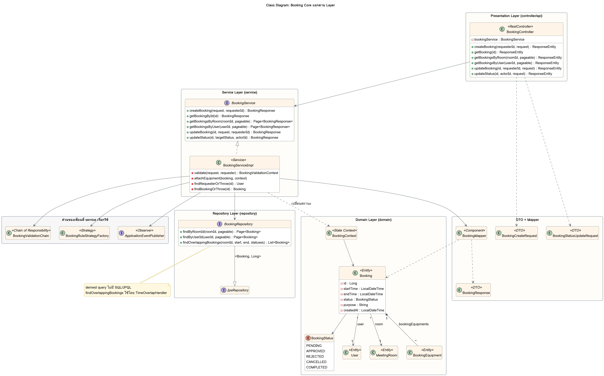

# Class Diagram: Booking Core แยกตาม Layer

ภาพรวมคลาสทั้งหมดในส่วน Booking Core เรียงตาม Layered Architecture จากบนลงล่าง ลูกศรชี้ทางเดียวเสมอ (Controller → Service → Repository → Domain) ไม่มี Layer ไหนเรียกข้าม

ซอร์ส PlantUML: [class-booking-core.puml](class-booking-core.puml)

| Layer | คลาส | หน้าที่ |
|---|---|---|
| Presentation | `BookingController` | รับ HTTP, อ่าน header `X-User-Id`, คืน status code ไม่มี logic |
| Service | `BookingService`, `BookingServiceImpl` | business logic ของการจอง และเป็นจุดที่ Chain, Strategy, State, Observer มาประกอบกัน |
| Repository | `BookingRepository` | derived query ของ Spring Data JPA ไม่มี SQL/JPQL |
| Domain | `Booking`, `BookingStatus`, `BookingContext` | ข้อมูลการจองและ State Pattern |
| DTO + Mapper | `BookingCreateRequest`, `BookingStatusUpdateRequest`, `BookingResponse`, `BookingMapper` | ไม่ส่ง Entity ออก API ตรงๆ |

ความสัมพันธ์ของ `Booking`: ผู้ใช้ 1 คนมีได้หลายการจอง และห้อง 1 ห้องมีได้หลายการจอง (Many-to-One ทั้งสองฝั่ง, `FetchType.LAZY`) ส่วนอุปกรณ์เป็น One-to-Many ไปที่ `BookingEquipment` (`cascade = ALL`, `orphanRemoval = true`) ซึ่งเป็นตารางเชื่อม Many-to-Many กับ `Equipment`
