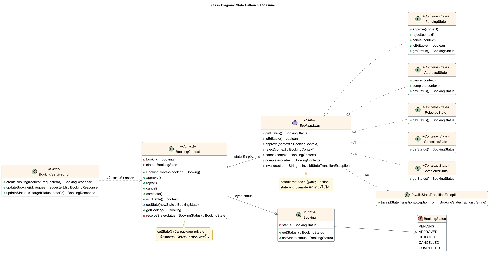

# Class Diagram: State Pattern ของการจอง

ซอร์ส PlantUML: [class-state.puml](class-state.puml)

| บทบาทใน State Pattern | คลาส |
|---|---|
| State | `BookingState` |
| Concrete State | `PendingState`, `ApprovedState`, `RejectedState`, `CancelledState`, `CompletedState` |
| Context | `BookingContext` |
| Client | `BookingServiceImpl` |
