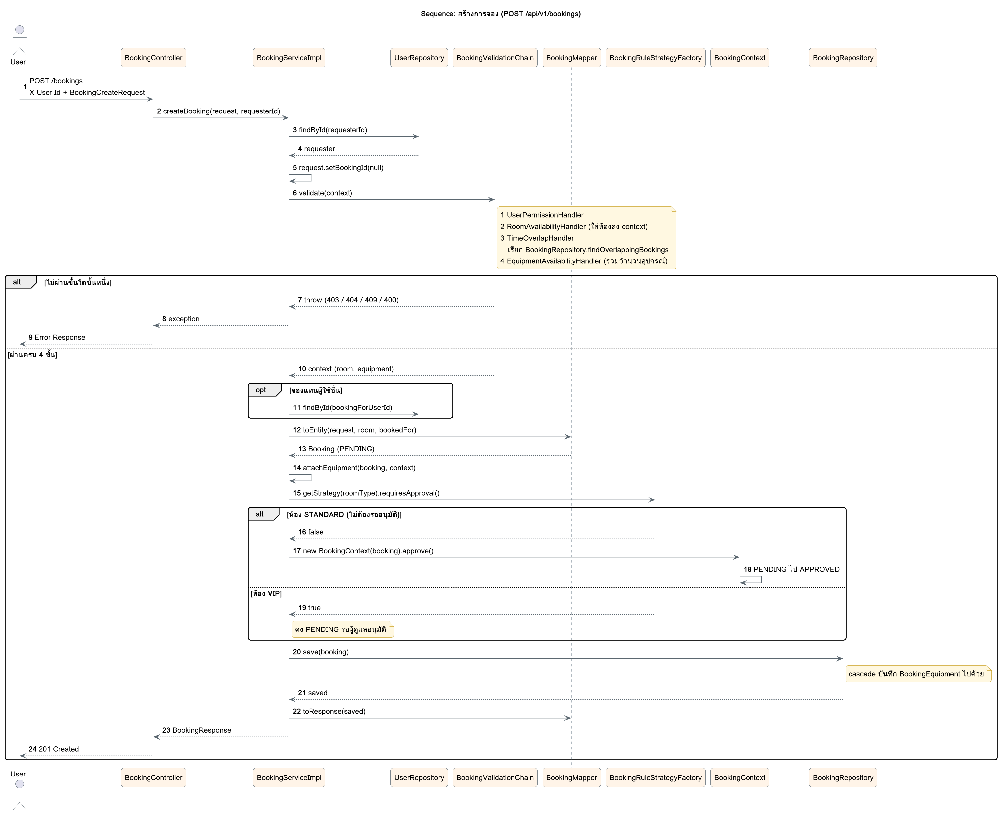

# Sequence: สร้างการจอง

`POST /api/v1/bookings` ตรวจทุกเงื่อนไขก่อน ตัดสินสถานะด้วย Strategy + State แล้วจึงบันทึกครั้งเดียว ถ้าขั้นใดไม่ผ่านจะไม่มีอะไรถูกบันทึก

ซอร์ส PlantUML: [sequence-create-booking.puml](sequence-create-booking.puml)

| ขั้น | ใครทำ | ผลถ้าไม่ผ่าน |
|---|---|---|
| หาผู้จองจาก `X-User-Id` | `BookingServiceImpl.findRequesterOrThrow()` | ไม่มี header 400, ไม่พบผู้ใช้ 404 |
| ตรวจสิทธิ์ | `UserPermissionHandler` | 403 |
| ตรวจห้อง | `RoomAvailabilityHandler` | ไม่พบ 404, ห้องไม่พร้อม 409 |
| ตรวจเวลาซ้อน | `TimeOverlapHandler` + `BookingRepository.findOverlappingBookings()` | เวลาผิด 400, ชน 409 |
| ตรวจอุปกรณ์ | `EquipmentAvailabilityHandler` | ไม่พอ 409 |
| ตัดสินสถานะ | `BookingRuleStrategyFactory` + `BookingContext.approve()` | STANDARD เป็น APPROVED, VIP คง PENDING |
| บันทึก | `BookingRepository.save()` | cascade บันทึกอุปกรณ์ไปด้วย ได้ 201 |

`request.setBookingId(null)` (ขั้นที่ 5) กันไม่ให้ client ส่ง bookingId มาเองเพื่อหลบการตรวจเวลาซ้อน
