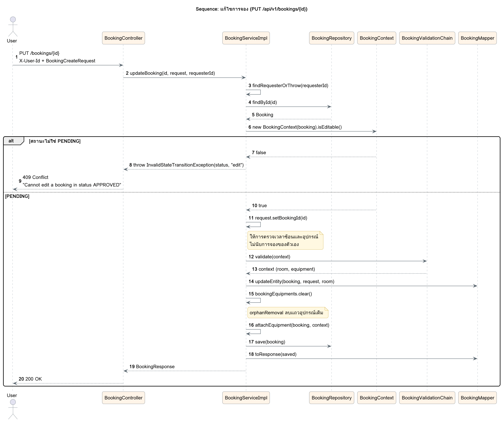

# Sequence: แก้ไขการจอง

`PUT /api/v1/bookings/{id}` ให้ State Pattern ตัดสินก่อนว่าแก้ไขได้ไหม (`isEditable()`) แก้ได้เฉพาะสถานะ PENDING จากนั้นตรวจเงื่อนไขซ้ำทั้งหมดโดยไม่นับการจองของตัวเอง

ซอร์ส PlantUML: [sequence-update-booking.puml](sequence-update-booking.puml)

- **ตรวจ `isEditable()` ก่อนเข้า chain** การจองที่แก้ไม่ได้จะได้ 409 ทันทีโดยไม่ต้องตรวจเงื่อนไขอื่น
- **`request.setBookingId(id)`** ทำให้ `TimeOverlapHandler` และ `EquipmentAvailabilityHandler` ไม่นับการจองนี้เอง ไม่งั้นแก้แค่วัตถุประสงค์ก็จะชนกับเวลาเดิมของตัวเอง
- **`bookingEquipments.clear()`** แล้วแนบใหม่ `orphanRemoval = true` ลบแถวอุปกรณ์เดิมออกจากฐานข้อมูลให้เอง
- `updateEntity()` แก้แค่ห้อง เวลา และวัตถุประสงค์ ไม่แตะสถานะและเจ้าของการจอง
