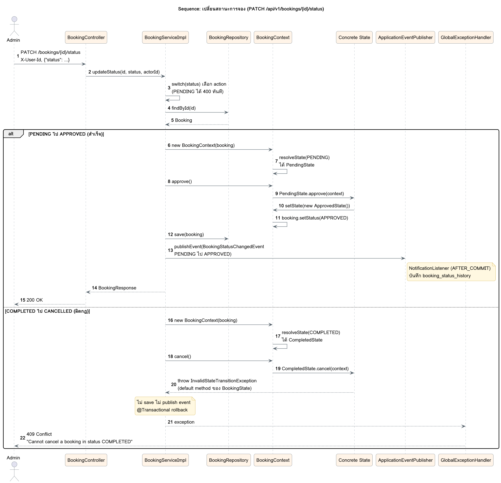

# Sequence: เปลี่ยนสถานะการจอง

สองกรณีหลักของ `PATCH /api/v1/bookings/{id}/status` กรณีแรกอนุมัติการจองที่ PENDING สำเร็จ กรณีที่สองยกเลิกการจองที่ COMPLETED แล้ว ถูก State Pattern ปฏิเสธและได้ 409 โดยไม่บันทึกอะไรและไม่ส่ง event

ซอร์ส PlantUML: [sequence-update-status.puml](sequence-update-status.puml)
