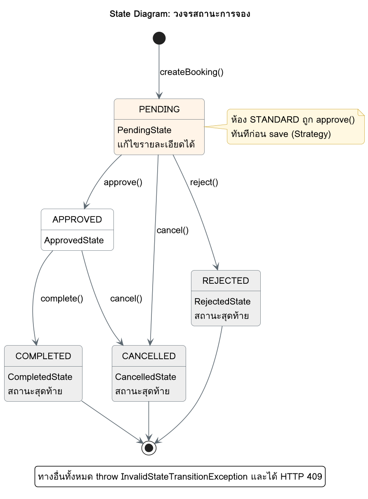

# State Diagram: วงจรสถานะการจอง

การจองเริ่มที่ PENDING และจบที่ 3 สถานะที่เปลี่ยนต่อไม่ได้ ทุก transition ในภาพตรงกับ method ที่ concrete state override ไว้ ทางอื่นทั้งหมด throw `InvalidStateTransitionException` และได้ HTTP 409

ซอร์ส PlantUML: [state-booking.puml](state-booking.puml)

## ตาราง transition ครบ 20 คู่

✅ = เปลี่ยนสถานะได้ (ระบุสถานะปลายทาง) ❌ = throw `InvalidStateTransitionException` (409)

| สถานะปัจจุบัน | approve() | reject() | cancel() | complete() | แก้ไขได้ |
|---|---|---|---|---|---|
| PENDING | ✅ APPROVED | ✅ REJECTED | ✅ CANCELLED | ❌ | ✅ |
| APPROVED | ❌ | ❌ | ✅ CANCELLED | ✅ COMPLETED | ❌ |
| REJECTED | ❌ | ❌ | ❌ | ❌ | ❌ |
| CANCELLED | ❌ | ❌ | ❌ | ❌ | ❌ |
| COMPLETED | ❌ | ❌ | ❌ | ❌ | ❌ |

ทุกช่องในตารางนี้มี test ใน `BookingStateTest` (`allowedTransitions` 5 กรณี, `rejectedTransitions` 15 กรณี, `onlyPendingBookingIsEditable` 5 กรณี)

## การเปลี่ยนกลับเป็น PENDING

`PATCH /api/v1/bookings/{id}/status` ด้วย `"status": "PENDING"` ถูกปฏิเสธใน `BookingServiceImpl.updateStatus()` ก่อนแตะฐานข้อมูล ได้ 400 เพราะไม่มีสถานะใดย้อนกลับไป PENDING ได้

State Diagram ฝั่ง validation ดูเพิ่มที่ [`../nuttachai_673380581-8_04/diagrams/07-booking-state.md`](../nuttachai_673380581-8_04/diagrams/07-booking-state.md)
