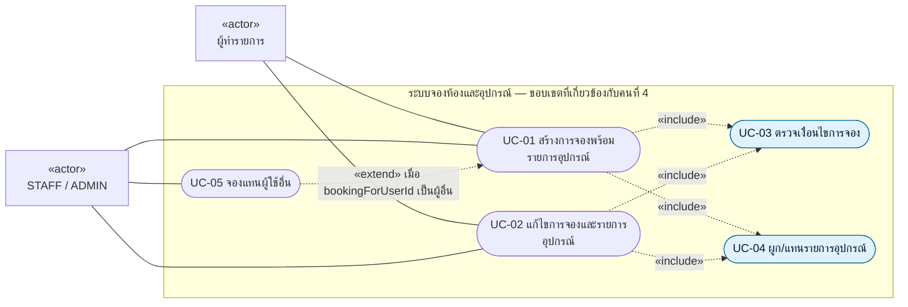

# Use Case Diagram และ Use Case Description

ผู้รับผิดชอบ: **นายณัฏฐชัย ผลดี (คนที่ 4)**

ภาพแสดงการตรวจการจองและเชื่อมอุปกรณ์ที่ถูกเรียกจาก Booking Core ผู้ใช้เรียกสร้าง/แก้ไข Booking ส่วน validation และการผูกอุปกรณ์เป็นขั้นตอนภายใน Service

Mermaid ใช้ flowchart แสดงความสัมพันธ์ Use Case สำหรับดูใน Markdown ส่วน [01-use-cases.puml](01-use-cases.puml) เป็นต้นฉบับ UML Use Case โดยตรง สีฟ้าแสดงขั้นตอนหลักของคนที่ 4; UC-01/02 เป็นบริการของ Booking Core ที่เรียกขั้นตอนเหล่านี้

## UC-01 — สร้างการจองพร้อมรายการอุปกรณ์

| รายการ | รายละเอียด |
| --- | --- |
| Actor | ผู้ทำรายการ; STAFF / ADMIN ใช้ flow นี้ได้ |
| เป้าหมาย | สร้าง Booking และจำนวนอุปกรณ์ที่ต้องการใช้ร่วมกับห้อง |
| Trigger | `POST /api/v1/bookings` พร้อม `BookingCreateRequest` และ requester ที่ Service ระบุได้ |
| เงื่อนไขก่อนเริ่ม | ผ่าน Security/การตรวจ DTO; User และห้องต้องมีอยู่; เวลาเริ่มก่อนเวลาสิ้นสุด |
| ผลสำเร็จ | บันทึก Booking และ join rows ของอุปกรณ์ พร้อมส่ง `BookingResponse` กลับ HTTP 201 |
| ส่วนคนที่ 4 | UC-03, UC-04, `BookingCreateRequest`, `BookingMapper`, `BookingResponse` |

ลำดับหลัก:

1. Controller ตรวจ DTO ด้วย `@Valid` แล้วส่งคำขอไป Service
2. Service อ่าน requester และกำหนด `bookingId = null` เพื่อไม่ตัด Booking ใดออกจากการตรวจการจองใหม่
3. เรียก UC-03 ตรวจเงื่อนไขทั้ง 4 ขั้น
4. Mapper สร้าง Booking โดยเริ่ม `PENDING`; UC-04 ผูกอุปกรณ์จากจำนวนที่รวมแล้ว
5. Booking Core ใช้ Strategy ของประเภทห้อง: STANDARD อนุมัติทันที ส่วน VIP รออนุมัติ
6. บันทึก Booking พร้อมอุปกรณ์ด้วย JPA cascade แล้วแปลงเป็น response

ทางเลือก: ไม่ขออุปกรณ์ให้ส่ง `equipmentItems` เป็น `null` หรือ list ว่างได้; หากจองแทนคนอื่นให้ใช้ UC-05 หาก validation ล้มเหลวจะไม่ถึงขั้นบันทึก

## UC-02 — แก้ไขการจองและรายการอุปกรณ์

| รายการ | รายละเอียด |
| --- | --- |
| Actor | ผู้ทำรายการที่คำขอผ่านชั้น HTTP/Security |
| Trigger | `PUT /api/v1/bookings/{id}` พร้อม DTO ใหม่ |
| เงื่อนไขก่อนเริ่ม | Booking มีอยู่ และ `BookingContext.isEditable()` อนุญาต |
| ผลสำเร็จ | เวลา/ห้อง/วัตถุประสงค์และรายการอุปกรณ์เปลี่ยนตามคำขอ; user และ status เดิมคงค่า |
| ส่วนคนที่ 4 | ตรวจเงื่อนไขโดยไม่นับ Booking เดิม, DTO, Mapper และ join entity |

ลำดับหลัก:

1. Service อ่าน Booking เดิมและตรวจสถานะที่อนุญาตให้แก้ไข
2. เขียน `request.bookingId` จาก id ของ Booking เดิมทับค่าที่ Client ส่งมา
3. เรียก UC-03; การตรวจเวลาซ้อนทับและยอดอุปกรณ์ตัด Booking นี้ออก
4. `BookingMapper.updateEntity()` เปลี่ยนห้อง/เวลา/วัตถุประสงค์
5. ล้าง collection อุปกรณ์เดิม แล้วเรียก UC-04 เพิ่ม join rows ชุดใหม่
6. บันทึกด้วย cascade และ orphan removal; ส่ง response HTTP 200

ทางเลือก: รายการอุปกรณ์ว่างหมายถึงนำอุปกรณ์เดิมออกทั้งหมด หากสถานะไม่อนุญาตแก้ไขจะเกิด `InvalidStateTransitionException` ก่อนเข้า Chain

ขอบเขตสิทธิ์ในโค้ดปัจจุบัน: `UserPermissionHandler` ตรวจบัญชีถูกระงับและสิทธิ์จองแทนผู้อื่น การตรวจนี้ไม่ได้ตรวจเจ้าของ Booking ที่กำลังแก้ไข

## UC-03 — ตรวจเงื่อนไขการจอง

| ขั้นตอนตาม `@Order` | ตรวจอะไร | เมื่อไม่ผ่าน |
| --- | --- | --- |
| 1. UserPermissionHandler | บัญชีถูกระงับหรือไม่; ถ้าจองแทนผู้อื่นต้องเป็น STAFF / ADMIN | `ForbiddenException` |
| 2. RoomAvailabilityHandler | ห้องมีอยู่และสถานะ `AVAILABLE`; เก็บห้องลง context | `ResourceNotFoundException` / `RoomNotAvailableException` |
| 3. TimeOverlapHandler | start < end; ไม่มี Booking `PENDING` / `APPROVED` อื่นทับเวลาห้อง | `IllegalArgumentException` / `RoomNotAvailableException` |
| 4. EquipmentAvailabilityHandler | รายการและ quantity ถูกต้อง; รวม equipmentId ซ้ำ; มี stock พอตลอดช่วงที่ขอ | `IllegalArgumentException` / `ResourceNotFoundException` / `EquipmentNotAvailableException` |

ผลสำเร็จคือ context มีห้องและ map จำนวนอุปกรณ์ที่ตรวจแล้ว หากไม่ผ่านจะหยุด Chain และส่ง exception กลับ HTTP API ใช้ ErrorResponse ของคนที่ 5: 400 สำหรับข้อมูลไม่ถูกต้อง, 403 สำหรับสิทธิ์, 404 สำหรับ resource ไม่มี, 409 สำหรับห้องหรืออุปกรณ์ไม่พร้อม

## UC-04 — ผูก/แทนรายการอุปกรณ์

เงื่อนไขก่อนเริ่ม: UC-03 ผ่าน และมี Booking entity ที่จะบันทึก Service ใช้ map ใน context ซึ่งรวมจำนวนซ้ำแล้ว สร้าง `BookingEquipment(booking, equipment, quantity)` ต่อหนึ่ง equipmentId และเพิ่มลง collection ของ Booking

การแก้ไขใช้ `clear()` กับ `orphanRemoval = true` เพื่อลบแถวเดิม และ `cascade = ALL` เพื่อบันทึกแถวใหม่ การล้างและบันทึกเป็นหน้าที่ Service ของคนที่ 3 ส่วน join entity และข้อมูลจำนวนที่ตรวจแล้วเป็นงานคนที่ 4

## UC-05 — จองแทนผู้ใช้อื่น

เป็น flow เพิ่มเติมของ UC-01 เมื่อ `bookingForUserId` ระบุผู้ใช้ต่างจาก requester `UserPermissionHandler` อนุญาตเฉพาะ STAFF / ADMIN จากนั้น Service อ่านผู้ใช้เป้าหมายและส่งให้ Mapper เป็นเจ้าของ Booking หากไม่พบผู้ใช้เป้าหมายจะไม่บันทึก

## โค้ดอ้างอิง

- [BookingController.java](../../../code/src/main/java/com/example/roombooking/controller/api/BookingController.java)
- [BookingServiceImpl.java](../../../code/src/main/java/com/example/roombooking/service/impl/BookingServiceImpl.java)
- [BookingCreateRequest.java](../../../code/src/main/java/com/example/roombooking/dto/request/BookingCreateRequest.java)
- [BookingValidationChain.java](../../../code/src/main/java/com/example/roombooking/service/validation/BookingValidationChain.java) และ [UserPermissionHandler.java](../../../code/src/main/java/com/example/roombooking/service/validation/UserPermissionHandler.java)
- [BookingMapper.java](../../../code/src/main/java/com/example/roombooking/mapper/BookingMapper.java)
