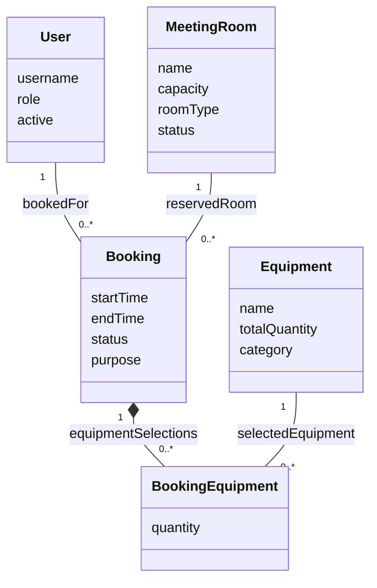
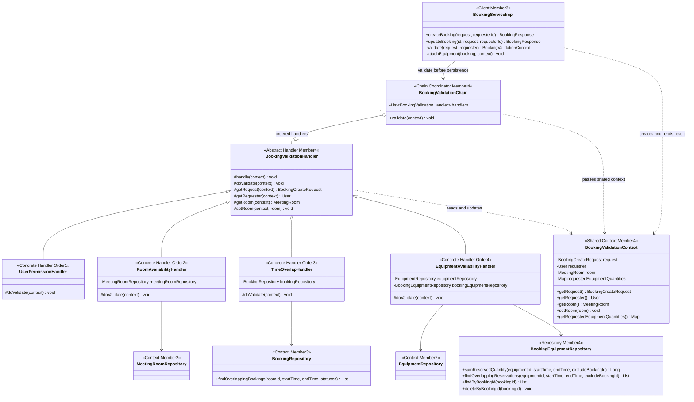
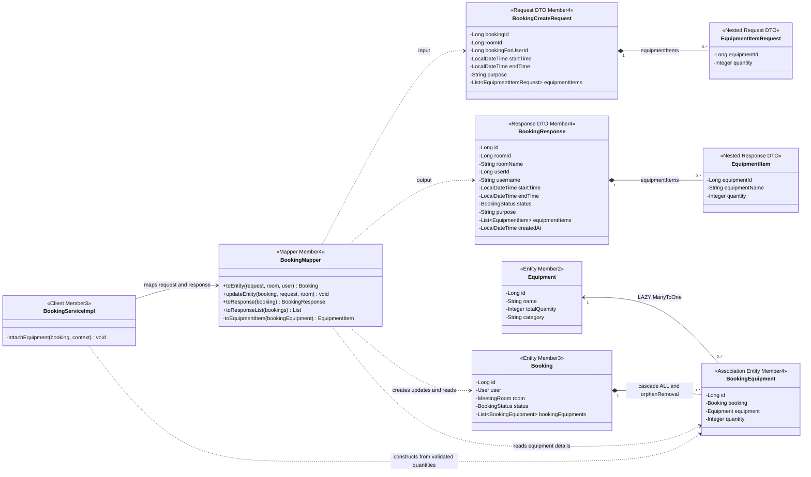

# Domain Model และ Class Diagram — คนที่ 4

ผู้รับผิดชอบ: **นายณัฏฐชัย ผลดี — Booking Validation + Equipment Linking**

เอกสารนี้แสดงส่วนของข้อ 9.1 ที่เกี่ยวกับ `BookingEquipment`, Chain of Responsibility, Booking DTO และ Mapper โดยใช้ชื่อคลาสและความสัมพันธ์จากโค้ดใน branch `nuttachai_673380581-8_04` วันที่ 9 ตุลาคม 2026 คลาสของสมาชิกอื่นแสดงเพื่ออธิบายจุดเชื่อมต่อของระบบ

## Domain Model / Conceptual Class Diagram

โมเดลเชิงแนวคิดเน้นความหมายของข้อมูล ไม่แสดง Spring, Repository หรือรายละเอียดตารางฐานข้อมูล

- หนึ่งการจองมีผู้ใช้และห้องอย่างละหนึ่งรายการ การจองที่ไม่ขออุปกรณ์มี `BookingEquipment` เป็นศูนย์รายการได้
- `BookingEquipment` เป็น association entity ของความสัมพันธ์เชิงธุรกิจแบบ Many-to-Many ระหว่าง Booking กับ Equipment เพราะแต่ละลิงก์ต้องเก็บ `quantity` เพิ่มเติม ใน JPA จึงใช้ `ManyToOne` สองด้านแทน `@ManyToMany` โดยตรง
- จำนวนอุปกรณ์ที่เหลือเป็นค่าคำนวณตามช่วงเวลาที่ขอ ไม่ใช่ฟิลด์ที่บันทึกใน Equipment: `available = totalQuantity - peakReserved`
- User เป็นงานของคนที่ 1; MeetingRoom และ Equipment เป็นงานของคนที่ 2; Booking และสถานะการจองเป็นงานของคนที่ 3; association entity และการตรวจสอบเป็นงานของคนที่ 4

## Class Diagram: Chain of Responsibility

โค้ดใช้ Chain of Responsibility แบบ **รายการ Handler ที่ Spring เรียงตาม `@Order`** โดย `BookingValidationChain` เรียกแต่ละตัวตามลำดับ เมื่อ Handler โยน exception การตรวจสอบหยุดทันที ทุก Handler ต้องผ่านก่อน Service จะสร้างหรือแก้ไข Entity ไม่มีฟิลด์ `next` และไม่มีการส่งต่อระหว่าง Handler โดยตรง

| ลำดับ | Handler | หน้าที่และผลลัพธ์ที่ใช้ต่อ |
| --- | --- | --- |
| 1 | `UserPermissionHandler` | ปฏิเสธบัญชีที่ `active == false`; การจองแทนผู้อื่นอนุญาตเฉพาะ ADMIN หรือ STAFF |
| 2 | `RoomAvailabilityHandler` | ค้นหาห้อง ตรวจสถานะ AVAILABLE และเก็บ `room` ใน context |
| 3 | `TimeOverlapHandler` | ตรวจ `startTime < endTime` และการจองห้องซ้อนทับเฉพาะ PENDING/APPROVED; ตอนแก้ไขตัด bookingId เดิมออก |
| 4 | `EquipmentAvailabilityHandler` | รวม quantity ของ equipmentId ซ้ำ ตรวจจำนวนบวก/จำนวนรวมไม่ล้น และตรวจจำนวนที่เหลือตามช่วงเวลา; เก็บผลรวมใน context |

`BookingEquipmentRepository.sumReservedQuantity()` แม้ชื่อขึ้นต้นด้วย `sum` แต่ผลลัพธ์จริงคือ **จำนวนที่ถูกจองพร้อมกันสูงสุด** โดยนำช่วงเวลาทับซ้อนมาทำ event sweep ช่วงเวลาถูกตีความเป็น `[startTime, endTime)` จึงอนุญาตให้คืนและเริ่มยืมต่อที่เวลาเดียวกันได้ การยกเลิก/ปฏิเสธ/เสร็จสิ้นไม่นับเป็นยอดจองคงค้าง

## Class Diagram: DTO, Mapper และ Equipment Linking

รูปนี้แสดงตำแหน่ง DTO/Mapper และ ownership ของลิงก์อุปกรณ์ โดยละ accessor และ constructor ที่ซ้ำกันเพื่อให้อ่านได้

- Bean Validation ตรวจ roomId/startTime/endTime ว่ามีค่า, purpose ยาวไม่เกิน 255, รายการอุปกรณ์ไม่เป็น null และ quantity เป็นบวก ส่วนการตรวจเวลาสัมพันธ์กันและความพร้อมของทรัพยากรอยู่ใน Handler
- `bookingId` ใน request ใช้ตัดรายการตัวเองตอนแก้ไข Service เขียนทับค่าจาก client: สร้างใหม่เป็น null และแก้ไขเป็น id ของ Entity เดิม
- Mapper สร้าง Booking เริ่มต้นเป็น PENDING ส่วนการอนุมัติทันทีสำหรับ STANDARD อยู่ใน BookingServiceImpl/Strategy/State ของสมาชิกที่เกี่ยวข้อง
- Mapper ไม่สร้าง `BookingEquipment` จาก request โดยตรง Service ใช้ quantity ที่รวมและตรวจแล้วใน context ก่อนแนบรายการอุปกรณ์
- `updateEntity()` เปลี่ยนห้อง เวลา และ purpose โดยไม่เปลี่ยน user/status การแทนที่รายการอุปกรณ์อยู่ใน Service และถูกจัดการผ่าน collection ของ Booking

## อ้างอิงโค้ด

- [BookingEquipment.java](../../../code/src/main/java/com/example/roombooking/domain/entity/BookingEquipment.java), [Booking.java](../../../code/src/main/java/com/example/roombooking/domain/entity/Booking.java), [Equipment.java](../../../code/src/main/java/com/example/roombooking/domain/entity/Equipment.java)
- [BookingValidationChain.java](../../../code/src/main/java/com/example/roombooking/service/validation/BookingValidationChain.java), [BookingValidationHandler.java](../../../code/src/main/java/com/example/roombooking/service/validation/BookingValidationHandler.java), [BookingValidationContext.java](../../../code/src/main/java/com/example/roombooking/service/validation/BookingValidationContext.java)
- [UserPermissionHandler.java](../../../code/src/main/java/com/example/roombooking/service/validation/UserPermissionHandler.java), [RoomAvailabilityHandler.java](../../../code/src/main/java/com/example/roombooking/service/validation/RoomAvailabilityHandler.java), [TimeOverlapHandler.java](../../../code/src/main/java/com/example/roombooking/service/validation/TimeOverlapHandler.java), [EquipmentAvailabilityHandler.java](../../../code/src/main/java/com/example/roombooking/service/validation/EquipmentAvailabilityHandler.java)
- [BookingCreateRequest.java](../../../code/src/main/java/com/example/roombooking/dto/request/BookingCreateRequest.java), [BookingResponse.java](../../../code/src/main/java/com/example/roombooking/dto/response/BookingResponse.java), [BookingMapper.java](../../../code/src/main/java/com/example/roombooking/mapper/BookingMapper.java)
- [BookingServiceImpl.java](../../../code/src/main/java/com/example/roombooking/service/impl/BookingServiceImpl.java), [BookingEquipmentRepository.java](../../../code/src/main/java/com/example/roombooking/repository/BookingEquipmentRepository.java)

[กลับสารบัญ](README.md)
