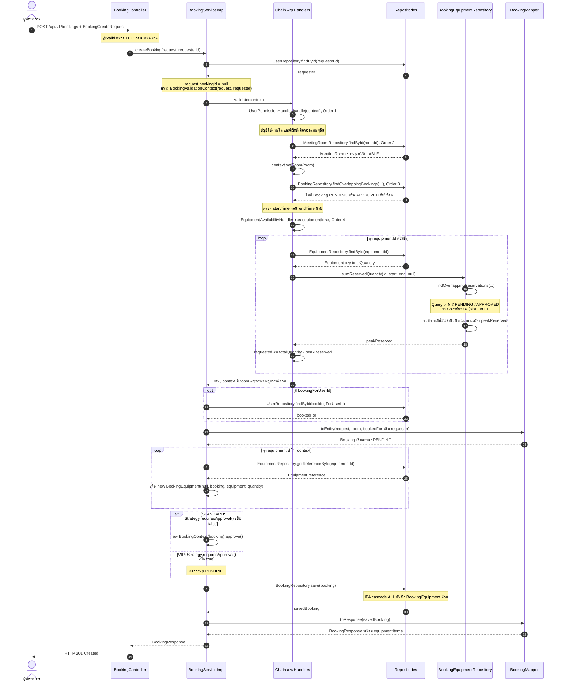
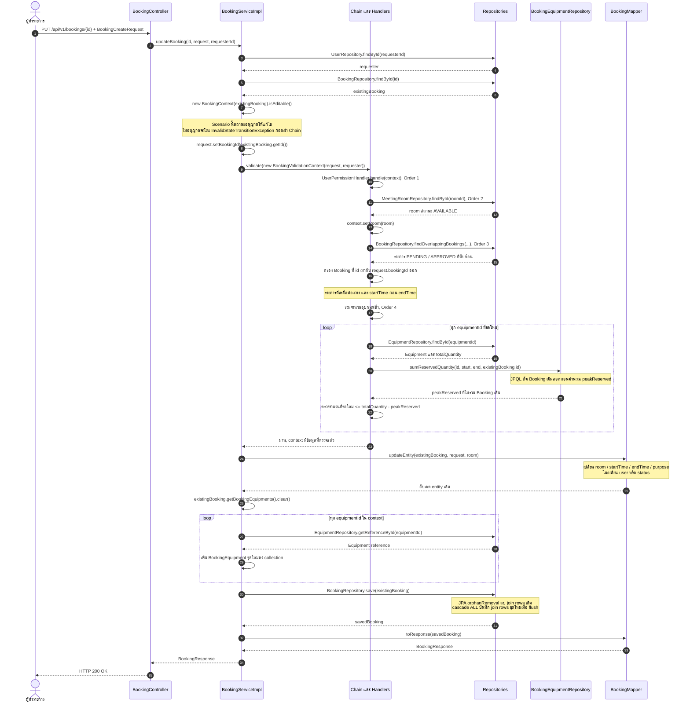
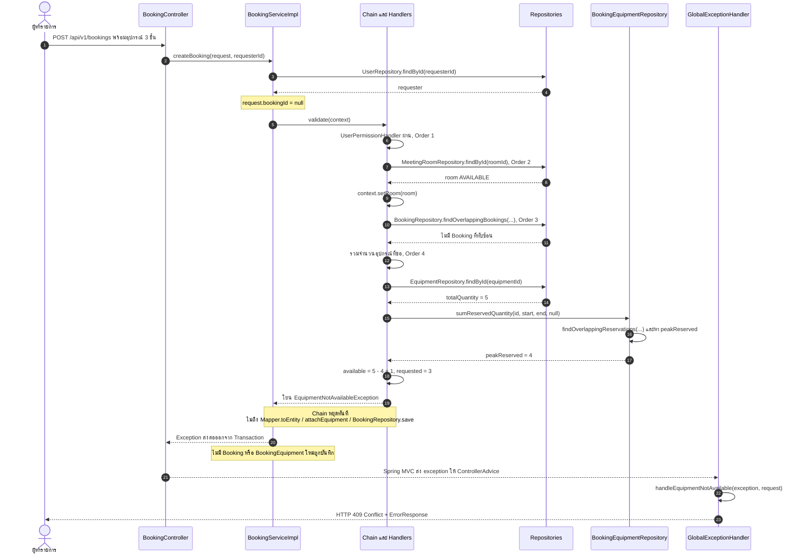

# Sequence Diagram — Booking Validation และ Equipment Linking

ผู้รับผิดชอบ: **นายณัฏฐชัย ผลดี (คนที่ 4)**

เอกสารนี้แสดง 3 Scenario หลักตามข้อ 9.1 ของใบงาน โดยยึดการเรียกเมธอดในโค้ดปัจจุบัน เน้น `BookingCreateRequest`, `BookingValidationChain`, Handler ทั้ง 4 ตัว, `BookingEquipmentRepository`, `BookingEquipment` และ `BookingMapper` ส่วน `BookingController` / `BookingServiceImpl` เป็นงาน Booking Core ของคนที่ 3, Strategy เป็นงานคนที่ 2 และ `GlobalExceptionHandler` เป็นงานคนที่ 5 ซึ่งนำมาแสดงเพื่ออธิบายจุดเชื่อมต่อเท่านั้น

ทั้ง 3 Scenario สมมติว่าคำขอผ่านการตรวจรูปแบบ DTO ด้วย `@Valid` และผ่านการอนุญาตของชั้น HTTP/Security แล้ว การตรวจสิทธิ์ใน `UserPermissionHandler` ตรวจบัญชีที่ถูกระงับและการจองแทนผู้อื่น ไม่ได้ตรวจว่าใครเป็นเจ้าของ Booking ที่แก้ไข

`BookingValidationChain` วนผ่าน `List<BookingValidationHandler>` ที่ Spring เรียงตาม `@Order`: **UserPermission (1) → RoomAvailability (2) → TimeOverlap (3) → EquipmentAvailability (4)** ไม่มีการเชื่อม Handler ด้วย field `next` เมื่อ Handler โยน exception การวนจะหยุดทันที ใน Diagram ย่อ Handler เหล่านี้เป็นการทำงานภายใน lifeline `Validation` และรวม Repository ทั่วไปไว้ใน lifeline `Repositories` เพื่อลดความกว้างของภาพ

## 1. สร้างการจองพร้อมอุปกรณ์สำเร็จ

ตัวอย่าง: ผู้ใช้ที่มีสิทธิ์ขอจองห้องที่ `AVAILABLE` ในเวลาที่ไม่ทับซ้อน และส่งอุปกรณ์ชนิดเดียวกันจำนวน 2 กับ 1 ระบบรวมเป็นจำนวน 3 ก่อนตรวจสต็อก แล้วสร้าง `BookingEquipment` หนึ่งรายการสำหรับอุปกรณ์ชนิดนั้น

ผลลัพธ์: ข้อมูลอุปกรณ์ถูกผูกผ่าน entity `BookingEquipment` ซึ่งเก็บ `booking`, `equipment` และ `quantity` การบันทึกผ่าน `BookingRepository.save()` ใช้ cascade จาก `Booking` ไม่ได้เรียก `BookingEquipmentRepository.save()` โดยตรง Transaction จะ commit เมื่อการเรียก Service สำเร็จ

## 2. แก้ไขการจองและแทนรายการอุปกรณ์เดิม

ตัวอย่าง: แก้ Booking ที่ยังอยู่ในสถานะซึ่ง `BookingContext.isEditable()` อนุญาต โดยเปลี่ยนเวลาและรายการอุปกรณ์ Service กำหนด `bookingId` จาก entity เดิมเพื่อไม่ให้นับการจองตัวเองเป็นคู่แข่ง ค่าที่ Client ส่งใน field นี้จะถูกเขียนทับ

ผลลัพธ์: การตรวจห้องกรอง Booking เดิมหลัง query ส่วนการตรวจอุปกรณ์ส่ง `excludeBookingId` เข้า JPQL โดยตรง จึงไม่นับจำนวนที่ Booking เดิมใช้ การเปลี่ยน collection กับ `orphanRemoval = true` เป็นกลไกลบรายการเก่าใน flow นี้ ไม่ได้เรียก `deleteByBookingId()`

ถ้ารายการอุปกรณ์ใหม่เป็น `null` หรือว่าง Handler จะผ่านโดยไม่เติมจำนวนใน context เมื่อ update สำเร็จ Service จะล้างรายการเดิมและไม่สร้าง join rows ใหม่

## 3. ปฏิเสธคำขอเมื่ออุปกรณ์ไม่เพียงพอ

ตัวอย่าง: อุปกรณ์มีทั้งหมด 5 ชิ้น มีการจองพร้อมกันสูงสุดในช่วงที่ขอ 4 ชิ้น จึงเหลือ 1 ชิ้น แต่คำขอใหม่ต้องการ 3 ชิ้น โดยสิทธิ์ผู้ใช้ ห้อง และเวลา ผ่านการตรวจแล้ว

ผลลัพธ์: คำขอไม่ผ่าน validation และไม่มีการสร้าง Booking ใหม่ คำว่า “ปฏิเสธคำขอ” ใน Scenario นี้ **ไม่ได้** หมายถึงสร้าง Booking สถานะ `REJECTED`; การเปลี่ยนเป็น `REJECTED` เป็นอีก flow ของ State Pattern

หาก Handler ก่อนหน้าล้มเหลว จะหยุดที่ Handler นั้นเช่นเดียวกัน: `ForbiddenException` → 403, `ResourceNotFoundException` → 404, `RoomNotAvailableException` → 409 และ `IllegalArgumentException` → 400 ตาม `GlobalExceptionHandler`

## จุดที่ต้องอ่านภาพให้ตรงกับโค้ด

- `sumReservedQuantity()` คืน **จำนวนที่ถูกจองพร้อมกันสูงสุด** ในช่วงที่ขอ ไม่ใช่ผลรวมทุก Booking ที่มีเวลาแตะช่วงนั้น วิธีคำนวณใช้การเพิ่มและลดจำนวนที่จุดเวลาใน `TreeMap`
- เวลาทับซ้อนใช้ `existing.startTime < requested.endTime` และ `existing.endTime > requested.startTime` ดังนั้นรายการที่สิ้นสุดพอดีกับเวลาเริ่มรายการถัดไปไม่ถือว่าทับซ้อน
- `PENDING` กับ `APPROVED` ใช้ในการตรวจการจองที่ยังมีผล ส่วน `REJECTED`, `CANCELLED`, `COMPLETED` ไม่นับยอดใช้อุปกรณ์
- ไม่ได้แสดง pessimistic lock หรือการจองสต็อกแบบ atomic เพราะ flow ปัจจุบันไม่มีขั้นตอนดังกล่าว ภาพนี้อธิบายการตรวจและบันทึกของแต่ละคำขอ ไม่ใช่หลักฐานว่าคำขอหลายรายการพร้อมกันจะไม่แย่งสต็อก
- Sequence เหล่านี้อธิบายเส้นทาง REST API ผลลัพธ์ของหน้า Thymeleaf อาจเป็น redirect หรือข้อความบนหน้าเว็บ จึงไม่ได้ใช้ HTTP 201 / JSON ในทุกหน้าเว็บ

## โค้ดอ้างอิง

- [BookingServiceImpl.java](../../../code/src/main/java/com/example/roombooking/service/impl/BookingServiceImpl.java): `createBooking()`, `updateBooking()`, `validate()`, `attachEquipment()`
- [BookingValidationChain.java](../../../code/src/main/java/com/example/roombooking/service/validation/BookingValidationChain.java) และ [BookingValidationContext.java](../../../code/src/main/java/com/example/roombooking/service/validation/BookingValidationContext.java)
- [UserPermissionHandler.java](../../../code/src/main/java/com/example/roombooking/service/validation/UserPermissionHandler.java), [RoomAvailabilityHandler.java](../../../code/src/main/java/com/example/roombooking/service/validation/RoomAvailabilityHandler.java), [TimeOverlapHandler.java](../../../code/src/main/java/com/example/roombooking/service/validation/TimeOverlapHandler.java), [EquipmentAvailabilityHandler.java](../../../code/src/main/java/com/example/roombooking/service/validation/EquipmentAvailabilityHandler.java)
- [BookingEquipmentRepository.java](../../../code/src/main/java/com/example/roombooking/repository/BookingEquipmentRepository.java) และ [BookingRepository.java](../../../code/src/main/java/com/example/roombooking/repository/BookingRepository.java)
- [BookingMapper.java](../../../code/src/main/java/com/example/roombooking/mapper/BookingMapper.java), [BookingCreateRequest.java](../../../code/src/main/java/com/example/roombooking/dto/request/BookingCreateRequest.java), [BookingResponse.java](../../../code/src/main/java/com/example/roombooking/dto/response/BookingResponse.java)
- [Booking.java](../../../code/src/main/java/com/example/roombooking/domain/entity/Booking.java) และ [BookingEquipment.java](../../../code/src/main/java/com/example/roombooking/domain/entity/BookingEquipment.java)
- [BookingController.java](../../../code/src/main/java/com/example/roombooking/controller/api/BookingController.java) และ [GlobalExceptionHandler.java](../../../code/src/main/java/com/example/roombooking/exception/GlobalExceptionHandler.java)
