# Activity Diagram — Booking Validation และ Equipment Linking

ผู้รับผิดชอบ: **นายณัฏฐชัย ผลดี (คนที่ 4)**

ภาพแสดง validation ที่ใช้ร่วมกันในการสร้างและแก้ไข Booking ตาม `BookingValidationChain` และ Handler ในโค้ด ส่วนก่อนเข้า Chain และหลังตรวจผ่านเป็นจุดเชื่อมกับ Booking Core ของคนที่ 3

```mermaid
flowchart TD
    Start(("เริ่ม")) --> DTO["รับ BookingCreateRequest<br/>ผ่าน Bean Validation และ Security"]
    DTO --> Setup["Service อ่าน requester<br/>สร้างใหม่: bookingId = null<br/>แก้ไข: อ่าน Booking, ตรวจ isEditable,<br/>กำหนด bookingId จาก Booking เดิม"]
    Setup --> Context["สร้าง BookingValidationContext"]
    Context --> User["Order 1: UserPermissionHandler<br/>ตรวจ active และสิทธิ์จองแทนผู้อื่น"]
    User --> UserOK{"สิทธิ์ผ่าน?"}
    UserOK -->|"ไม่ผ่าน"| Forbidden["ForbiddenException"]
    UserOK -->|"ผ่าน"| Room["Order 2: RoomAvailabilityHandler<br/>อ่านห้องจาก MeetingRoomRepository"]
    Room --> RoomFound{"พบห้อง?"}
    RoomFound -->|"ไม่พบ"| NotFound["ResourceNotFoundException"]
    RoomFound -->|"พบ"| RoomOK{"สถานะ AVAILABLE?"}
    RoomOK -->|"ไม่ใช่"| RoomError["RoomNotAvailableException"]
    RoomOK -->|"ใช่"| StoreRoom["context.setRoom(room)"]
    StoreRoom --> Time["Order 3: TimeOverlapHandler"]
    Time --> TimeOK{"startTime / endTime มีค่า<br/>และ startTime ก่อน endTime?"}
    TimeOK -->|"ไม่ผ่าน"| Invalid["IllegalArgumentException"]
    TimeOK -->|"ผ่าน"| Overlap["หา Booking PENDING / APPROVED<br/>ของห้องที่ทับช่วงเวลา<br/>กรอง Booking เดิมออกเมื่อแก้ไข"]
    Overlap --> NoOverlap{"ไม่มี Booking อื่นทับเวลา?"}
    NoOverlap -->|"มีทับซ้อน"| RoomError
    NoOverlap -->|"ไม่มี"| Equipment["Order 4: EquipmentAvailabilityHandler"]
    Equipment --> HasItems{"equipmentItems มีรายการ?"}
    HasItems -->|"ไม่มี"| Pass["Chain ผ่าน<br/>ส่ง context กลับ Service"]
    HasItems -->|"มี"| Merge["ตรวจ item / equipmentId / quantity<br/>รวมจำนวน equipmentId ซ้ำด้วย Math.addExact"]
    Merge --> ItemsOK{"ข้อมูลถูกต้องและจำนวนไม่ overflow?"}
    ItemsOK -->|"ไม่ผ่าน"| Invalid
    ItemsOK -->|"ผ่าน"| NextItem["เลือก equipmentId ที่ยังไม่ได้ตรวจ"]
    NextItem --> LoadEquipment["EquipmentRepository.findById(equipmentId)"]
    LoadEquipment --> EquipmentFound{"พบอุปกรณ์?"}
    EquipmentFound -->|"ไม่พบ"| NotFound
    EquipmentFound -->|"พบ"| Reserved["sumReservedQuantity(..., bookingId)<br/>หา peakReserved ในช่วงที่ขอ<br/>นับ PENDING / APPROVED และตัด Booking เดิม"]
    Reserved --> Enough{"requested quantity<br/>ไม่เกิน totalQuantity - peakReserved?"}
    Enough -->|"ไม่พอ"| EquipmentError["EquipmentNotAvailableException"]
    Enough -->|"พอ"| More{"มี equipmentId ที่ยังไม่ได้ตรวจ?"}
    More -->|"มี"| NextItem
    More -->|"หมดแล้ว"| Pass
    Pass --> Map["Mapper สร้าง / อัปเดต Booking<br/>เมื่อแก้ไข Service ล้าง collection อุปกรณ์เดิม"]
    Map --> Attach["Service เพิ่ม BookingEquipment<br/>จาก map จำนวนใน context"]
    Attach --> Core["Booking Core ใช้ Strategy เมื่อสร้างใหม่<br/>บันทึก Booking พร้อม join rows และแปลง response"]
    Core --> Success(("สำเร็จ"))
    Forbidden --> Failure["หยุด Chain ทันที<br/>ส่ง exception ออกก่อนบันทึก<br/>HTTP API ใช้ GlobalExceptionHandler"]
    NotFound --> Failure
    RoomError --> Failure
    Invalid --> Failure
    EquipmentError --> Failure
    Failure --> Stop(("สิ้นสุดคำขอที่ไม่ผ่าน"))
    classDef member4 fill:#e0f2fe,stroke:#0369a1,color:#0f172a
    class Context,User,Room,StoreRoom,Time,Overlap,Equipment,Merge,Reserved,Pass,Map member4
```

## เงื่อนไขที่ใช้จริง

- Chain ไม่มี field `next`: Spring ส่ง list ที่เรียง `@Order` ให้ Chain แล้ว Chain วน `handler.handle(context)` ต่อไปเมื่อขั้นก่อนหน้าผ่าน
- เวลาทับซ้อนใช้ `existing.startTime < requested.endTime` และ `existing.endTime > requested.startTime` ช่วงเวลาที่จบพอดีกับเวลาเริ่มอีก Booking จึงไม่ชนกัน
- การตรวจจำนวนอุปกรณ์รวมรายการซ้ำก่อนตรวจทีละ equipmentId และเก็บ map ลง context ยอดจองใน Repository เป็น **peak concurrency** ตลอดช่วงที่ขอ ไม่ใช่ผลรวมทุก Booking ที่ทับช่วง
- บัญชี `active = false` ถูกปฏิเสธ; ถ้า `bookingForUserId` ต่างจาก requester ต้องมี role STAFF หรือ ADMIN
- เมื่อแก้ไข Service จะกำหนด id ที่ใช้ยกเว้นจาก Booking จริง ไม่ใช้ id ที่ Client ส่งมาโดยตรง
- เงื่อนไข `isEditable()` และการอ่าน requester/Booking ก่อนเข้า Chain อาจหยุดคำขอได้เช่นกัน ภาพเน้นรายละเอียดข้อผิดพลาดภายใน Chain

## โค้ดอ้างอิง

- [BookingValidationChain.java](../../../code/src/main/java/com/example/roombooking/service/validation/BookingValidationChain.java)
- [BookingValidationContext.java](../../../code/src/main/java/com/example/roombooking/service/validation/BookingValidationContext.java)
- [UserPermissionHandler.java](../../../code/src/main/java/com/example/roombooking/service/validation/UserPermissionHandler.java)
- [RoomAvailabilityHandler.java](../../../code/src/main/java/com/example/roombooking/service/validation/RoomAvailabilityHandler.java)
- [TimeOverlapHandler.java](../../../code/src/main/java/com/example/roombooking/service/validation/TimeOverlapHandler.java)
- [EquipmentAvailabilityHandler.java](../../../code/src/main/java/com/example/roombooking/service/validation/EquipmentAvailabilityHandler.java)
- [BookingEquipmentRepository.java](../../../code/src/main/java/com/example/roombooking/repository/BookingEquipmentRepository.java)
- [BookingServiceImpl.java](../../../code/src/main/java/com/example/roombooking/service/impl/BookingServiceImpl.java)
