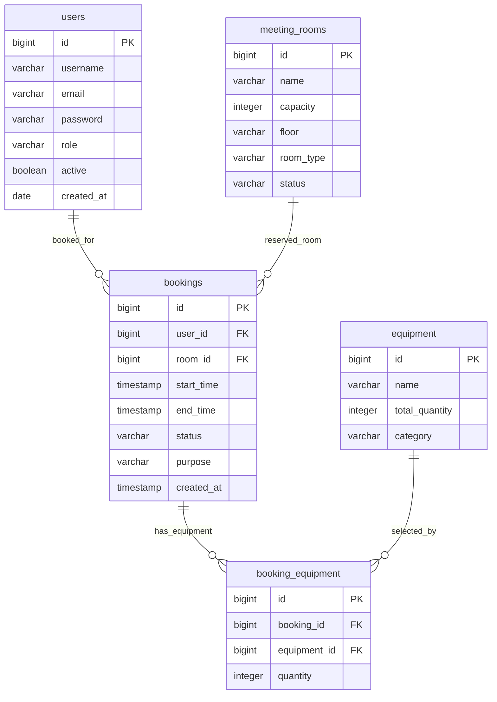

# ER Diagram และ Database Schema — คนที่ 4

ผู้รับผิดชอบ: **นายณัฏฐชัย ผลดี — Booking Validation + Equipment Linking**

ตารางที่คนที่ 4 รับผิดชอบคือ `booking_equipment` ตาราง users, meeting_rooms, bookings และ equipment แสดงเป็นบริบทสำหรับ foreign key และการคำนวณความพร้อมของอุปกรณ์ รูปนี้จึงเป็นส่วนของ ER Diagram ที่เกี่ยวกับงานคนที่ 4 ไม่ครอบคลุม user_profile และ booking_status_history ของทั้งโครงการ

## ER Diagram

รูปแสดงชื่อคอลัมน์จริงจาก [PostgreSQL schema.sql](../../../code/src/main/resources/db/postgresql/schema.sql) ใช้ `timestamp` ในรูปแทนชนิดเต็ม `TIMESTAMP(6) WITHOUT TIME ZONE`

Booking หนึ่งรายการมีอุปกรณ์ได้หลายรายการ และอุปกรณ์ชนิดเดียวปรากฏในหลายการจองได้ `booking_equipment` ทำให้ความสัมพันธ์ Many-to-Many แตกเป็น One-to-Many สองด้าน โดยแต่ละแถวเก็บจำนวนที่เลือก

## Data Dictionary ของ booking_equipment

| คอลัมน์ | ชนิด PostgreSQL | Null | Key / เงื่อนไข | ความหมาย |
| --- | --- | --- | --- | --- |
| `id` | `BIGINT GENERATED BY DEFAULT AS IDENTITY` | ไม่ได้ | Primary key | รหัสแถวของลิงก์ ใช้แยกแถวเก่าและแถวใหม่ระหว่างแก้ไข |
| `booking_id` | `BIGINT` | ไม่ได้ | FK → `bookings.id` | การจองเจ้าของรายการ |
| `equipment_id` | `BIGINT` | ไม่ได้ | FK → `equipment.id` | ประเภทอุปกรณ์ที่เลือก |
| `quantity` | `INTEGER` | ไม่ได้ | `CHECK (quantity > 0)` | จำนวนอุปกรณ์ที่ขอในช่วงเวลาของ Booking |

| Constraint / Index | นิยามจริง | เหตุผล |
| --- | --- | --- |
| `fk_booking_equipment_booking` | `booking_id` อ้างถึง `bookings(id)` | ป้องกันแถวลิงก์ที่ไม่มี Booking |
| `fk_booking_equipment_equipment` | `equipment_id` อ้างถึง `equipment(id)` | ป้องกันแถวลิงก์ที่ไม่มี Equipment |
| `ck_booking_equipment_quantity` | `quantity > 0` | บังคับกฎจำนวนบวกในฐานข้อมูล แม้มีผู้เขียนข้อมูลผ่านช่องทางอื่น |
| `idx_booking_equipment_booking` | Index ปกติบน `booking_id` | รองรับค้นหา/ลบลิงก์ของ Booking หนึ่งรายการ |
| `idx_booking_equipment_equipment` | Index ปกติบน `equipment_id` | รองรับค้นหาลิงก์ของอุปกรณ์ก่อน join ไปตรวจเวลา/สถานะของ Booking |

Constraint และ index ข้างต้นปรากฏทั้งใน JPA annotation ของ `BookingEquipment` และ SQL สำหรับตารางใหม่ ไม่มี unique constraint บนคู่ `(booking_id, equipment_id)` Service รวมรายการอุปกรณ์ซ้ำก่อนบันทึก แต่ SQL ยอมให้คู่เดิมมีหลายแถวได้ เพื่อรองรับการแทนที่แถวใหม่และลบ orphan ในลำดับ flush ของ JPA

## Cascade, Fetch และการลบ

| จุดเชื่อมต่อ | การตั้งค่าในโค้ด / SQL | ผลที่เกิดขึ้นและเหตุผล |
| --- | --- | --- |
| `Booking.bookingEquipments` | `@OneToMany(mappedBy="booking", cascade=ALL, orphanRemoval=true)` | บันทึก/ลบลิงก์ผ่าน aggregate ของ Booking; เมื่อ clear รายการเดิมตอนแก้ไข JPA จะลบ orphan และบันทึกรายการใหม่ |
| `BookingEquipment.booking` | `@ManyToOne(fetch=LAZY, optional=false)` | โหลด Booking เมื่อเข้าถึง และทุกแถวต้องมี Booking |
| `BookingEquipment.equipment` | `@ManyToOne(fetch=LAZY, optional=false)` | โหลดรายละเอียด Equipment เมื่อใช้งาน เช่น Mapper สร้าง response และทุกแถวต้องมี Equipment |
| Cascade จาก BookingEquipment ไปยัง parent | ไม่มี JPA cascade ในสอง `ManyToOne` | การบันทึก/ลบแถวลิงก์ไม่ทำให้ลบ Booking หรือ Equipment ที่เป็นข้อมูลหลัก |
| Foreign key ใน SQL | ไม่ระบุ `ON DELETE CASCADE` | PostgreSQL ใช้ค่าเริ่มต้น NO ACTION; การลบ parent โดยตรงใน SQL ขณะที่มีลิงก์อยู่จะถูก FK ปฏิเสธ |

Cascade ของ JPA กับ cascade ในฐานข้อมูลเป็นคนละกลไก ชุด SQL นี้ไม่ได้ประกาศ database cascade การลบผ่าน JPA aggregate ต้องให้ ORM จัดการ child ก่อน parent ส่วนการลบ parent ผ่าน SQL ต้องจัดการ child เองอย่างถูกต้อง

## ข้อมูลที่ใช้ตรวจสอบ availability

- `BookingRepository.findOverlappingBookings()` ตรวจห้องผ่าน roomId เวลา และสถานะ PENDING/APPROVED โดยเงื่อนไข `existing.start < requested.end` และ `existing.end > requested.start`
- `BookingEquipmentRepository.findOverlappingReservations()` join ลิงก์เข้ากับ Booking เพื่ออ่าน start/end/quantity ของอุปกรณ์ที่ยังมีผลอยู่ ตัด bookingId เดิมออกเมื่อแก้ไข
- `sumReservedQuantity()` หายอดที่จองพร้อมกันสูงสุดในช่วงที่ขอ จึงไม่รวม quantity ของรายการที่เกิดคนละเวลาเป็นยอดเดียวกัน
- `EquipmentAvailabilityHandler` เปรียบเทียบ quantity ที่ขอรวมกับ `equipment.total_quantity - peakReserved` และหยุดก่อนการเขียน Entity เมื่อจำนวนไม่พอ
- ความพร้อมตามช่วงเวลาเป็นกฎใน Service/Repository ไม่ได้แทนด้วย `CHECK` ของตาราง รูป ER นี้ไม่ได้อ้างว่ามี database constraint หรือ lock ป้องกันการจองพร้อมกันทุกกรณี

## SQL สองชุดในโครงการ

| ไฟล์ | ขอบเขตและวิธีใช้งานตามโค้ดปัจจุบัน |
| --- | --- |
| [db/postgresql/schema.sql](../../../code/src/main/resources/db/postgresql/schema.sql) | สร้างตารางทั้งแอปใน PostgreSQL ฐานใหม่ พร้อม FK/check/index; `IF NOT EXISTS` ไม่แก้โครงสร้างตารางเก่าที่ต่างจากไฟล์ |
| [db/nuttachai_673380581-8_04/schema.sql](../../../code/src/main/resources/db/nuttachai_673380581-8_04/schema.sql) | งานของคนที่ 4: สร้าง/ปรับ `booking_equipment` โดยต้องมี bookings/equipment ก่อน; บังคับ quantity NOT NULL, positive check และ lookup indexes ใช้กับ PostgreSQL/H2 ตามการทดสอบ |

ทั้งสองไฟล์อยู่ในโฟลเดอร์ย่อยของ resources จึงไม่ได้ถูกรันด้วย default lookup ของ Spring Boot อัตโนมัติ SQL สำหรับงานคนที่ 4 ไม่ซ่อม FK หรือ parent table ที่มีอยู่ก่อน และไม่แก้/ลบแถว quantity ที่ผิด; ต้องตรวจข้อมูลเดิมก่อนใช้งานจริง เอกสารนี้อธิบายไฟล์ใน repository โดยไม่ได้ยืนยันว่า schema ใน Aiven ปัจจุบันตรงกับไฟล์แล้ว

## อ้างอิงโค้ด

- [BookingEquipment.java](../../../code/src/main/java/com/example/roombooking/domain/entity/BookingEquipment.java), [Booking.java](../../../code/src/main/java/com/example/roombooking/domain/entity/Booking.java), [Equipment.java](../../../code/src/main/java/com/example/roombooking/domain/entity/Equipment.java)
- [BookingEquipmentRepository.java](../../../code/src/main/java/com/example/roombooking/repository/BookingEquipmentRepository.java), [BookingRepository.java](../../../code/src/main/java/com/example/roombooking/repository/BookingRepository.java)
- [EquipmentAvailabilityHandler.java](../../../code/src/main/java/com/example/roombooking/service/validation/EquipmentAvailabilityHandler.java), [BookingServiceImpl.java](../../../code/src/main/java/com/example/roombooking/service/impl/BookingServiceImpl.java)

[กลับสารบัญ](README.md)
