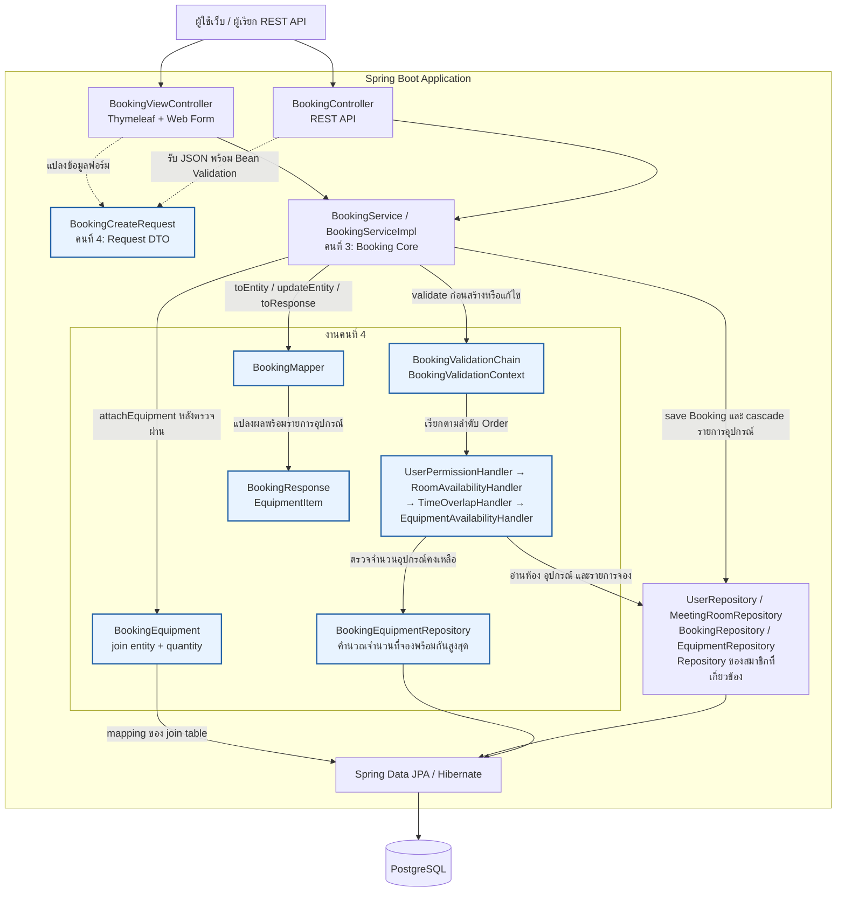
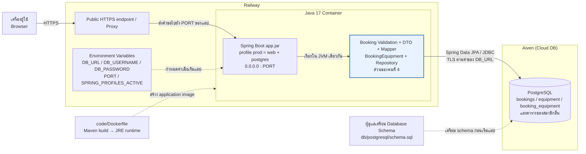

# Component Diagram และ Deployment Diagram

เจ้าของเอกสารส่วน Booking Validation และ Equipment Linking: **นายณัฏฐชัย ผลดี (คนที่ 4)**

Component Diagram นี้แสดงตำแหน่งงานของคนที่ 4 ภายในแอป Spring Boot และจุดเชื่อมกับงานของสมาชิกคนอื่น ส่วน Deployment Diagram เป็นภาพสถาปัตยกรรมเป้าหมาย Railway + Aiven เพื่ออธิบายว่าโมดูลนี้ทำงานที่ใด งาน Infra/Deployment เป็นความรับผิดชอบของคนที่ 5 ภาพนี้ไม่ได้ยืนยันว่าได้ deploy หรือเชื่อม Aiven สำเร็จแล้ว

## Component Diagram

กล่องสีน้ำเงินเป็นส่วนที่คนที่ 4 รับผิดชอบ ทุกส่วนอยู่ในแอปเดียวกัน การเรียก Handler หรือ Mapper เป็นการเรียก Java ภายใน process เดียว ไม่มี service แยกสำหรับแต่ละ Handler

`BookingServiceImpl` สร้าง `BookingEquipment` จากจำนวนอุปกรณ์ที่ Handler รวมและตรวจสอบแล้ว จากนั้นบันทึกผ่าน `BookingRepository.save()` โดย `Booking.bookingEquipments` มี `cascade = ALL` ส่วน `BookingEquipmentRepository` ถูกใช้ตรวจจำนวนที่ถูกจองในช่วงเวลา จึงไม่ได้ถูกเรียก `save()` โดยตรงในเส้นทางสร้าง/แก้ไขการจองนี้

## Deployment Diagram: เป้าหมาย Railway + Aiven

ค่าที่มีใน repository และเกี่ยวข้องกับภาพนี้:

| ค่า/ไฟล์ | ความหมาย |
| --- | --- |
| `spring.profiles.default=prod` | เมื่อไม่ระบุ profile จะเลือก `prod`; group `prod` เปิด `web,postgres` |
| `DB_URL` | PostgreSQL JDBC URL ของฐานข้อมูลเป้าหมาย พร้อมการตั้งค่า TLS ที่ใช้เชื่อม Aiven |
| `DB_USERNAME`, `DB_PASSWORD` | ข้อมูลเชื่อมต่อจาก deployment environment |
| `server.address=0.0.0.0`, `server.port=${PORT:8080}` | รับคำขอผ่าน interface ของ container และ port ที่ environment กำหนด |
| `server.forward-headers-strategy=framework` | รองรับ forwarded headers จาก proxy |
| `spring.jpa.hibernate.ddl-auto=validate` | ตรวจ schema ที่เตรียมไว้แล้วตอนเริ่มแอป |
| `spring.sql.init.mode=never` | ไม่รัน `schema.sql` / `data.sql` อัตโนมัติเมื่อเปิดแอป |
| `code/Dockerfile` | build ด้วย Maven/Java 17 แล้วรัน executable JAR บน Java 17 JRE |
| `code/docker-compose.yml` | กำหนดเฉพาะ app service และรับข้อมูล PostgreSQL ภายนอกผ่าน environment |

หากเลือก deploy ด้วย Dockerfile นี้ ต้องใช้ `code/` เป็น build context เพราะ `COPY pom.xml` และ `COPY src` อ้างจากโฟลเดอร์นั้น การตั้งค่า Railway project, public domain และ Aiven service ต้องดำเนินการในระบบ Cloud โดยผู้รับผิดชอบ Infra

## อ้างอิงโค้ด

- [BookingServiceImpl.java](../../../code/src/main/java/com/example/roombooking/service/impl/BookingServiceImpl.java)
- [BookingValidationChain.java](../../../code/src/main/java/com/example/roombooking/service/validation/BookingValidationChain.java)
- [EquipmentAvailabilityHandler.java](../../../code/src/main/java/com/example/roombooking/service/validation/EquipmentAvailabilityHandler.java)
- [BookingMapper.java](../../../code/src/main/java/com/example/roombooking/mapper/BookingMapper.java)
- [BookingEquipmentRepository.java](../../../code/src/main/java/com/example/roombooking/repository/BookingEquipmentRepository.java)
- [Booking.java](../../../code/src/main/java/com/example/roombooking/domain/entity/Booking.java)
- [BookingEquipment.java](../../../code/src/main/java/com/example/roombooking/domain/entity/BookingEquipment.java)
- [application.properties](../../../code/src/main/resources/application.properties), [application-postgres.properties](../../../code/src/main/resources/application-postgres.properties), [application-web.properties](../../../code/src/main/resources/application-web.properties)
- [Dockerfile](../../../code/Dockerfile), [docker-compose.yml](../../../code/docker-compose.yml), [PostgreSQL schema.sql](../../../code/src/main/resources/db/postgresql/schema.sql)
