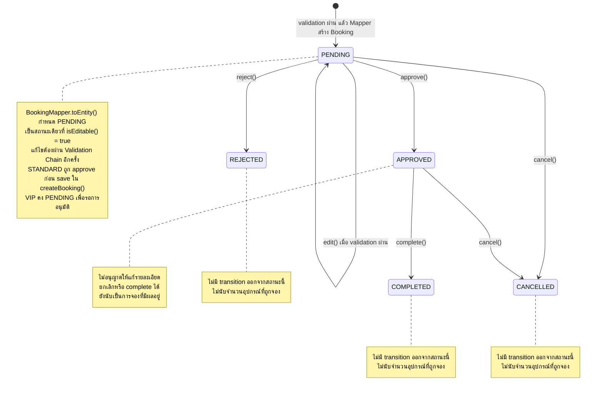

# State Diagram: บริบทที่เกี่ยวข้องกับ Booking Validation

เจ้าของเอกสารส่วน Booking Validation และ Equipment Linking: **นายณัฏฐชัย ผลดี (คนที่ 4)**

`Booking` มีสถานะ จึงต้องมี State Diagram ตามหัวข้อ 9.1 ของใบงาน การเขียน State Pattern (`BookingContext`, `BookingState` และ Concrete State) เป็นงานของคนที่ 3 เอกสารนี้อธิบายเฉพาะสถานะที่โค้ดปัจจุบันอนุญาต และจุดที่ Validation ของคนที่ 4 เชื่อมกับการสร้าง/แก้ไขการจอง

ลูกศร `edit()` หมายถึง operation `BookingServiceImpl.updateBooking()` ที่คงสถานะ `PENDING` เดิม ไม่ใช่เมธอดใน `BookingState` ส่วนลูกศรเริ่มต้นแสดงการสร้าง entity ในหน่วยความจำ หลังจาก Validation ผ่านแล้ว กรณีห้อง STANDARD จะเปลี่ยนเป็น `APPROVED` ก่อนบันทึกครั้งแรก ดังนั้นไม่ได้หมายความว่าทุกการจองจะบันทึกแถวสถานะ `PENDING` ลงฐานข้อมูลก่อนเสมอ

## จุดเชื่อมกับงานของคนที่ 4

| Operation | เงื่อนไขและผลที่เกี่ยวกับ Validation/Equipment Linking |
| --- | --- |
| `createBooking()` | กำหนด `request.bookingId = null`; ตรวจสิทธิ์ → ห้อง → เวลาทับซ้อน → จำนวนอุปกรณ์ ก่อนสร้าง `Booking` และ `BookingEquipment` |
| `updateBooking()` | ตรวจ `BookingContext.isEditable()` ก่อน; ถ้าเป็น `PENDING` จึงตั้ง `request.bookingId` เป็น id เดิมและตรวจ Validation Chain โดยไม่นับการจองตัวเอง |
| แก้ไขผ่านทุก Handler | Mapper อัปเดตรายละเอียด ล้างรายการอุปกรณ์เดิม และสร้างรายการใหม่โดยคงสถานะ/ผู้จองเดิม |
| Validation ไม่ผ่าน | โยน exception และหยุดขั้นตอนนั้น ไม่เพิ่มสถานะ `FAILED` และไม่เดินต่อไปสร้าง/บันทึก entity ตามเส้นทางสำเร็จ |
| ตรวจอุปกรณ์คงเหลือ | `BookingEquipmentRepository` นับเฉพาะ `PENDING` และ `APPROVED` ที่เวลาทับซ้อน; `REJECTED`, `CANCELLED`, `COMPLETED` ไม่ถูกนับ |
| `updateStatus()` | ใช้ State Pattern เปลี่ยนสถานะและเผยแพร่ event โดยไม่ได้เรียก Validation Chain ชุด create/update |

## Transition ที่โค้ดปฏิเสธ

`BookingState` มี default method ที่โยน `InvalidStateTransitionException` ถ้า Concrete State ไม่ได้ override action นั้น การกลับไป `PENDING` ถูกปฏิเสธใน `BookingServiceImpl.updateStatus()` และการแก้ไขรายละเอียดในสถานะอื่นถูกปฏิเสธก่อนเรียก Validation Chain

`REJECTED`, `CANCELLED` และ `COMPLETED` ไม่มี operation เปลี่ยนต่อใน State Pattern ปัจจุบัน แต่ข้อมูลการจองและรายการอุปกรณ์ยังคงอยู่ในฐานข้อมูล การเข้าสถานะเหล่านี้ไม่ได้แปลว่าลบแถว `BookingEquipment` อัตโนมัติ และไม่มี transition `COMPLETED` อัตโนมัติจากการถึง `endTime` ในคลาสที่อ้างอิงนี้

## อ้างอิงโค้ด

- [BookingStatus.java](../../../code/src/main/java/com/example/roombooking/domain/enums/BookingStatus.java)
- [BookingContext.java](../../../code/src/main/java/com/example/roombooking/domain/state/BookingContext.java)
- [BookingState.java](../../../code/src/main/java/com/example/roombooking/domain/state/BookingState.java)
- [PendingState.java](../../../code/src/main/java/com/example/roombooking/domain/state/PendingState.java), [ApprovedState.java](../../../code/src/main/java/com/example/roombooking/domain/state/ApprovedState.java)
- [RejectedState.java](../../../code/src/main/java/com/example/roombooking/domain/state/RejectedState.java), [CancelledState.java](../../../code/src/main/java/com/example/roombooking/domain/state/CancelledState.java), [CompletedState.java](../../../code/src/main/java/com/example/roombooking/domain/state/CompletedState.java)
- [BookingServiceImpl.java](../../../code/src/main/java/com/example/roombooking/service/impl/BookingServiceImpl.java)
- [BookingMapper.java](../../../code/src/main/java/com/example/roombooking/mapper/BookingMapper.java)
- [BookingEquipmentRepository.java](../../../code/src/main/java/com/example/roombooking/repository/BookingEquipmentRepository.java)
- [StandardRoomRuleStrategy.java](../../../code/src/main/java/com/example/roombooking/service/strategy/StandardRoomRuleStrategy.java), [VipRoomRuleStrategy.java](../../../code/src/main/java/com/example/roombooking/service/strategy/VipRoomRuleStrategy.java)
