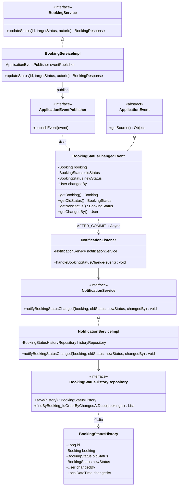
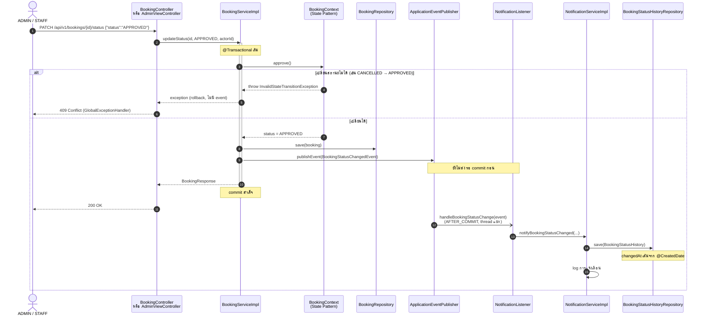

# Design Pattern: Observer (แจ้งเตือนเมื่อสถานะการจองเปลี่ยน)

ผู้รับผิดชอบ: นายจีรภัทร แก้วดี (673380577-9), branch `jiraphat_673380577-9_03`
Path ย่อจาก `code/src/main/java/com/example/roombooking/` บรรทัดอ้างอิงจาก `develop` commit `0c0b2ab`

## ปัญหาที่แก้

เมื่อการจองเปลี่ยนสถานะ (อนุมัติ, ปฏิเสธ, ยกเลิก, เสร็จสิ้น) ระบบต้องทำงานต่ออีกหลายอย่าง:

1. บันทึกประวัติลงตาราง `booking_status_history`
2. แจ้งเตือนผู้เกี่ยวข้อง (ตอนนี้เป็น log และต่อยอดเป็นอีเมล/SMS ได้)

ถ้าเขียนทั้งหมดไว้ใน `BookingServiceImpl.updateStatus()` จะเกิดปัญหา 3 อย่าง:
- service การจองต้องรู้จักทุกงานปลายทาง (coupling สูง)
- ทุกครั้งที่เพิ่มช่องทางแจ้งเตือน ต้องกลับไปแก้ `BookingServiceImpl` ซึ่งผิด Open/Closed
- ถ้าบันทึกประวัติไปแล้ว แต่ transaction ของการจอง rollback ภายหลัง จะเกิดประวัติปลอม

## วิธีแก้: Observer Pattern

| บทบาทใน Observer | คลาสในโปรเจกต์ | บรรทัด |
|---|---|---|
| **Subject** (ผู้ส่งเหตุการณ์) | `service/impl/BookingServiceImpl.java` | 141–142 `eventPublisher.publishEvent(...)` |
| **Event** (ข้อมูลที่ส่ง) | `event/BookingStatusChangedEvent.java` | 8–21 |
| **Event Bus** (ตัวกลาง) | Spring `ApplicationEventPublisher` | inject ที่ `BookingServiceImpl` บรรทัด 37, 45 |
| **Observer** (ผู้รับ) | `event/NotificationListener.java` | 27–38 |
| **งานที่ Observer สั่ง** | `service/impl/NotificationServiceImpl.java` | 25–44 |
| **ข้อมูลที่บันทึก** | `domain/entity/BookingStatusHistory.java` | 10–37 |

`BookingServiceImpl` ไม่ import `NotificationListener` เลย ถ้าเพิ่ม listener ตัวใหม่ ไม่ต้องแก้ subject

### จุดสำคัญในโค้ด

```java
// event/NotificationListener.java บรรทัด 27–29
@Async
@TransactionalEventListener(phase = TransactionPhase.AFTER_COMMIT, fallbackExecution = true)
public void handleBookingStatusChange(BookingStatusChangedEvent event) {
```

| Annotation | ทำไมต้องใช้ |
|---|---|
| `@TransactionalEventListener(phase = AFTER_COMMIT)` | listener ทำงาน **หลัง** การเปลี่ยนสถานะ commit ลงฐานข้อมูลแล้วเท่านั้น ถ้า transaction rollback จะไม่มีประวัติหรือแจ้งเตือนหลุดออกไป |
| `fallbackExecution = true` | ถ้า event ถูก publish นอก transaction (เช่น ใน test) listener ก็ยังทำงาน |
| `@Async` (เปิดด้วย `@EnableAsync` ที่ `DemoApplication.java` บรรทัด 8) | รันบน thread แยก ผู้ใช้ไม่ต้องรอการบันทึกประวัติหรือส่งแจ้งเตือน และถ้าการแจ้งเตือนล้มเหลว การเปลี่ยนสถานะที่ commit ไปแล้วไม่เสีย |
| `@CreatedDate` + `@EnableJpaAuditing` | เติม `changedAt` อัตโนมัติ (`BookingStatusHistory.java` บรรทัด 35–37, `JpaAuditingConfig.java` บรรทัด 7–8) |

## Class Diagram



## Sequence Diagram: ADMIN อนุมัติการจองห้อง VIP



ทั้ง REST API (`BookingController.java` บรรทัด 62–67) และหน้าเว็บ (`AdminViewController.java` บรรทัด 80–84, `BookingViewController.java` บรรทัด 342) เรียก `updateStatus` ตัวเดียวกัน ประวัติจึงถูกบันทึกเหมือนกันทุกช่องทาง

## ทดสอบ

| Test | ยืนยันอะไร |
|---|---|
| `event/NotificationListenerTest` | listener ส่งข้อมูลจาก event ให้ `NotificationService` ครบ รวมกรณีไม่มีผู้เปลี่ยน (`changedBy = null`) |
| `service/impl/NotificationServiceImplTest` | สร้าง `BookingStatusHistory` ถูกต้องแล้ว save |
| `event/BookingStatusObserverIntegrationTest` | `@SpringBootTest` ใช้ระบบจริง: อนุมัติแล้วมีประวัติ, เปลี่ยนสถานะหลายครั้งได้ประวัติครบทุกครั้ง, **เปลี่ยนสถานะผิดกฎแล้วไม่มี event และไม่มีประวัติ** |
| `repository/BookingStatusHistoryRepositoryTest` | `changedAt` ถูกเติมอัตโนมัติ, ค้นประวัติเรียงจากล่าสุด, สถานะเก็บเป็นข้อความ |

ไฟล์ test อยู่ที่ `test/jiraphat_673380577-9_03/java/com/example/roombooking/`

## ข้อจำกัดที่รู้อยู่

- **การจองห้อง STANDARD ไม่มีแถวในประวัติ:** การจองที่อนุมัติทันทีตอนสร้าง (ห้อง STANDARD) ยังไม่มีแถวในประวัติ เพราะ `createBooking` ไม่ได้ publish event มีแค่ `updateStatus` ที่ publish ต่อยอดได้โดยให้ `createBooking` publish event แบบ `oldStatus = null` ซึ่ง listener รองรับอยู่แล้ว เพราะคอลัมน์ `old_status` เป็น nullable
- **การแจ้งเตือนเป็นแค่ log:** ยังไม่มีอีเมลหรือ SMS จริง จุดที่ต้องเพิ่มคือ `NotificationServiceImpl` บรรทัด 35–43

---

# แนวทางอื่นในส่วนนี้ (ไม่ใช่ GoF pattern)

| แนวทาง | ไฟล์ | ใช้ทำอะไร |
|---|---|---|
| Centralized Exception Handling (`@RestControllerAdvice`) | `exception/GlobalExceptionHandler.java` | จัดการ error ของทุก REST controller ที่เดียว รายละเอียดใน [error-handling.md](error-handling.md) |
| DTO | `dto/response/ErrorResponse.java` | รูปแบบ JSON ของ error คงที่ ไม่ส่ง exception หรือ stack trace ออกไปตรง ๆ |
| Dependency Injection | ทุกคลาสข้างบน | รับ dependency ผ่าน constructor และ field เป็น `final` |
