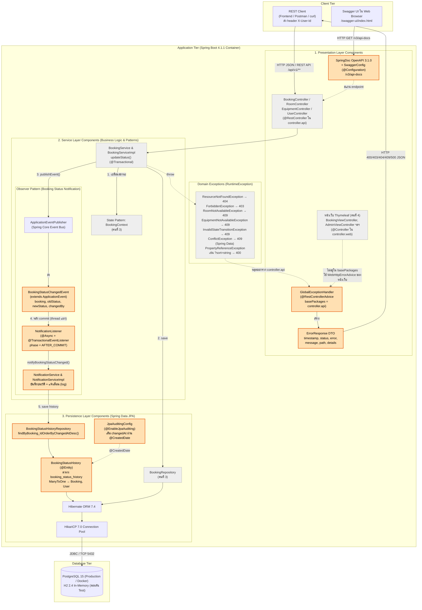
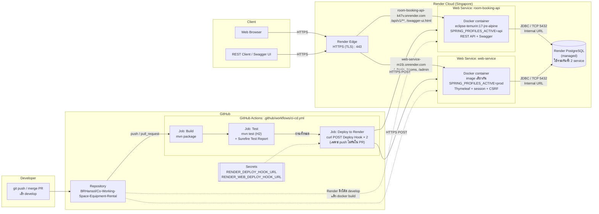
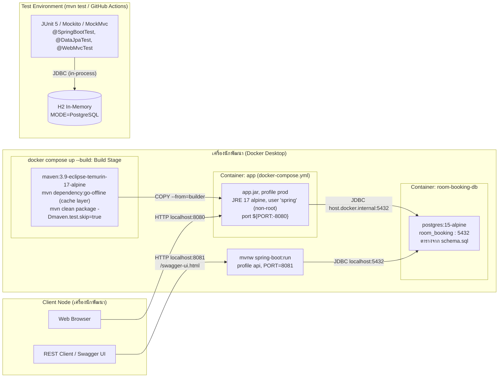

# Component Diagram & Deployment Diagram (ส่วนของคนที่ 5)
## โครงการ: Co-Working Space Equipment Rental (ระบบจองห้องประชุมและอุปกรณ์)
**ผู้รับผิดชอบ**: คนที่ 5 — Notification (Observer Pattern) + Error Handling + Infra/Deployment  
**มาตรฐานแผนภาพ**: UML 2.5 Component & Deployment Architecture Specifications  
**เทคโนโลยีหลัก**: Spring Boot 4.1.1 (Spring Framework 7.0), Java 17, PostgreSQL 15, Docker, GitHub Actions, Render

ขอบเขตงานของคนที่ 5 ในแผนภาพนี้:

| ส่วนประกอบ | ไฟล์ |
| :--- | :--- |
| Entity ประวัติการเปลี่ยนสถานะ | `domain/entity/BookingStatusHistory.java`, `repository/BookingStatusHistoryRepository.java` |
| Observer Pattern | `event/BookingStatusChangedEvent.java`, `event/NotificationListener.java`, `service/NotificationService.java`, `service/impl/NotificationServiceImpl.java` |
| JPA Auditing (เติม `changedAt` อัตโนมัติ) | `config/JpaAuditingConfig.java` |
| Error Handling | `exception/GlobalExceptionHandler.java`, `dto/response/ErrorResponse.java` |
| API Documentation | `config/SwaggerConfig.java` (springdoc-openapi 3.1.0) |
| Infra / Deployment | `Dockerfile`, `.dockerignore`, `docker-compose.yml`, `server.port=${PORT:8080}`, Render 2 service (API + หน้าเว็บ) |
| CI/CD | `.github/workflows/ci-cd.yml` (Build → Test → Deploy ผ่าน Render Deploy Hook) |

---

## 1. Component Diagram (แผนภาพแสดงองค์ประกอบและสถาปัตยกรรมภายใน)

Component Diagram แสดงส่วนประกอบซอฟต์แวร์ (Software Components), อินเทอร์เฟซที่ให้บริการ (Provided Interfaces), อินเทอร์เฟซที่เรียกใช้ (Required Interfaces) และการพึ่งพาระหว่างเลเยอร์ของ Spring Boot โดย**กล่องสีส้มคือส่วนที่คนที่ 5 รับผิดชอบ** กล่องสีเทาคือส่วนของสมาชิกคนอื่นที่คนที่ 5 ต้องเชื่อมต่อด้วย

### ลำดับการทำงานของ Observer Pattern (ตามหมายเลขในแผนภาพ)

1. `BookingServiceImpl.updateStatus()` ให้ `BookingContext` (State Pattern) ตรวจว่าเปลี่ยนสถานะได้ไหม ถ้าไม่ได้จะโยน `InvalidStateTransitionException` และ**ไม่มี event ถูกส่ง**
2. บันทึก `Booking` ที่เปลี่ยนสถานะแล้วผ่าน `BookingRepository`
3. ส่ง `BookingStatusChangedEvent` ผ่าน `ApplicationEventPublisher` โดย `BookingServiceImpl` ไม่รู้จัก listener ตัวไหนเลย (loose coupling)
4. `NotificationListener` ทำงาน**หลัง transaction commit แล้วเท่านั้น** (`AFTER_COMMIT`) บน thread แยก (`@Async`) ถ้า transaction rollback จะไม่มีการแจ้งเตือนหรือประวัติปลอมหลุดออกไป
5. `NotificationServiceImpl` บันทึก `BookingStatusHistory` ลงฐานข้อมูล โดย `changedAt` ถูกเติมอัตโนมัติจาก JPA Auditing แล้ว log การแจ้งเตือน (จุดต่อยอดสำหรับอีเมล/SMS ในอนาคตโดยไม่ต้องแก้ `BookingServiceImpl`)

---

## 2. Deployment Diagram (แผนภาพการติดตั้งระบบขึ้นใช้งานจริง)

ระบบรันได้ 3 สภาพแวดล้อม ทุกแบบใช้ `Dockerfile` ตัวเดียวกัน ต่างกันแค่ **Spring profile** และตัวแปรสภาพแวดล้อม

| สภาพแวดล้อม | ใช้ทำอะไร | ฐานข้อมูล |
| :--- | :--- | :--- |
| **Cloud (Render)** | ระบบจริงที่มี URL สาธารณะ | Render PostgreSQL (managed) |
| **บนเครื่อง / Docker Compose** | รันทดสอบบนเครื่องตัวเอง | PostgreSQL ใน Docker (`postgres:15-alpine`) |
| **Test (`mvn test`)** | รัน test อัตโนมัติบนเครื่องและใน GitHub Actions | H2 in-memory |

| Profile | เปิดอะไร |
| :--- | :--- |
| `prod` (ค่าเริ่มต้น = `web` + `postgres`) | หน้าเว็บ Thymeleaf, session, สิทธิ์ USER/STAFF/ADMIN, CSRF โดยปิด `/api/**` (403) และ Swagger |
| `api` (= `postgres`) | REST API `/api/v1/**` + Swagger UI ไม่มีหน้าเว็บ |

ระบบ deploy เป็น **2 service** ที่ใช้ฐานข้อมูลเดียวกัน เพราะ REST API ระบุผู้ใช้ด้วย header `X-User-Id` ซึ่ง client ส่งเองได้ ถ้าเปิด API บน service เดียวกับหน้าเว็บ จะใช้ API ข้ามการตรวจสิทธิ์ของหน้าเว็บได้

ทั้งสองแบบใช้ `ddl-auto=validate` คือแอปตรวจว่าตารางตรงกับ Entity เท่านั้น ส่วนการสร้างตารางต้องทำแยกก่อน ด้วย `db/postgresql/schema.sql`

### 2.1 Cloud Deployment (Render + GitHub Actions)

### 2.2 Local Deployment (บนเครื่อง / Docker Compose)

### คำสั่งที่ใช้ (รายละเอียดใน [HOWTORUN.md](../HOWTORUN.md))

| งาน | คำสั่ง |
| :--- | :--- |
| รัน test ทั้งหมด | `cd code && ./mvnw clean test` |
| สร้างตาราง | `psql ... -f code/src/main/resources/db/postgresql/schema.sql` |
| รันหน้าเว็บบนเครื่อง | `./mvnw spring-boot:run` (ตั้ง `DB_*` และ `SESSION_COOKIE_SECURE=false`) |
| รัน API + Swagger บนเครื่อง | `./mvnw spring-boot:run -Dspring-boot.run.profiles=api` |
| รันหน้าเว็บด้วย Docker Compose | `cd code && docker compose up --build` (ตั้ง `DB_URL`, `DB_USERNAME`, `DB_PASSWORD`) |

---

## 3. ตารางการเชื่อมต่อเครือข่าย (Network & Protocols Matrix)

| ต้นทาง | ปลายทาง | โปรโตคอล | พอร์ต | ความปลอดภัย | วัตถุประสงค์ |
| :--- | :--- | :---: | :---: | :--- | :--- |
| **Browser** | **Render Edge → web-service** | HTTPS | `443` | TLS จาก Render, session cookie แบบ Secure/HttpOnly/SameSite=Lax, CSRF token | ใช้หน้าเว็บ |
| **REST Client** | **Render Edge → room-booking-api** | HTTPS | `443` | TLS จาก Render, ระบุผู้ใช้ด้วย `X-User-Id` (ยังไม่มี JWT) | เรียก REST API / Swagger |
| **Render Edge** | **container ทั้งสอง** | HTTP | `$PORT` | อยู่ในเครือข่ายของ Render, แอปอ่าน `X-Forwarded-*` (`forward-headers-strategy=framework`) | ส่ง request เข้า container |
| **container ทั้งสอง** | **Render PostgreSQL** | JDBC over TCP | `5432` | Internal URL (private network), รหัสผ่านอยู่ใน Environment ไม่อยู่ในโค้ด | อ่าน/เขียนข้อมูลและ `booking_status_history` |
| **GitHub Actions** | **Render Deploy Hook** | HTTPS POST | `443` | URL เก็บใน GitHub Secrets | สั่ง deploy หลัง test ผ่าน |
| **app container (local)** | **room-booking-db** | JDBC over TCP | `5432` | ผ่าน `host.docker.internal` | ฐานข้อมูลบนเครื่อง |
| **JVM ตอนรัน test** | **H2 In-Memory** | JDBC (in-process) | - | ไม่มีการเชื่อมต่อเครือข่าย | รัน test โดยไม่พึ่งฐานข้อมูลจริง |

---

## 4. ข้อกำหนดทรัพยากรระบบ (System Specifications)

| ส่วนประกอบ | ที่ใช้จริง (Render Free) | แนะนำสำหรับ Production | เทคโนโลยี |
| :--- | :--- | :--- | :--- |
| **Application (ต่อ 1 service)** | 0.1 CPU, 512 MB RAM | 1 vCPU, 1 GB RAM | Docker, Alpine, Temurin JRE 17, Spring Boot 4.1.1, Tomcat 11 |
| **Database** | Render PostgreSQL Free | 1 vCPU, 1 GB RAM, 10 GB SSD + Backup | Managed PostgreSQL |
| **CI/CD** | GitHub Actions `ubuntu-latest` | เหมือนเดิม | JDK 17 (Temurin) + Maven |
| **Build** | Docker multi-stage build บน Render | เหมือนเดิม | `maven:3.9-eclipse-temurin-17-alpine` → `eclipse-temurin:17-jre-alpine` |

Render Free จะหยุด service เมื่อไม่มีคนใช้ประมาณ 15 นาที request แรกหลังจากนั้นจะช้าประมาณ 30–60 วินาที

### ตัวแปรสภาพแวดล้อม (Environment Variables) บน Render

| ตัวแปร | `room-booking-api` | `web-service` | ใช้ทำอะไร |
| :--- | :--- | :--- | :--- |
| `SPRING_PROFILES_ACTIVE` | `api` | `prod` | เลือกโหมด API หรือหน้าเว็บ |
| `DB_URL` | `jdbc:postgresql://<internal-host>:5432/<db-name>` | เหมือนกัน | ที่อยู่ฐานข้อมูล (ขึ้นต้นด้วย `jdbc:` และไม่ใส่ user:password ใน URL) |
| `DB_USERNAME` / `DB_PASSWORD` | จากหน้า Render PostgreSQL | เหมือนกัน | บัญชีฐานข้อมูล |
| `JAVA_TOOL_OPTIONS` | `-Xmx300m -Xss512k -XX:MaxMetaspaceSize=150m -XX:+UseSerialGC -XX:TieredStopAtLevel=1` | เหมือนกัน | จำกัดหน่วยความจำ JVM ให้พอดีกับ RAM 512 MB |
| `PORT` | Render ส่งให้เอง | Render ส่งให้เอง | พอร์ตที่ Tomcat เปิดรับ (`server.port=${PORT:8080}`) |
