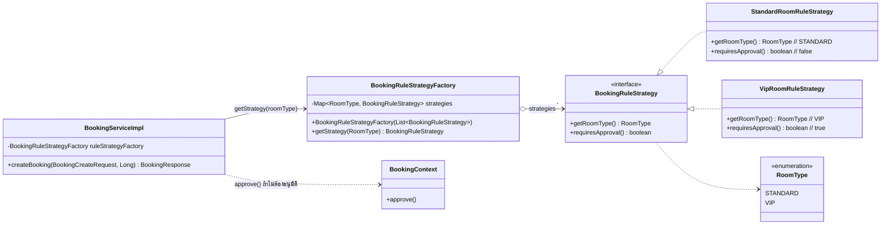

# Design Patterns: ส่วน Room / Equipment / Booking Rule Strategy

ผู้รับผิดชอบ: กฤติธี ศรีใสย์ (673380572-9), branch `krittitee_673380572-9_04`
กลุ่ม GoF: **Behavioral**

| Pattern | ปัญหาที่แก้ | ไฟล์/คลาสที่ใช้ |
|---|---|---|
| **Strategy** (Behavioral) | ห้องแต่ละประเภทมีกฎการอนุมัติต่างกัน (STANDARD อนุมัติอัตโนมัติ, VIP ต้องรอ admin) ถ้าเขียน `if (type == VIP) ... else ...` ใน service ทุกครั้งที่เพิ่มประเภทห้องต้องกลับไปแก้ service | `BookingRuleStrategy` (interface), `StandardRoomRuleStrategy`, `VipRoomRuleStrategy`, ใช้งานใน `BookingServiceImpl.createBooking()` บรรทัด 74–76 |
| Factory (ตัวช่วยเลือก Strategy) | ต้องมีที่เดียวสำหรับเลือก strategy ให้ตรงกับ `RoomType` และแจ้ง error ชัดเจนถ้าไม่มีกฎ | `BookingRuleStrategyFactory.getStrategy()` |
| Service Layer + Repository + DTO/Mapper (Enterprise) | แยก Room/Equipment เป็นชั้น controller → service → repository และไม่ส่ง Entity ออก API | `RoomController` → `RoomService` → `MeetingRoomRepository`, `RoomMapper` (Equipment เหมือนกัน) |

## Strategy

### ทำไมเลือก Strategy
- กฎที่เปลี่ยนตาม "ประเภท" ของสิ่งของคือกรณีคลาสสิกของ Strategy
- ทำให้เพิ่มประเภทห้องใหม่ได้โดยเพิ่มคลาส ไม่ต้องแก้โค้ดเดิม (Open/Closed)
- ทดสอบกฎแต่ละตัวแยกกันได้ (`BookingRuleStrategyTest`)

### ทำงานร่วมกับ Pattern อื่นยังไง
- **State**: ถ้าไม่ต้องอนุมัติ Strategy จะเรียก `BookingContext.approve()` เพื่อเปลี่ยน PENDING → APPROVED ผ่าน state machine ไม่ได้ set status ตรง ๆ
- **Chain of Responsibility**: validation chain หาห้องให้ก่อน แล้ว Strategy ใช้ `room.getRoomType()` จากผลนั้น

### Class Diagram

