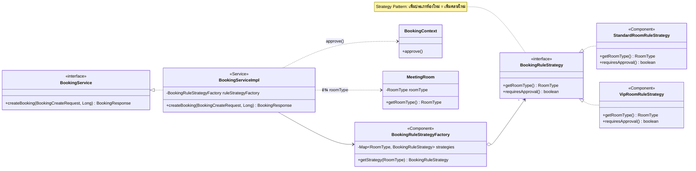

# Class Diagram: Booking Rule Strategy

```mermaid
classDiagram
    direction LR
    class BookingRuleStrategy {
        <<interface>>
        +getRoomType() RoomType
        +requiresApproval() boolean
    }
    class StandardRoomRuleStrategy {
        <<Component>>
        +getRoomType() RoomType
        +requiresApproval() boolean
    }
    class VipRoomRuleStrategy {
        <<Component>>
        +getRoomType() RoomType
        +requiresApproval() boolean
    }
    class BookingRuleStrategyFactory {
        <<Component>>
        -Map~RoomType, BookingRuleStrategy~ strategies
        +getStrategy(RoomType) BookingRuleStrategy
    }
    class BookingService {
        <<interface>>
        +createBooking(BookingCreateRequest, Long) BookingResponse
    }
    class BookingServiceImpl {
        <<Service>>
        -BookingRuleStrategyFactory ruleStrategyFactory
        +createBooking(BookingCreateRequest, Long) BookingResponse
    }
    class BookingContext {
        +approve()
    }
    class MeetingRoom {
        -RoomType roomType
        +getRoomType() RoomType
    }

    BookingRuleStrategy <|.. StandardRoomRuleStrategy
    BookingRuleStrategy <|.. VipRoomRuleStrategy
    BookingService <|.. BookingServiceImpl
    BookingRuleStrategyFactory o--> "*" BookingRuleStrategy
    BookingServiceImpl --> BookingRuleStrategyFactory
    BookingServiceImpl ..> MeetingRoom : อ่าน roomType
    BookingServiceImpl ..> BookingContext : approve()
    note for BookingRuleStrategy "Strategy Pattern: เพิ่มประเภทห้องใหม่ = เพิ่มคลาสใหม่"
```
