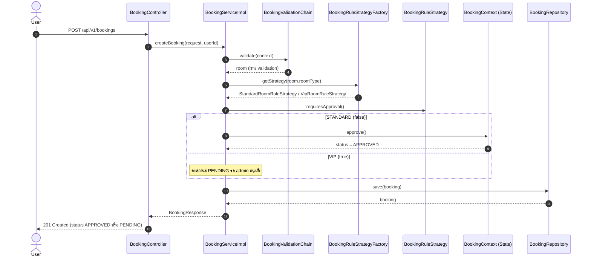

# Sequence Diagram: สร้างการจองแล้วเลือกกฎตามประเภทห้อง

```mermaid
sequenceDiagram
    autonumber
    actor U as User
    participant C as BookingController
    participant S as BookingServiceImpl
    participant V as BookingValidationChain
    participant F as BookingRuleStrategyFactory
    participant R as BookingRuleStrategy
    participant B as BookingContext (State)
    participant DB as BookingRepository

    U->>C: POST /api/v1/bookings
    C->>S: createBooking(request, userId)
    S->>V: validate(context)
    V-->>S: room (ผ่าน validation)
    S->>F: getStrategy(room.roomType)
    F-->>S: StandardRoomRuleStrategy / VipRoomRuleStrategy
    S->>R: requiresApproval()
    alt STANDARD (false)
        S->>B: approve()
        B-->>S: status = APPROVED
    else VIP (true)
        Note over S: คงสถานะ PENDING รอ admin อนุมัติ
    end
    S->>DB: save(booking)
    DB-->>S: booking
    S-->>C: BookingResponse
    C-->>U: 201 Created (status APPROVED หรือ PENDING)
```
