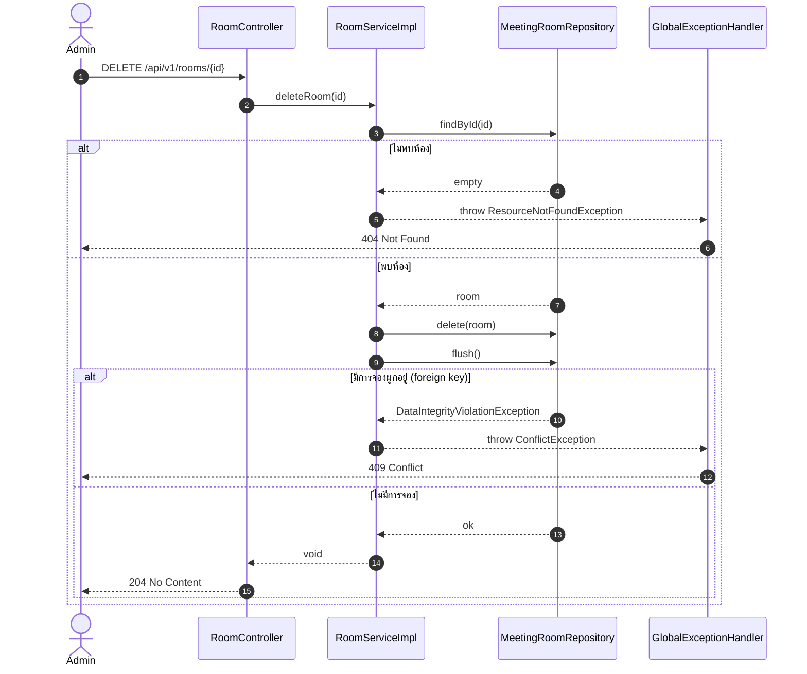

# Sequence Diagram: ลบห้องที่ยังมีการจองอยู่

```mermaid
sequenceDiagram
    autonumber
    actor A as Admin
    participant C as RoomController
    participant S as RoomServiceImpl
    participant DB as MeetingRoomRepository
    participant H as GlobalExceptionHandler

    A->>C: DELETE /api/v1/rooms/{id}
    C->>S: deleteRoom(id)
    S->>DB: findById(id)
    alt ไม่พบห้อง
        DB-->>S: empty
        S-->>H: throw ResourceNotFoundException
        H-->>A: 404 Not Found
    else พบห้อง
        DB-->>S: room
        S->>DB: delete(room)
        S->>DB: flush()
        alt มีการจองผูกอยู่ (foreign key)
            DB-->>S: DataIntegrityViolationException
            S-->>H: throw ConflictException
            H-->>A: 409 Conflict
        else ไม่มีการจอง
            DB-->>S: ok
            S-->>C: void
            C-->>A: 204 No Content
        end
    end
```
