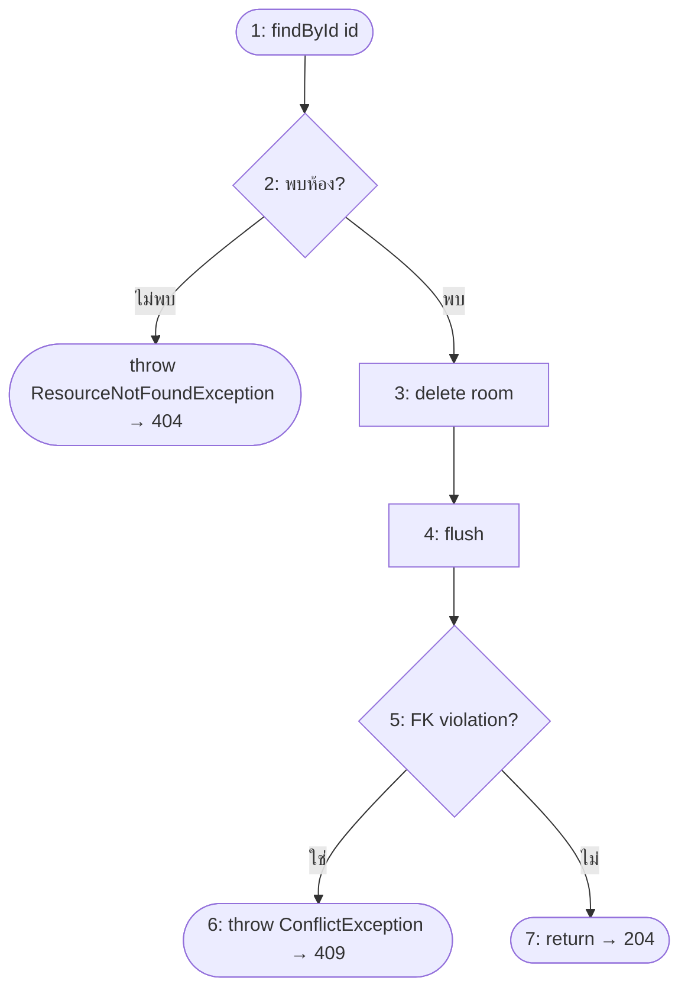
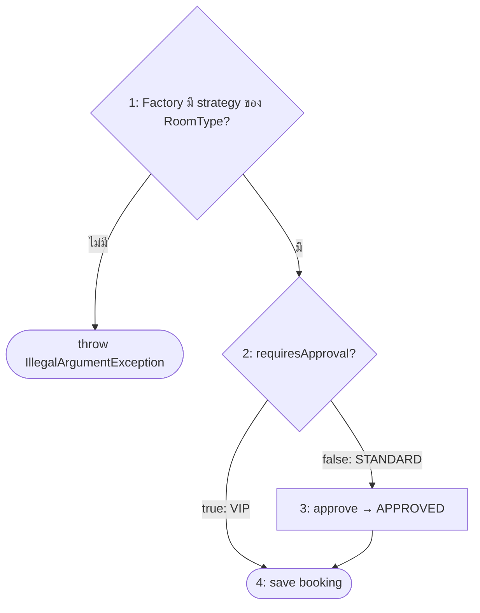

# White-box Testing: Control Flow Graph และ Basis Path

ผู้รับผิดชอบ: กฤติธี ศรีใสย์ (673380572-9)

วิเคราะห์ 2 method ที่มี logic แตกแขนงมากที่สุดในส่วนงานนี้ แล้วใช้ **Basis Path Testing** หาจำนวน test case ขั้นต่ำที่ครอบคลุมทุกเส้นทางอิสระ จำนวนนั้นคือ **Cyclomatic Complexity V(G)**

`V(G) = E − N + 2` (E = จำนวนเส้น, N = จำนวนโหนด) หรือ `V(G) = จำนวน decision + 1`

---

## 1. `RoomServiceImpl.deleteRoom(Long id)`

```java
public void deleteRoom(Long id) {
    MeetingRoom existingRoom = findRoomOrThrow(id);          // 1, 2
    try {
        meetingRoomRepository.delete(existingRoom);          // 3
        meetingRoomRepository.flush();                       // 4
    } catch (DataIntegrityViolationException ex) {           // 5
        throw new ConflictException("...");                 // 6
    }
}                                                            // 7 (return)
```



| | ค่า |
|---|---|
| Decision | 2 (พบห้องไหม, flush ชน FK ไหม) |
| **V(G)** | **2 + 1 = 3** |

| Basis Path | เส้นทาง | Test Case |
|---|---|---|
| P1 | 1 → 2 → throw 404 | TC-RS08, TC-RC03, TC-IT05 |
| P2 | 1 → 2 → 3 → 4 → 5 → 7 | TC-RS07, TC-RS09, TC-RC04, TC-IT02 |
| P3 | 1 → 2 → 3 → 4 → 5 → 6 | TC-RS10, TC-RC05, TC-IT01 |

ครอบคลุมครบ 3/3 เส้นทาง `EquipmentServiceImpl.deleteEquipment` มีโครงสร้างเดียวกัน (V(G) = 3) ครอบคลุมด้วย TC-ES10 / TC-ES09, TC-IT04 / TC-ES12, TC-IT03

---

## 2. `BookingServiceImpl.createBooking(...)`: ส่วนเรียก Strategy

```java
BookingRuleStrategy rule = ruleStrategyFactory.getStrategy(roomType);   // 1  (Factory: มี strategy ไหม)
if (!rule.requiresApproval()) {                                         // 2
    new BookingContext(booking).approve();                              // 3
}
bookingRepository.save(booking);                                        // 4
```



| | ค่า |
|---|---|
| Decision | 2 |
| **V(G)** | **3** |

| Basis Path | เส้นทาง | Test Case |
|---|---|---|
| P1 | 1 → throw | TC-ST05 |
| P2 | 1 → 2 → 3 → 4 (STANDARD) | TC-BK01 |
| P3 | 1 → 2 → 4 (VIP) | TC-BK02 |

---

## 3. Code Coverage (JaCoCo)

ใช้ JaCoCo วัด statement (line) และ branch coverage ของคลาสในส่วนงานนี้

```bash
cd code
./mvnw clean test -P krittitee_673380572-9_04
```

เปิดผลที่ `code/target/krittitee_673380572-9_04-jacoco/index.html`

ไม่รวม `BookingServiceImpl` ทั้งคลาส เพราะส่วนที่เป็นงานคนที่ 2 มีแค่การเรียก Strategy ใน `createBooking` ส่วนนั้นวัดด้วย basis path ในข้อ 2 แทน
