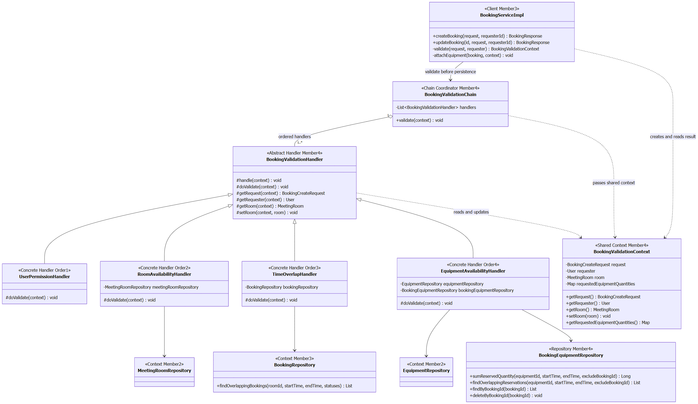

# Design Patterns: ส่วน Booking Validation / Equipment Linking / Booking DTO และ Mapper

ผู้รับผิดชอบ: ณัฏฐชัย ผลดี (673380581-8), branch `nuttachai_673380581-8_04`

กลุ่ม GoF หลัก: **Behavioral — Chain of Responsibility**

| Pattern | ปัญหาที่แก้ | ไฟล์/คลาสที่ใช้ | Class Diagram |
|---|---|---|---|
| **Chain of Responsibility** (Behavioral) | การจองต้องผ่านกฎหลายชุด ถ้ารวมการตรวจสิทธิ์ ห้อง เวลา และอุปกรณ์ไว้ใน Service เดียว จะขยายและทดสอบกฎแต่ละชุดได้ยาก | `BookingValidationChain`, `BookingValidationHandler`, `UserPermissionHandler`, `RoomAvailabilityHandler`, `TimeOverlapHandler`, `EquipmentAvailabilityHandler`, `BookingValidationContext` | [Chain และ Handler](diagrams/02-domain-and-class.md#class-diagram-chain-of-responsibility) |
| DTO / Mapper (Enterprise) | รูปแบบข้อมูลรับเข้าและส่งออกต่างจาก Entity และต้องกำหนดว่าฟิลด์ใดเปลี่ยนได้เมื่อแก้ไขการจอง | `BookingCreateRequest`, `BookingResponse`, `BookingMapper` | [DTO, Mapper และ Equipment Linking](diagrams/02-domain-and-class.md#class-diagram-dto-mapper-และ-equipment-linking) |
| Repository (Enterprise) | ต้องอ่านยอดใช้อุปกรณ์จากฐานข้อมูลโดยไม่ให้ Handler เขียน JPQL หรือรวมช่วงเวลาการจองเอง | `BookingEquipmentRepository` และ projection `ReservationWindow` | [ตำแหน่ง Repository ใน Chain](diagrams/02-domain-and-class.md#class-diagram-chain-of-responsibility) |

DTO, Mapper และ Repository เป็นรูปแบบจัดโครงสร้างแอปพลิเคชัน ไม่ได้นับเป็น GoF เพิ่มอีกสาม Pattern ส่วน `BookingEquipment` เป็น association entity สำหรับเก็บข้อมูลของความสัมพันธ์ ไม่ใช่ GoF Pattern

## Chain of Responsibility

### ทำไมเลือก Chain of Responsibility

- กฎสิทธิ์ผู้ใช้ ความพร้อมของห้อง เวลาซ้อนทับ และจำนวนอุปกรณ์มีเหตุผลในการเปลี่ยนต่างกัน จึงแยกเป็น Handler ที่มีหน้าที่ชัดเจน
- Service เรียก `validationChain.validate(context)` จุดเดียว และนำผลลัพธ์ไปสร้างหรือแก้ไขการจอง ทำให้ลำดับธุรกิจของ Service อ่านได้ง่ายขึ้น
- เพิ่มกฎได้โดยสร้าง subclass ของ `BookingValidationHandler`, ลงทะเบียนเป็น Spring bean และกำหนด `@Order` โดยไม่ต้องเพิ่มเงื่อนไขในลูปของ Chain แต่ยังต้องเลือกตำแหน่งและตรวจความสัมพันธ์กับกฎเดิม
- ทดสอบ Handler แต่ละตัวด้วย Repository จำลองได้ และทดสอบลำดับของ Chain แยกจากการบันทึกฐานข้อมูลได้

### การทำงานของ Chain ในโค้ดจริง

`BookingValidationChain` รับ `List<BookingValidationHandler>` ผ่าน constructor โดย Spring เรียง bean ตาม `@Order` แล้ว Chain วนเรียก `handler.handle(context)` ทีละตัว การตรวจสอบทุกตัวต้องผ่านก่อน Service บันทึกข้อมูล หากตัวใดโยน exception ลูปหยุดทันทีและ Service ไม่ไปถึงขั้นสร้างลิงก์อุปกรณ์หรือบันทึกการจอง

โค้ดนี้ใช้ Chain แบบรายการที่มีตัวประสานกลาง ไม่มีฟิลด์ `next` และไม่มี Handler เรียก Handler ถัดไปด้วยตัวเอง จึงเป็น validation pipeline ที่ประยุกต์แนวคิด Chain of Responsibility ให้เหมาะกับกฎที่ต้องผ่านทุกข้อ

| ลำดับ | Handler | กฎที่ตรวจและข้อมูลที่ส่งต่อ |
|---|---|---|
| 1 | `UserPermissionHandler` | ปฏิเสธบัญชีที่ `active == false`; การจองแทนผู้อื่นอนุญาตเฉพาะ ADMIN หรือ STAFF |
| 2 | `RoomAvailabilityHandler` | ค้นหาห้อง ตรวจสถานะ AVAILABLE และเก็บ `MeetingRoom` ลงใน context |
| 3 | `TimeOverlapHandler` | ตรวจ `startTime < endTime` และการจองห้องซ้อนทับเฉพาะ PENDING/APPROVED; ตอนแก้ไขตัดการจองตัวเองออก |
| 4 | `EquipmentAvailabilityHandler` | รวม quantity ของ equipmentId ที่ซ้ำ ตรวจจำนวนบวกและจำนวนรวมไม่ล้น แล้วเทียบกับอุปกรณ์ที่เหลือตามช่วงเวลา |

`BookingValidationContext` เก็บ request, requester, ห้องที่ตรวจแล้ว และ `Map<Long, Integer>` ของจำนวนอุปกรณ์ที่รวมแล้ว ทำให้ Service ใช้ผลการตรวจชุดเดียวกันต่อได้ โดยไม่แปลงรายการอุปกรณ์จาก request ซ้ำ ควรสร้าง context ใหม่ต่อการตรวจหนึ่งครั้งตามที่ `BookingServiceImpl.validate()` ทำ เพราะ context มีข้อมูลที่ Handler เปลี่ยนระหว่างทาง

`BookingValidationHandler.handle()` เป็น `final` และเรียก `doValidate()` ที่ subclass ต้อง implement จึงกำหนดจุดเรียกกฎร่วมกันในลักษณะเดียวกับ Template Method อย่างง่าย อย่างไรก็ตามเมธอดนี้มีเพียงขั้นตอนเดียว จึงไม่อ้างว่าเป็น GoF หลักอีก Pattern ของงานชิ้นนี้

### Class Diagram

ดู Mermaid source พร้อมรายละเอียดความสัมพันธ์ได้ที่ [Domain Model และ Class Diagram](diagrams/02-domain-and-class.md) โดยแสดงตำแหน่ง Client, Chain Coordinator, Abstract Handler, Concrete Handler, Shared Context และ Repository ตามโค้ดจริง

### จำนวนอุปกรณ์ที่เหลือคำนวณอย่างไร

`EquipmentAvailabilityHandler` เรียก `BookingEquipmentRepository.sumReservedQuantity()` แล้วคำนวณ `available = totalQuantity - peakReserved` แม้เมธอดชื่อ `sumReservedQuantity` แต่ค่าที่คืนจริงคือ **จำนวนที่ถูกจองพร้อมกันสูงสุด** ในช่วงเวลาที่ขอ ไม่ใช่ผลรวมอุปกรณ์ของทุกการจองที่ทับซ้อน

Repository ดึงช่วงเวลาของการจอง PENDING/APPROVED ตัดช่วงให้ตรงกับช่วงที่ขอ แล้วใช้ `TreeMap` รวมเหตุการณ์เริ่มยืมและคืนอุปกรณ์ จากนั้นเดินตามเวลาเพื่อหายอดสูงสุด เหตุผลคือการจองหลายรายการที่เกิดคนละช่วงอาจใช้อุปกรณ์ชุดเดียวกันต่อกันได้ การบวก quantity ของทุกแถวตรง ๆ จะทำให้เหลืออุปกรณ์น้อยกว่าความจริง

ช่วงเวลามีความหมายเป็น `[startTime, endTime)` จึงสามารถคืนและเริ่มใช้ต่อที่เวลาเดียวกันได้ ส่วน `excludeBookingId` ใช้ไม่นับรายการเดิมตอนแก้ไขการจอง Service กำหนดค่านี้เอง: สร้างใหม่เป็น `null` และแก้ไขเป็น id ของ Booking ที่โหลดแล้ว

การตรวจพร้อมใช้แล้วบันทึกใน transaction ยังไม่รับประกันการป้องกันคำขอพร้อมกันทุกกรณี โค้ดส่วนนี้ไม่มี lock สำหรับแย่งห้องหรืออุปกรณ์ จึงไม่ควรอ้างว่า Chain เพียงอย่างเดียวป้องกันการจองเกินจำนวนจาก concurrent requests ได้

## DTO / Mapper และ Equipment Linking

### ทำไมแยก DTO และ Mapper

- `BookingCreateRequest` ใช้ Bean Validation ตรวจโครงสร้างข้อมูล เช่น roomId/เวลาไม่เป็น null และ quantity เป็นบวก ส่วนกฎที่ต้องอ่านฐานข้อมูลอยู่ใน Chain
- `BookingResponse` ระบุข้อมูลที่จะส่งกลับอย่างชัดเจน จึงไม่ต้องส่ง JPA Entity และความสัมพันธ์ทั้งหมดออกจาก API โดยตรง
- `BookingMapper.toEntity()` สร้าง Booking เริ่มต้นเป็น PENDING; `updateEntity()` เปลี่ยนห้อง เวลา และ purpose โดยไม่แก้ user/status ทำให้ขอบเขตการแปลงข้อมูลแน่นอน
- Mapper ไม่สร้างลิงก์อุปกรณ์จาก request โดยตรง Service ใช้ quantity ที่รวมและผ่านการตรวจจาก context สร้าง `BookingEquipment` จึงบันทึกจำนวนเดียวกับที่ตรวจไว้

`BookingEquipment` เก็บ quantity เพิ่มจากความสัมพันธ์ Booking–Equipment จึงใช้ association entity พร้อม `ManyToOne` สองด้านแทน `@ManyToMany` โดยตรง `Booking` เป็นเจ้าของ collection ที่ใช้ cascade และ orphanRemoval; ตอนแก้ไข Service ล้างรายการเดิมแล้วแนบรายการใหม่ ส่วน entity ฝั่งลิงก์กำหนด FK, index และข้อกำหนด `quantity > 0`

ดูความสัมพันธ์ได้ที่ [Class Diagram ของ DTO, Mapper และ Equipment Linking](diagrams/02-domain-and-class.md#class-diagram-dto-mapper-และ-equipment-linking)

## ทำงานร่วมกับ Pattern และส่วนของสมาชิกอื่นอย่างไร

- **Service Layer — คนที่ 3:** `BookingServiceImpl` สร้าง context เรียก Chain และใช้ Mapper จากงานคนที่ 4 ส่วนการจัดการ transaction และ CRUD เป็นงาน Booking Core
- **Strategy — คนที่ 2:** หลัง Chain ตรวจห้องและทรัพยากรผ่านแล้ว Service เลือกกฎจากประเภทห้อง STANDARD อนุมัติทันที ส่วน VIP รออนุมัติ กฎนี้อยู่นอก Chain
- **State — คนที่ 3:** Service ใช้ `BookingContext` ตรวจว่าแก้ไข Booking ได้หรือไม่ก่อนเรียก Chain และเปลี่ยนสถานะผ่าน State Pattern การตรวจทรัพยากรไม่ได้เปลี่ยนสถานะการจองเอง
- **Observer / Error Response — คนที่ 5:** การเปลี่ยนสถานะผ่าน `updateStatus()` ส่ง `BookingStatusChangedEvent`; exception จาก Chain ส่งต่อให้ตัวจัดการข้อผิดพลาดส่วนกลาง การตรวจไม่ผ่านไม่ได้เปลี่ยนสถานะเป็น REJECTED และไม่ได้ส่ง event สถานะโดยตัว Handler
- **User / Room / Equipment — คนที่ 1 และ 2:** Chain ใช้ User และ Repository ของทรัพยากรเป็นจุดเชื่อมต่อ งานนี้ไม่เปลี่ยนเจ้าของ Entity หรือ CRUD ของสมาชิกเหล่านั้น

ดูตัวอย่างลำดับการทำงานได้ที่ [Sequence Diagram: สร้างสำเร็จ แก้ไขสำเร็จ และอุปกรณ์ไม่พอ](diagrams/03-sequence-diagrams.md)

## อ้างอิงโค้ด

- [BookingValidationChain.java](../../code/src/main/java/com/example/roombooking/service/validation/BookingValidationChain.java), [BookingValidationHandler.java](../../code/src/main/java/com/example/roombooking/service/validation/BookingValidationHandler.java), [BookingValidationContext.java](../../code/src/main/java/com/example/roombooking/service/validation/BookingValidationContext.java)
- [UserPermissionHandler.java](../../code/src/main/java/com/example/roombooking/service/validation/UserPermissionHandler.java), [RoomAvailabilityHandler.java](../../code/src/main/java/com/example/roombooking/service/validation/RoomAvailabilityHandler.java), [TimeOverlapHandler.java](../../code/src/main/java/com/example/roombooking/service/validation/TimeOverlapHandler.java), [EquipmentAvailabilityHandler.java](../../code/src/main/java/com/example/roombooking/service/validation/EquipmentAvailabilityHandler.java)
- [BookingEquipment.java](../../code/src/main/java/com/example/roombooking/domain/entity/BookingEquipment.java), [BookingEquipmentRepository.java](../../code/src/main/java/com/example/roombooking/repository/BookingEquipmentRepository.java)
- [BookingCreateRequest.java](../../code/src/main/java/com/example/roombooking/dto/request/BookingCreateRequest.java), [BookingResponse.java](../../code/src/main/java/com/example/roombooking/dto/response/BookingResponse.java), [BookingMapper.java](../../code/src/main/java/com/example/roombooking/mapper/BookingMapper.java)
- [BookingServiceImpl.java](../../code/src/main/java/com/example/roombooking/service/impl/BookingServiceImpl.java)

[กลับสารบัญรายงานคนที่ 4](README.md)
