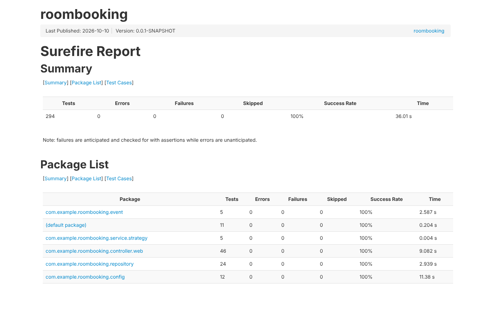

# Test Report

รายงานผลการทดสอบอัตโนมัติของระบบ Co-Working-Space-Equipment-Rental

| | |
|---|---|
| วันที่รัน | 10 ต.ค. 2569 (2026-10-10) |
| โค้ดที่ทดสอบ | `develop` (`744ac8a`) + PR #79 (`jiraphat_673380577-9_03`, `3ab5759`) + PR #78 (`boonyapaween_673380588-4_03`, `81f8e6c`) |
| คำสั่ง | `cd code && ./mvnw clean test` แล้ว `./mvnw surefire-report:report-only` |
| สภาพแวดล้อม | JDK 17, Maven 3.9, Spring Boot 4.1.1, ฐานข้อมูล H2 in-memory (`MODE=PostgreSQL`) จาก `code/src/test/resources/application.properties` |
| เครื่องมือ | JUnit 5, Mockito, Spring Boot Test (`@SpringBootTest`, `@DataJpaTest`, `@WebMvcTest`), MockMvc, AssertJ, Awaitility |

## สรุปผล

| Tests | Passed | Failures | Errors | Skipped | Success Rate | เวลา |
|---:|---:|---:|---:|---:|---:|---:|
| **294** | **294** | 0 | 0 | 0 | **100%** | 36.0 s |

**ผลลัพธ์: `BUILD SUCCESS` ทุก test ผ่าน**



รายงาน HTML ฉบับเต็ม (รายชื่อ test case ทุกตัว): [surefire/surefire.html](surefire/surefire.html) (ดาวน์โหลดแล้วเปิดในเบราว์เซอร์)

## แยกตามประเภทการทดสอบ

| ประเภท | ใช้ทดสอบอะไร | จำนวน test |
|---|---|---:|
| Mockito | จำลอง (mock) dependency เพื่อทดสอบ service, controller, listener และ validation แยกจากฐานข้อมูล | 172 |
| `@DataJpaTest` | repository/entity กับฐานข้อมูล H2 จริง | 24 |
| `@WebMvcTest` | controller + GlobalExceptionHandler (HTTP status, JSON) | 24 |
| `@SpringBootTest` | integration ทั้งระบบ (controller → service → repository → DB, Observer, profile) | 23 |
| JUnit 5 ล้วน | State Pattern, Strategy, validation chain, mapper, SQL schema | 75 |

บาง class ใช้หลายแบบร่วมกัน (เช่น `@SpringBootTest` + MockMvc) จึงนับซ้ำได้

## แยกตามสมาชิก

| คนที่ | สมาชิก | ส่วนงาน | โฟลเดอร์ test | Classes | Tests | ผล |
|---|---|---|---|---:|---:|---|
| 1 | นายยุทธนา เหล่าวิสัย | User & Authentication | `test/yuttana_673380422-8_03/java` | 1 | 11 | ✅ ผ่านทั้งหมด |
| 2 | นายกฤติธี ศรีใสย์ | Room & Equipment + Strategy | `test/krittitee_673380572-9_04/java` | 6 | 39 | ✅ ผ่านทั้งหมด |
| 3 | นายบุญปวีณ เรืองไพศาล | Booking Core + State | `test/boonyapaween_673380588-4_03/java` | 4 | 61 | ✅ ผ่านทั้งหมด |
| 4 | นายณัฏฐชัย ผลดี | Booking Validation + Equipment Linking | `test/nuttachai_673380581-8_04/java` | 6 | 78 | ✅ ผ่านทั้งหมด |
| 5 | นายจีรภัทร แก้วดี | Notification Observer + Infrastructure | `test/jiraphat_673380577-9_03/java` | 9 | 43 | ✅ ผ่านทั้งหมด |
| - | ส่วนกลาง | หน้าเว็บ Thymeleaf, security profile, application context | `code/src/test/java` | 9 | 62 | ✅ ผ่านทั้งหมด |
| | | | **รวม** | **35** | **294** | ✅ |

## รายละเอียดราย Test Class

### คนที่ 1: นายยุทธนา เหล่าวิสัย (User & Authentication)

| Test class | ประเภท | Tests | Failures | Errors | เวลา (s) |
|---|---|---:|---:|---:|---:|
| `UserServiceImplTest` | Mockito | 11 | 0 | 0 | 0.23 |

### คนที่ 2: นายกฤติธี ศรีใสย์ (Room & Equipment + Strategy)

| Test class | ประเภท | Tests | Failures | Errors | เวลา (s) |
|---|---|---:|---:|---:|---:|
| `BookingRuleStrategyTest` | JUnit 5 | 5 | 0 | 0 | 0.00 |
| `BookingServiceImplStrategyTest` | Mockito | 2 | 0 | 0 | 0.39 |
| `EquipmentControllerTest` | MockMvc, Mockito | 5 | 0 | 0 | 0.10 |
| `EquipmentServiceImplTest` | Mockito | 12 | 0 | 0 | 0.03 |
| `RoomControllerTest` | MockMvc, Mockito | 5 | 0 | 0 | 0.09 |
| `RoomServiceImplTest` | Mockito | 10 | 0 | 0 | 0.13 |

### คนที่ 3: นายบุญปวีณ เรืองไพศาล (Booking Core + State)

| Test class | ประเภท | Tests | Failures | Errors | เวลา (s) |
|---|---|---:|---:|---:|---:|
| `BookingControllerTest` | @WebMvcTest, Mockito | 8 | 0 | 0 | 0.55 |
| `BookingRepositoryTest` | @DataJpaTest | 7 | 0 | 0 | 0.66 |
| `BookingServiceImplTest` | Mockito | 19 | 0 | 0 | 0.11 |
| `BookingStateTest` | JUnit 5 | 27 | 0 | 0 | 0.05 |

### คนที่ 4: นายณัฏฐชัย ผลดี (Booking Validation + Equipment Linking)

| Test class | ประเภท | Tests | Failures | Errors | เวลา (s) |
|---|---|---:|---:|---:|---:|
| `BookingCreateRequestTest` | JUnit 5 | 11 | 0 | 0 | 1.26 |
| `BookingEquipmentRepositoryTest` | @DataJpaTest | 13 | 0 | 0 | 1.56 |
| `BookingEquipmentSqlTest` | JUnit 5 | 10 | 0 | 0 | 0.13 |
| `BookingMapperTest` | JUnit 5 | 8 | 0 | 0 | 0.01 |
| `BookingValidationTest` | Mockito | 22 | 0 | 0 | 0.28 |
| `PostgresqlSchemaTest` | JUnit 5 | 14 | 0 | 0 | 4.21 |

### คนที่ 5: นายจีรภัทร แก้วดี (Notification Observer + Infrastructure)

| Test class | ประเภท | Tests | Failures | Errors | เวลา (s) |
|---|---|---:|---:|---:|---:|
| `BookingStatusHistoryControllerIntegrationTest` | Spring Boot Test, MockMvc | 4 | 0 | 0 | 0.38 |
| `BookingStatusHistoryRepositoryTest` | @DataJpaTest | 4 | 0 | 0 | 0.72 |
| `BookingStatusHistoryServiceImplTest` | Mockito | 4 | 0 | 0 | 0.13 |
| `BookingStatusObserverIntegrationTest` | Spring Boot Test | 3 | 0 | 0 | 2.48 |
| `GlobalExceptionHandlerTest` | @WebMvcTest, Mockito | 16 | 0 | 0 | 0.91 |
| `InvalidSortIntegrationTest` | Spring Boot Test, MockMvc | 5 | 0 | 0 | 0.19 |
| `NotificationListenerTest` | Mockito | 2 | 0 | 0 | 0.11 |
| `NotificationServiceImplTest` | Mockito | 2 | 0 | 0 | 0.01 |
| `SwaggerConfigTest` | Spring Boot Test, MockMvc | 3 | 0 | 0 | 2.57 |

### ส่วนกลาง (`code/src/test/java`)

| Test class | ประเภท | Tests | Failures | Errors | เวลา (s) |
|---|---|---:|---:|---:|---:|
| `AdminViewControllerTest` | MockMvc, Mockito | 10 | 0 | 0 | 0.41 |
| `BookingViewControllerTest` | MockMvc, Mockito | 12 | 0 | 0 | 0.56 |
| `CatalogViewControllerTest` | MockMvc, Mockito | 4 | 0 | 0 | 0.09 |
| `DemoApplicationTests` | Spring Boot Test | 1 | 0 | 0 | 0.85 |
| `PostgresWebsiteProfileTest` | Spring Boot Test | 1 | 0 | 0 | 7.06 |
| `SecurityProfileTest` | MockMvc, Mockito | 8 | 0 | 0 | 1.75 |
| `UserControllerTest` | Mockito | 6 | 0 | 0 | 0.01 |
| `WebAuthFlowTest` | MockMvc, Mockito | 14 | 0 | 0 | 0.78 |
| `WebsiteIntegrationTest` | Spring Boot Test | 6 | 0 | 0 | 7.24 |

## วิธีรันซ้ำและดูรายงาน

```powershell
cd code
.\mvnw.cmd clean test
.\mvnw.cmd surefire-report:report-only
```

- รายงาน HTML: `code/target/reports/surefire.html`
- ผลดิบราย class: `code/target/surefire-reports/`
- บน GitHub: ทุก push/PR เข้า `develop` GitHub Actions รัน test ชุดเดียวกันและเก็บรายงานเป็น artifact `test-report` (แท็บ **Actions** → เลือก run → **Artifacts**)

## หมายเหตุ

- test ใช้ H2 in-memory แทน PostgreSQL จึงไม่ต้องมีฐานข้อมูลจริงตอนรัน ส่วน `PostgresqlSchemaTest` ตรวจว่า `db/postgresql/schema.sql` ตรงกับ Entity (JPA validate)
- `(default package)` ใน HTML report คือ `UserServiceImplTest` ซึ่งไฟล์ไม่ได้ประกาศ `package`
- ตัวเลขนี้นับรวม PR #78 และ #79 ที่ยังรอ merge ถ้า merge แล้วรันบน `develop` จะได้ผลเท่ากัน
