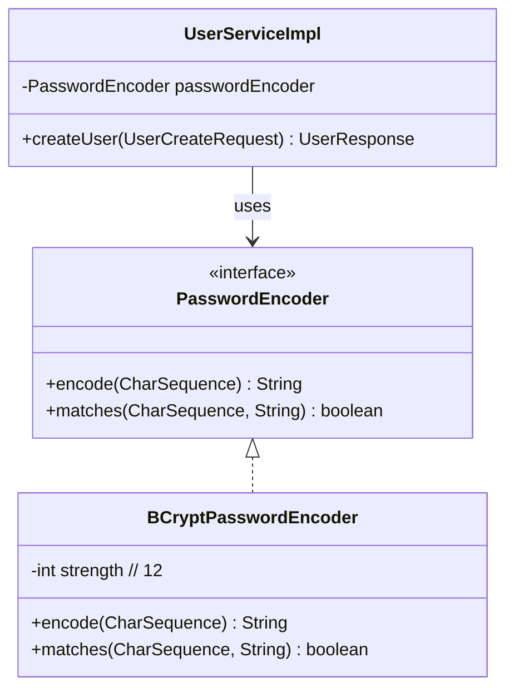

# Design Patterns: ส่วน User, UserProfile และ Authentication

ผู้รับผิดชอบ: นายยุทธนา เหล่าวิสัย (673380572-8), branch `yuttana_673380422-8_03`

---

## สรุป Patterns ที่นำมาใช้งาน

| รูปแบบ Pattern | กลุ่ม | ปัญหาที่แก้ | ตำแหน่งในโค้ด |
|---|---|---|---|
| **Layered Architecture** | Architectural | ป้องกันโค้ดปะปนกัน แยกส่วนติดต่อผู้ใช้ (Controller) ออกจากตรรกะทางธุรกิจ (Service) และการเข้าถึงฐานข้อมูล (Repository) | `UserController` → `UserService` → `UserRepository` |
| **Data Transfer Object (DTO)** | Enterprise | ป้องกันไม่ให้โครงสร้างฐานข้อมูล (Entity) รั่วไหลออกทาง API และคัดกรองข้อมูลความลับ (เช่น password) ไม่ให้หลุดออกไป | `UserCreateRequest`, `UserUpdateRequest`, `UserResponse`, `PageResponse` |
| **Data Mapper Pattern** | Enterprise | แยกหน้าที่การแปลงข้อมูล (Entity ↔ DTO) ออกจาก Service เพื่อให้โค้ดทดสอบง่ายและไม่ซ้ำซ้อน | `UserMapper` (`toEntity`, `updateEntity`, `toResponse`) |
| **Repository Pattern** | Enterprise / DDD | ซ่อนความซับซ้อนของ SQL/JPA และจำลองการเข้าถึงฐานข้อมูลให้เสมือนการเรียกใช้ Collection ในหน่วยความจำ | `UserRepository` (`JpaRepository<User, Long>`) |
| **Dependency Injection (DI)** | Creational / IoC | ลดการผูกมัดแน่น (Loose Coupling) ทำให้สามารถเปลี่ยน Implementation หรือเขียน Mockito Test ได้ง่าย | Constructor Injection ใน `UserController`, `UserServiceImpl`, `AuthViewController` |
| **Strategy (Password Hashing)** | Behavioral | ป้องกันการผูกติดกับขั้นตอนวิธีเข้ารหัสตัวใดตัวหนึ่ง โดยเรียกผ่าน `PasswordEncoder` Interface | `PasswordEncoder` (Interface) → `BCryptPasswordEncoder(12)` |

---

## 1. DTO and Data Mapper Pattern

### ปัญหาที่พบหากไม่ใช้
หากส่ง Entity `User` ออกไปเป็น JSON โดยตรงผ่าน `@ResponseBody`:
1. ฟิลด์ `password` (แม้จะเป็น hash) จะถูก serialize ส่งกลับไปให้ผู้ใช้ ซึ่งเป็นช่องโหว่ความปลอดภัยร้ายแรง
2. ปัญหา Lazy Loading หรือ Infinite Recursion เมื่อ serialize ความสัมพันธ์แบบ One-to-One Bidirectional (`user` ↔ `userProfile`)
3. การแก้ไขโครงสร้างตารางฐานข้อมูลจะส่งผลกระทบต่อ API Contract ทันที (Breaking Changes)

### วิธีแก้ด้วย DTO และ Mapper
- สร้าง `UserCreateRequest` พร้อม Jakarta Validation สำหรับรับข้อมูลสร้างผู้ใช้
- สร้าง `UserUpdateRequest` สำหรับรับข้อมูลอัปเดต (เฉพาะฟิลด์ที่อนุญาตให้แก้ไข)
- สร้าง `UserResponse` ที่มีเฉพาะข้อมูลที่ปลอดภัยและจำเป็นต่อ Client
- รวมศูนย์การแปลงข้อมูลไว้ที่ `UserMapper` คลาสเดียว

```mermaid
flowchart LR
    Client["Client / Swagger"] -->|UserCreateRequest| Controller["UserController"]
    Controller -->|UserCreateRequest| Service["UserServiceImpl"]
    Service -->|UserCreateRequest, encodedPassword| Mapper["UserMapper"]
    Mapper -->|User Entity| Service
    Service -->|User Entity| Repo["UserRepository"]
    Repo -->|User Entity| Service
    Service -->|User Entity| Mapper
    Mapper -->|UserResponse| Service
    Service -->|UserResponse| Controller
    Controller -->|UserResponse (JSON)| Client
```

---

## 2. Strategy Pattern ใน Password Encoding

ระบบใช้ `PasswordEncoder` interface จาก Spring Security ซึ่งทำงานเสมือน Strategy Pattern:
- `UserServiceImpl` ไม่จำเป็นต้องรู้ว่ารหัสผ่านถูก hash ด้วยอัลกอริทึมใด (BCrypt, Argon2, PBKDF2)
- รู้จักเพียง method `passwordEncoder.encode(rawPassword)`
- สามารถสลับการตั้งค่าอัลกอริทึมใน `SecurityConfig` ได้โดยไม่กระทบ Business Logic



---

## 3. Aggregate & Cascade Management ใน One-to-One

ความสัมพันธ์ระหว่าง `User` และ `UserProfile` ถูกออกแบบให้ `User` ทำหน้าที่เป็น Aggregate Root:
- การบันทึกหรือลบ `User` จะส่งผลกระทบต่อเนื่องไปยัง `UserProfile` อัตโนมัติ (`CascadeType.ALL, orphanRemoval = true`)
- มีการจัดการ Bi-directional Relationship แบบสอดคล้อง (Consistent):

```java
// ใน User.java
public void setProfile(UserProfile profile) {
    this.profile = profile;
    if (profile != null && profile.getUser() != this) {
        profile.setUser(this);
    }
}

// ใน UserProfile.java
public void setUser(User user) {
    this.user = user;
    if (user != null && user.getProfile() != this) {
        user.setProfile(this);
    }
}
```
แนวทางนี้ป้องกันบั๊ก Null Pointer หรือ Foreign Key หาย เมื่อมีการผูกออบเจกต์ในหน่วยความจำ
